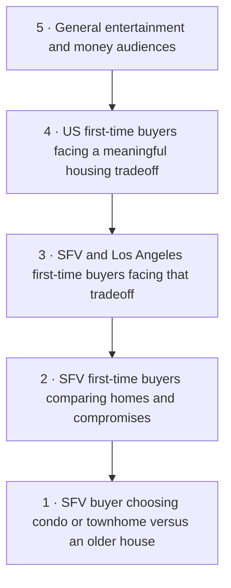

# Jen’s audience bullseye

**Center:** A first-time Valley buyer comparing a comfortable condo or townhome with an older, smaller or farther-away house, unsure which compromise they will regret.

**Freshness:** Current 2026 facts and new listening are separated from historical and undated references in the [research addendum](</Users/farricecain/.codex/worktrees/35aa/Google Antigravity/_active/clients/jen-listings/04-deliverables/content-strategy/2026-09-07-kallaway-research-foundation/04-ai-topic-mining-report.md>).

Use this person to make the writing specific. Build repeatable content around Rings 2–4 so the account has room to grow.

## Five rings, with an explicit change at each step

| Ring | Constraint relaxed from the ring inside | Relative size | Purchase-conversation proximity | Competitive evidence |
|---|---|---|---|---|
| 1 | None: the precise reference person | Smallest by definition; count unknown | Potentially close if actively comparing | A real SFV discussion demonstrates the situation; creator competition not measured |
| 2 | Remove the condo-versus-house restriction | Broader; count unknown | High when a real property decision is present | Jen’s own budget/wishlist post supplies a specimen, not a market-share measure |
| 3 | Widen geography from SFV to the rest of Los Angeles | Broader; count unknown | Relevant if Jen serves the location | LA/California sources exist; no exhaustive local competitor audit |
| 4 | Widen geography to the United States | Broader; count unknown | Mixed: many viewers cannot become Jen’s local clients | Nate, Rachael, Logan, Trips and Karime supply topical/craft examples |
| 5 | Remove the remaining first-purchase and housing-decision constraints | Broadest; count unknown | Usually low for Jen’s service | General home, finance and entertainment specimens are craft references only |

Size follows the nesting; it is not TAM research. Proximity is a strategic estimate, not a measured conversion rate. Geography widens in two deliberate steps so local service relevance remains visible. Ring 5 is deliberately outside the buyer definition; the jump relaxes all remaining constraints.

## The starting mix: three buckets, two pieces each, one experiment

A **seven-piece batch**, not a requirement to publish seven videos every week. It may run across two or more weeks to fit Jen’s capacity. Carousels and Reels have separate jobs.

| Bucket | Ring and job | Two first topics | Why this belongs |
|---|---|---|---|
| **The home you can live with** / alternate: Before the offer | 2–3 · Decision support | Condo versus older house; what changes after a second look | Preserves the existing Valley tradeoff focus |
| **The question you almost didn’t ask** / alternate: Ask Jen | 2–3 · Trust and expertise | Asking for another explanation; inspection-report panic | Connects Jen’s protective voice to the strongest user-endorsed reference |
| **The part of buying you recognize** / alternate: House-shopping moments | 4 · Reach, re-aimed at the local buyer | Listing codewords; first purchase after closing that surprised the buyer | A recognizable scene can travel without turning into generic motivation |

No bucket requires every topic to be a B-roll Reel. The approved negotiation carousel remains a comparison; the first asking-again treatment is B-roll; inspection triage belongs in an expert explanation.

## Bucket bench and service connection

Every row is a choice, not an obligation. “Working” thresholds below are proposed learning rules, not industry benchmarks. Lead value is unknown for every row because Jen’s economics and attribution were not supplied.

| Candidate / alternate name | Ring; role | Example topics | Service / useful response | Working signal across three batches; then decision |
|---|---|---|---|---|
| The home you can live with / Before the offer | 2–3; decision support | Condo vs older house; second-look priorities | Property comparison consultation | At least two relevant property-comparison inquiries: continue; otherwise review exposure and test Money after closing |
| The question you almost didn’t ask / Ask Jen | 2–3; trust | Ask again; inspection confusion | Buyer question conversation | At least two substantive local buyer questions: continue; otherwise test a more specific question |
| The part of buying you recognize / House-shopping moments | 4; reach | Codewords; furnishing surprise | Optional first conversation | One relevant inquiry or repeated identifiable target-buyer responses: retain provisionally; views alone do not earn more slots |
| Money after closing / The payment and the rest | 2–3; readiness | Cash kept back; quoted payment versus full expense picture | Jen + lender planning | Two readiness questions: trial as a core bucket |
| Life around the home / A normal Tuesday | 2–3; search refinement | Route observation; layout during a working day | Search refinement | Two local requests about fit: keep; no response prompts a better specimen before retirement |
| The offer and what happened next / After you find it | 2–3; expertise | Competing offer; report follow-up | Buyer representation | Two specific offer-stage questions: keep |
| Income that needs explaining / Before the lender call | 2–3; specialist test | Mixed-income preparation; documents that need clarification | Lender introduction | One relevant inquiry plus Jen’s evidence of service fit: develop; otherwise leave on bench |
| Buying with help / Before money changes hands | 2–3; specialist test | Family contribution expectations; who answers which question | Professional coordination | One qualified conversation and verified technical scope: develop; otherwise hold |
| A fresh start with support / Someone to work it through with | 2–3; trust | Decision load; asking someone to join a second look | Buyer planning | Two relevant responses about support: develop if Jen has a real story |

A zero after poor distribution is inconclusive. After adequate exposure across two or three batches, change the premise or its presentation before discarding the audience.

## Sourcing map: who to study and what to take

| Ring | Pillar and bucket served | Concrete topic examples | Source and permitted use | Search starting points | Trap |
|---|---|---|---|---|---|
| 1 | Property tradeoffs → The home you can live with | Shared walls versus repair capacity; paying for a renovated condo; a second visit focused on a dealbreaker | SFV buyer discussion: audience language and questions; no creator winner identified at this exact ring | SFV condo versus house; Valley older home repairs | Turning one person’s story into a population claim |
| 2 | Local decision confidence → both narrow buckets | Ask again during a tour; what to clarify after an inspection; price versus cash needed | Jen’s budget/wishlist and affordability posts: own voice/topic material | SFV first-time buyer questions; SFV inspection decisions | Assuming a published post proves lead generation |
| 3 | LA purchase choices → both narrow buckets | Buy/wait comparison; local home cost inputs; competing priorities | California-context sources in the ledger: topic candidates pending claims review | LA condo first purchase; Los Angeles home payment questions | Substituting a neighborhood name for real local substance |
| 4 | Familiar buying moments → broad bucket | Permission to ask; moving-day surprise; source-led comic translation | Karime, Rachael, Nate: question/scene construction; Logan: casual answer delivery | first home embarrassed question; just closed moving costs | Importing another state’s rules, numbers or client story |
| 5 | No topic pillar; craft reserve only | Reveal timing; ordinary gesture before an explanation; visual comparison | Moneyletter cups and Brickhomehaven reveal: craft only | visual reveal; object comparison demonstration | A popular unrelated subject becoming Jen’s content strategy |

Sources: [sfv](https://www.reddit.com/r/SFV/comments/1tq96p1/looking_for_home_buying_advice_and_a_realtor_in/) · [@_jiing reference](https://www.instagram.com/reel/DbEo59HMjuH/) · [@_jiing reference](https://www.instagram.com/reel/Db33yOnS6ig/) · [@karime215 reference](https://www.instagram.com/reel/DcwRrZ6NZJI/) · [@rachaelnovak reference](https://www.instagram.com/reel/DaTREfOhA3C/) · [@logan_the_lender reference](https://www.tiktok.com/@logan_the_lender/video/7663981949198929183) · [@moneyletter reference](https://www.instagram.com/reel/DcTb9M9xLC0/) · [@brickhomehaven reference](https://www.instagram.com/reel/DcAJdUvBDXO/).

## Four controlled experiments

1. **A real second-look disagreement:** Jen explains what changed her view of a home. Tests the opportunity in visible judgment. Requires her actual example.
2. **Buyer asks off-camera:** Someone asks Jen an actual buyer question during an ordinary action. Tests whether the natural answer survives filming better than a memorized script.
3. **A personal item from Jen’s first home:** Tests whether a truthful ownership memory strengthens the buyer relationship. Item and story are still needed.
4. **One property, two different lives:** A hypothetical comparison using the same verified property inputs. Tests whether life-fit comparisons outperform feature lists. The scenarios must be labeled hypothetical.

**Ring 5 traps:** a general marriage skit with a house word pasted in; a forecast of the next housing crash without evidence; a luxury mansion spectacle without a first-buyer connection. They may attract attention, but no evidence here shows they bring Jen relevant buyers.

Read [Document 7](</Users/farricecain/.codex/worktrees/35aa/Google Antigravity/_active/clients/jen-listings/04-deliverables/content-strategy/2026-09-07-kallaway-research-foundation/07-creative-brief-bank.md>) for the first seven briefs and [Document 8](</Users/farricecain/.codex/worktrees/35aa/Google Antigravity/_active/clients/jen-listings/04-deliverables/content-strategy/2026-09-07-kallaway-research-foundation/08-content-blueprint.md>) for measurement and ownership.
