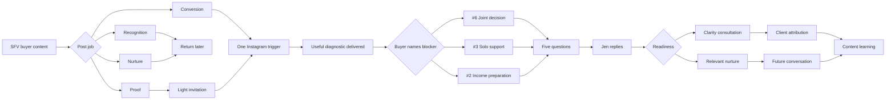

# Jen 6-3-2 Lead System Architecture

**First Home Valley decision brief | September 4, 2026**

Status: proposed for approval. No posts, lead magnets, messages, automation, or publishing have been produced from this brief.

## What 6-3-2 means

I am reading 6-3-2 as Jen's selected ICPs in priority order.

1. **#6 Two-Income Coordination Buyer:** the commercial lane.
2. **#3 Solo Fresh-Start Buyer:** the trust lane.
3. **#2 Creative-Income Buyer:** the differentiated authority test.

First Home Valley stays as the public umbrella. The Valley Tradeoff Buyer remains useful as subject matter: condo versus house, payment versus life, condition versus cash, and location versus commute. It does not need to become a fourth ICP.

The three selected buyers share one thought:

> My life does not fit the default first-time-buyer template. Can someone turn my complexity into a plan I trust?

## Verdict

Build one conversion system with three paths. The first asset should be a short **First Home Valley Decision Diagnostic**. A generic buyer guide would duplicate material that already exists in the [CFPB home-loan toolkit](https://www.consumerfinance.gov/owning-a-home/explore/home-loan-toolkit/) and [CalHFA buyer pathway](https://www.calhfa.ca.gov/homebuyer/index.htm). Jen's useful difference is interpretation: she finds the decision holding someone back and helps coordinate the next step.

## Pushback before production

1. Three separate brands or funnels would split Jen's identity and the learning data.
2. A large PDF may earn downloads without revealing who wants help. The asset needs to produce a small decision and a reason to reply.
3. Sending every responder to a calendar would create weak appointments. Jen should give value, ask five useful questions, and respond personally before offering a consultation.
4. A conversion CTA on every post would make ordinary warmth feel engineered. Recognition, nurture, proof, and conversion posts need different endings.
5. Early automation would freeze guesses into the system. The first 20–30 completed conversations should teach us what buyers actually say.

## How the system works

## The diagnostic

The common section should take about three minutes. It asks where the buyer needs to remain, when they may purchase, what stage they are in, which decision is blocking progress, and what their eventual home must leave room for in everyday life.

It gives a useful result before asking for contact details. The buyer then receives a short route-specific output.

### #6: Two-Income Coordination

Private tension: “How do two financial lives become one responsible plan?”

This route helps the buyers compare payment comfort, contributions, commutes, priorities, and unresolved choices before they shop. A human reply is warranted when they name different comfort ceilings, competing commute needs, unclear responsibilities, or a real timeline.

### #3: Solo Fresh-Start

Private tension: “Can I carry this decision without carrying every uncertainty alone?”

This route maps support, reserves, decision pressure, property-condition exposure, and the people who should surround the buyer. Useful signals include a specific fear, limited support, decision overload, or a stated next milestone.

### #2: Creative-Income

Private tension: “Is my situation impossible, or merely poorly organized?”

This route organizes income type, document history, lender questions, and preparation steps. It cannot decide eligibility. A qualified lender owns underwriting; attorneys own title and co-ownership advice; tax professionals own tax questions.

## The Instagram handoff

Use one memorable trigger during the first test. After the buyer requests the asset, delivery happens immediately. The next reply asks which of the three situations sounds closest. Five lightweight questions then give Jen enough context to respond like a person rather than a bot.

1. Are they buying alone, with another buyer, or still deciding?
2. What SFV area or commute anchors the search?
3. Is the timeline 0–3, 3–6, 6–12, or more than 12 months?
4. Which stage fits: exploration, preparation, pre-approval, tours, or active offers?
5. What is the main blocker in their own words?

Instagram should not collect exact income, credit scores, protected-class information, bank records, tax returns, Social Security numbers, or similar documents.

## What each post is allowed to do

**Recognition:** name the private tension. A story fragment may help, but there is no lead-asset pitch.

**Nurture:** help the buyer understand one decision. The next action can be a save, follow, or related post.

**Proof:** show what Jen noticed, translated, protected, or handled in a sourced client story. A light invitation is optional.

**Conversion:** expose one unresolved decision that benefits from Jen's help. This is where the diagnostic belongs.

Jun may use only documented facts. Every story candidate keeps its source-post ID, privacy exclusions, evidence for Problem/Pursuit/Payoff, professional boundary, and proof ceiling. Relationship disagreement, divorce, bereavement, debt, credit, tax records, income, and lender decisions remain sensitive.

## Minimum viable build

1. Create one diagnostic with three short outputs.
2. Add one Instagram trigger and saved delivery reply.
3. Prepare the five-question conversation sequence.
4. Give Jen a simple review and routing protocol.
5. Write one consultation invitation for active buyers.
6. Keep one low-pressure nurture path for future buyers.
7. Track the source post and every later step in one sheet.

Defer the funnel site, video sales letter, paid ads, automated scoring, separate landing pages, multiple email campaigns, financial diagnosis, and automatic calendar routing. Revisit those only after the manual path produces enough conversations to show where repetition truly exists.

## Measurement

The record for each person is:

`Post > trigger > asset delivered > diagnostic completed > qualified conversation > consultation > signed client > closing`

Reach shows whether relevant local people saw the work. Fit appears when someone recognizes their own situation. Trust appears when they disclose a real constraint or ask a consequential question. Commercial action begins with a completed diagnostic, qualified exchange, or consultation. Signed representation and closing remain separate revenue evidence.

A qualified conversation requires five things: a chosen path, an SFV location or commute anchor, a plausible timeline, a real blocker, and interest in a next step. A credible 6–12-month buyer belongs in nurture even when they are not ready for a meeting today.

## Test

Run four fair posts per ICP, 12 in total, under comparable conditions. Use the same diagnostic, delivery method, and tracking fields.

For #6, look for consultations. For #3, look for trust and recognition of Jen's service. For #2, look for evidence that the differentiated authority lane attracts real local buyers rather than peers.

After four executions, mark each lane **keep**, **revise**, or **inconclusive**. Promotion requires self-identification plus consequential action. Views do not settle the decision.

## Research basis

These sources changed the architecture rather than serving as decoration.

1. The [CFPB preparation path](https://www.consumerfinance.gov/owning-a-home/prepare/) and [loan-application packet](https://www.consumerfinance.gov/owning-a-home/prepare/create-a-loan-application-packet/) show that budget, readiness, and document organization belong before active shopping. They support a diagnostic that helps buyers prepare without pretending Jen is the lender.
2. CFPB guidance for [joint mortgage applicants](https://www.consumerfinance.gov/ask-cfpb/can-two-unmarried-people-apply-jointly-for-a-mortgage-or-a-home-equity-loan-en-357/) identifies income, credit, debt, and contribution questions that make #6 a coordination problem.
3. Fannie Mae's [debt-to-income guidance](https://guide-selling.fanniemae.com/sel/b3-6-02/debt-income-ratios) confirms that obligations and qualifying income affect the household picture. Its [self-employed borrower guidance](https://selling-guide.fanniemae.com/sel/b3-3.5-01/underwriting-factors-and-documentation-self-employed-borrower) supports the document-readiness path for #2 while keeping underwriting outside Jen's role.
4. The [CalHFA buyer pathway](https://www.calhfa.ca.gov/homebuyer/index.htm) assigns formal education and program eligibility work to approved education and lending channels. Jen's asset should help people find the right next question, not imitate those services.
5. California DRE's [advertising guidelines](https://www.dre.ca.gov/files/pdf/re27.pdf) and [2026 AI advisory](https://www.dre.ca.gov/Licensees/Advisories/Advisory_2026_03_17_AI_in_California_Real_Estate.html) set the truth, disclosure, fair-housing, professional-scope, and human-review floor for the later content and lead flow.

## Expert responsibilities

**Mike Sherrard:** owns the route from attention to a tracked buyer conversation.

**Kallaway:** decides what job each ICP's content performs and protects buyer-quality attention from empty reach.

**Jun Yuh:** turns documented material into truthful story packets later. He does not force a story or invent the client psychology.

**Alyssa Stalker:** checks that each post has one Instagram-native job and that Jen feels helpful before she feels transactional.

**Jen:** owns voice, the personal response, privacy approval, and the final relationship decision. Current California DRE guidance also requires truthful social advertising and applicable license disclosures. See the [advertising guidelines](https://www.dre.ca.gov/files/pdf/re27.pdf) and [2026 AI advisory](https://www.dre.ca.gov/Licensees/Advisories/Advisory_2026_03_17_AI_in_California_Real_Estate.html).

The main Jen content-system conductor integrates these passes. Expert count does not raise quality; a changed decision or safer handoff does.

## Decision status

Ready for approval: First Home Valley umbrella; ICP priority 6, 3, 2; one diagnostic with three paths; value before qualification; human review before booking; separate measures for reach, fit, trust, commercial action, and revenue.

Still open: final asset name, Instagram trigger, delivery platform, automation vendor, page design, content calendar, scripts, and visuals.

After approval, audit Jen's current booking link, CRM, link-in-bio, saved replies, and lender handoff. Then specify the diagnostic and CTA map before writing posts.
