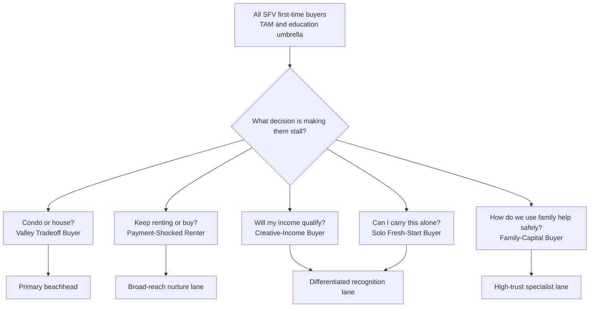
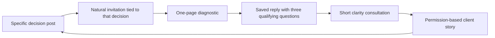

# Jen First-Time Buyer ICP Options

**Decision brief | San Fernando Valley | September 3, 2026**

> **Verdict:** Keep **First Home Valley** as the broad education umbrella. Make the **Valley Tradeoff Buyer** Jen's first content beachhead: the first-time buyer deciding between a condo or townhome and an older, smaller, or farther-out house. Use **Creative-Income Buyers** and **Solo Fresh-Start Buyers** as recurring recognition lanes, not separate brands.

This is a content-market decision, not a claim that one segment is the largest population. No public source reports exact psychographic segment sizes for San Fernando Valley first-time buyers. The rankings below combine current official market constraints, directional public social listening, and Jen's archived Instagram evidence.

## The thread line

First-time buyers are not mainly asking, “How do I buy a home?” They are asking:

> **Which compromise will I regret least,and who will make sure I do not miss the expensive thing?**

That question fits Jen better than a dramatic niche or a generic first-time-buyer classroom. Her value is not urgency. It is calm judgment, local context, and making the whole move feel handled.

## Why this market feels so hard

The pressure is structural, not a buyer-confidence problem:

- In the second quarter of 2026, only **17%** of households could afford the median-priced home in both Los Angeles Metro and Los Angeles County. C.A.R. modeled the county median at **$879,900**, with a **$5,480 monthly payment** and **$219,200 qualifying income** under its assumptions. [California Association of Realtors affordability report](https://www.car.org/aboutus/mediacenter/newsreleases/2026releases/2qtr2026HAI)
* Freddie Mac reported a **6.71%** average 30-year fixed mortgage rate on September 3, 2026. [Freddie Mac Primary Mortgage Market Survey](https://www.freddiemac.com/pmms)
+ Nationally, first-time buyers fell to a historic **21%** of purchasers and their median age rose to **40**. [National Association of Realtors](https://www.nar.realtor/press-releases/first-time-home-buyer-share-falls-to-historic-low-of-21-median-age-rises-to-40)
- The median first-time-buyer down payment was **10%**. Personal savings remained the leading source, but financial assets and family gifts or loans also mattered. [NAR buyer and seller trends](https://www.nar.realtor/news/real-estate-news/nar-2025-profile-of-home-buyers-sellers-reveals-market-extremes)
* A buyer's real monthly obligation includes taxes, insurance, and HOA dues. CFPB also tells buyers to anticipate closing costs and preserve an emergency cushion in its [home-budget guidance](https://www.consumerfinance.gov/owning-a-home/prepare/figure-out-how-much-you-want-to-spend/).

“You can buy with 3.5% down” may be technically true for eligible FHA borrowers, but it does not answer the buyer's actual fear: whether the total payment, reserves, property condition, commute, and life tradeoffs still make the choice wise. HUD explains the eligibility-dependent down-payment floor in its [FHA loan overview](https://www.hud.gov/buying/loans).

## What buyers are saying

Public discussion is directional evidence, not a representative survey. One unusually rich [local SFV thread](https://www.reddit.com/r/SFV/comments/1tq96p1/looking_for_home_buying_advice_and_a_realtor_in/) came from a buyer choosing between “a pretty decent condo” and “an okay house” that would need work. The discussion expanded into noisy neighbors, HOA dues, deferred maintenance, renovation risk, favorable rent, reserves, and the desire for an agent who narrows the search without pushing.

Across the wider listening set, the recurring language was:

|What they say | What it means for content |
|---|---|
|“I do not want to be house poor.” | Compare the life left after the payment, not just approval amount. |
|“I still want to live my life.” | Treat lifestyle capacity as part of affordability. |
|“Condo or an okay house that needs work?” | Make tradeoff judgment the content, not listing tours. |
|“I can afford it, but I cannot rationalize it.” | Give honest buy / wait / prepare verdicts. |
|“What will the lender actually count?” | Translate the preparation path; refer underwriting conclusions to a lender. |
|“I do not have anyone to bail me out.” | Show how Jen reduces decision load without promising risk-free ownership. |
|“How do we protect the family gift?” | Explain the question set and bring in lender, attorney, or tax professionals. |

The listening also shows an agent-selection problem. Buyers describe wanting someone patient, locally knowledgeable, able to notice cost and condition issues, and unwilling to pressure them into a property or an immediate agreement. That is unusually close to Jen's actual service promise. See the [SFV discussion](https://www.reddit.com/r/SFV/comments/1tq96p1/looking_for_home_buying_advice_and_a_realtor_in/), [agent-selection discussion](https://www.reddit.com/r/FirstTimeHomeBuyer/comments/1pt28yz/tips_on_how_to_pick_or_choose_realtor/), and [buyer report of agent pressure](https://www.reddit.com/r/FirstTimeHomeBuyer/comments/1s7kswi/realtors_attitude/).

## What Jen's Instagram already proves

The archive contains **2,779 accessible posts**. Keyword screening, not human classification, found recurring raw material around first-time buyers, financing and down payments, condos and HOAs, competitive offers, inspections, and life transitions. In a 2024-and-newer real-estate comparison, first-time-buyer posts had a higher median attention signal than Jen's other real-estate posts. That is an **attention signal only**, not proof of DMs, consultations, signed clients, or revenue.

More important than the aggregate is the proof shape already present:

+ A [North Hills first-time-buyer post](https://www.instagram.com/p/DYX9jSvjRK_/) follows a client who was outbid before eventually closing.
- A [North Hollywood buyer post](https://www.instagram.com/p/DVG__k-jV1H/) documents first-time buyers finding an under-$1M home with an ADU.
* Jen has explained California down-payment assistance in a [program post](https://www.instagram.com/p/DVeL1xBD-Tq/).
+ A [growing-family post](https://www.instagram.com/p/C_jbmWsS7Qr/) includes an inspection problem and a changed path.
- Jen has told her own renter-before-30 story in a [personal post](https://www.instagram.com/p/CFdvD3UAftC/).
* She has documented clients who did not think they could buy in a [buyer story](https://www.instagram.com/p/DA9XF65T8sL/).

The content lesson is not “post more financing tips.” Recent program, financing, and condo posts were weaker attention performers than Jen's personal and life-transition material. The human decision tension should be **beat one**; the property, program, or explanation should usually be **beat two**.

## The five micro-ICP options

Scores are strategic judgment on a five-point scale, not population estimates.

|Rank | Micro-ICP | Purchase proximity | Jen proof fit | Differentiation | Content range | Role in the system |
|---:|---|---:|---:|---:|---:|---|
|1 | **Valley Tradeoff Buyer** | 5 | 5 | 4 | 5 | Primary beachhead |
|2 | **Creative-Income Buyer** | 4 | 3 | 5 | 4 | Differentiated hypothesis |
|3 | **Solo Fresh-Start Buyer** | 4 | 5 | 4 | 4 | Emotional recognition lane |
|4 | **Family-Capital Buyer** | 4 | 3 | 4 | 4 | High-trust specialist lane |
|5 | **Payment-Shocked Long-Term Renter** | 3 | 4 | 2 | 5 | Broad-reach nurture lane |

### 1. Valley Tradeoff Buyer , recommended beachhead

**Situation:** They can buy something in or near the Valley, but not every version of the life they imagined. They are choosing among a condo or townhome, an older or smaller house, a property needing work, or a farther commute.

**The private question:** “Which compromise will I regret least?”

**What gets in the way:** HOA dues and documents, special-assessment exposure, shared walls, maintenance, inspection findings, insurance, renovation cash, commute, and the fear that “starter home” becomes a costly trap.

**Why Jen can own it:** This is where local pattern recognition and protective coordination become visible. It also lets her tell sourced client stories without turning her brand into a gimmick.

**Content jobs:**

+ Compare two homes at the same total monthly cost.
- Show the document or inspection detail that changed a recommendation.
* Separate “needs cosmetic work” from “needs financial capacity.”
+ Explain what Jen checks before a buyer falls in love.
- Tell a real story in which the chosen home was not the prettiest listing.

**Lead path:** “If you are weighing a condo against a house in the Valley, send me the two options. I will share the comparison map I use.”

### 2. Creative-Income Buyer: best differentiated hypothesis

**Situation:** They work in entertainment, music, freelance, production, a small business, or a mix of W-2 and 1099 income. Their earnings can be real but uneven or harder to document.

**The private question:** “Am I actually unqualified, or have I never had someone organize the right path?”

**What gets in the way:** tax-return history, business cash flow, year-to-year variability, documentation fatigue, and fear that a lender will not count income as expected. Fannie Mae generally calls for a two-year self-employment history, with a narrower one-year path under specified conditions, and requires cash-flow analysis in its [self-employed borrower guidance](https://selling-guide.fanniemae.com/sel/b3-3.5-01/underwriting-factors-and-documentation-self-employed-borrower).

**Why Jen may be credible:** Her local and creative-community ties can make the content feel lived rather than fabricated. But this is an **untested positioning hypothesis** until past-client evidence and lender conversations show repeated demand.

**Content jobs:**

* “What to organize before a mortgage conversation when your income is not one clean W-2.”
+ Buyer story: what became clear after the right documents reached the right professional.
- Three questions to ask a lender experienced with self-employed borrowers.
* A no-shame readiness timeline for inconsistent years.

**Boundary:** Jen explains the journey and coordinates experts. A qualified lender makes underwriting conclusions; a CPA or tax professional handles tax advice.

**Lead path:** “Tell me whether your income is W-2, self-employed, or mixed, and I will send you the preparation checklist.”

### 3. Solo Fresh-Start Buyer: strongest emotional brand fit

**Situation:** They are making the decision without a co-buyer, or buying during a major reset. The segment is defined by **decision load**, not sex, marital status, family status, or another protected identity.

**The private question:** “Can I carry the decision and the surprises without anyone to catch me?”

**What gets in the way:** one-income reserves, fear of repair surprises, decision fatigue, safety anxiety, and the absence of a second person to pressure-test the choice. Public buyers describe the process as exhausting when carried alone. [Solo-buyer discussion](https://www.reddit.com/r/FirstTimeHomeBuyer/comments/1o6szdz/how_do_single_people_go_through_the_homebuying/)

**Why Jen can own it:** Her “whole move feels handled” promise is most emotionally legible here if she shows concrete actions rather than saying she cares.

**Content jobs:**

+ The five decisions Jen helps a buyer pressure-test before an offer.
- “What I handled this week that my buyer did not have to chase.”
* How to build a personal advisory circle before shopping.
+ A truthful story about slowing down rather than being pushed.

**Lead path:** “If you are carrying this decision on your own, ask me for the support map I use with buyers.”

### 4. Family-Capital Buyer: high trust, higher complexity

**Situation:** The purchase may depend on a gift, inheritance, family loan, co-buying arrangement, or multigenerational housing plan.

**The private question:** “How do we accept help without creating a financial or family mess?”

**What gets in the way:** donor documentation, ownership expectations, repayment ambiguity, title decisions, family pressure, and competing ideas about ADUs or shared housing. Gift funds are permitted in many conventional scenarios subject to donor, documentation, and transaction rules in [Fannie Mae's gift-fund guidance](https://selling-guide.fanniemae.com/sel/b3-4.3-04/personal-gifts).

**Why Jen may win:** The buyer needs a calm coordinator who can surface the right questions early and bring the right professionals into the room.

**Content jobs:**

- “Before your parents transfer the down payment, answer these questions.”
* Gift versus loan versus shared ownership: the professionals to consult.
+ A multigenerational property tour through privacy, layout, parking, and future-use tradeoffs.
- An ADU story that starts with the family's actual need, not a return-on-investment promise.

**Boundary:** Ownership, estate, tax, and enforceability questions go to the appropriate attorney, CPA, and lender.

**Lead path:** “If family money may be part of the purchase, ask me for the question list to review before anyone transfers funds.”

### 5. Payment-Shocked Long-Term Renter: broadest reach, weakest moat

**Situation:** They have stable income, savings, or equity-like financial assets, but their current rent is meaningfully lower than the cost of buying what they would accept.

**The private question:** “If buying makes my monthly life worse, why would I do it?”

**What gets in the way:** the payment gap, sunk-cost fear, social pressure that rent is “throwing money away,” and uncertainty about the time horizon. LA renters describe wanting ownership while feeling deeply discouraged by prices and payments in this [public discussion](https://www.reddit.com/r/AskLosAngeles/comments/1o3a54k/wanting_to_buy_a_home_so_badly_but_very/).

**Why this should not be the whole niche:** It is a large and useful top-of-funnel problem, but many agents can publish affordability explainers. Jen becomes distinct when she gives an honest verdict and connects the numbers to the buyer's life.

**Content jobs:**

* “Three honest verdicts: buy, keep renting, or get ready.”
+ Compare monthly ownership cost with the value of optionality and reserves.
- Explain what would need to change before buying becomes wise.
* Use assistance programs as conditional tools, not urgency hooks. [Dream For All](https://www.calhfa.ca.gov/dream/index.htm) availability changes and must be checked before publication. Los Angeles County's [Greenline program](https://dcba.lacounty.gov/greenline/) currently describes a grant of up to $35,000 for eligible buyers, with education, contribution, occupancy, and other requirements.

**Lead path:** “If your rent makes buying hard to justify, send me the numbers you are comparing and I will share the readiness snapshot.”

## Kallaway content architecture

Do not create five content brands. Use one clear umbrella and route each post through one buyer decision.

### Positioning line

> **Jen helps first-time buyers in the San Fernando Valley make the tradeoffs listing portals cannot make for them: condo or house, payment or lifestyle, now or later. Then she keeps the whole move handled once they decide.**

### Four repeatable formats

1. **Same payment, different life**  
   Two real or representative options. Visual hook shows the contrast; text hook names the consequence; Jen's spoken hook asks the human decision.

2. **The detail that changed my recommendation**  
   Start with what Jen noticed. Show the document, inspection issue, HOA fact, insurance constraint, or commute reality. End with what the buyer could decide more clearly.

3. **Buy / Keep renting / Get ready**  
   Give three honest paths and the condition that makes each rational. This builds trust because “not yet” is an acceptable outcome.

4. **What I handled so they did not have to chase it**  
   Use a sourced service moment: what Jen noticed, translated, protected, prevented, or removed from the buyer's plate. Do not invent the client's feelings or causal outcome.

### The hook rule

When the human decision is stronger than the property, the house is beat two.

+ Weak: “Tour this two-bedroom condo in Sherman Oaks.”
- Stronger: “Her rent was so good that buying only made sense if the home gave her something rent could not.”
* Beat two: the specific condo, house, document, payment, or tradeoff.

## Lead flywheel

Recommended first diagnostic: **The SFV Condo-vs-House Decision Map**. It should help a buyer compare total monthly cost, reserves, HOA health, likely maintenance, commute, privacy, renovation appetite, and expected ownership horizon. It is decision support, not a property recommendation or financial advice.

Suggested saved reply questions:

1. What part of the Valley needs to remain in range, and why?
2. Which would bother you more for the next three years: shared walls and HOA rules, or repairs and maintenance you control?
3. What monthly payment would still leave room for the life and reserves you want?

## Thirty-day validation test

This is a demand test, not a rebrand.

|Lane | Posts | Primary signal |
|---|---:|---|
|Valley Tradeoff | 4 | Decision-map requests with two real options |
|Payment-Shocked Renter | 2 | Readiness requests with a location and timeline |
|Creative-Income | 2 | Concrete irregular-income preparation questions |
|Solo Fresh-Start | 1 | Support-map or consultation requests |
|Family-Capital | 1 | Gift or co-buying questions |

For every post, record reach, saves, profile actions, attributable DMs, qualified conversations, consultations, signed clients, closings, and collected revenue. Likes, views, and saves remain attention. A segment advances only when buyers identify themselves and take a consequential next step.

### Decision rule after thirty days

+ **Keep Valley Tradeoff as beachhead** if it generates at least three attributable qualified conversations and one consultation, and no other lane materially exceeds it.
- **Promote Creative-Income** if at least ten credible inquiries or past-client cases show repeated irregular-income friction and a lender confirms a repeatable preparation pathway.
* **Move Payment-Shocked Renters to nurture** if most inquiries remain below feasible buying power or have no plausible twelve-month readiness path.
+ **Keep Solo Fresh-Start educational** if Jen lacks privacy-cleared source stories.
- **Reframe geography** if actual hand-raisers consistently need a wider search area than SFV.

These are precommitted testing thresholds, not claims about expected conversion.

## Truth, privacy, and compliance gates

* Market by decision situation and service need, not protected identity, neighborhood demographic composition, or coded language.
+ Do not make claims about neighborhood safety, who an area is “good for,” or whether its residents make it preferable.
- Check mortgage rates, assistance-program availability, and eligibility language again on the day of publication.
* Jen can explain process and coordinate. Lenders determine qualification; inspectors assess condition; attorneys and CPAs handle legal and tax questions; insurance professionals quote coverage.
+ California DRE warns licensees that AI output requires verification and may create fair-housing, advertising, confidentiality, and professional-duty risks. [California DRE AI advisory](https://www.dre.ca.gov/Licensees/Advisories/Advisory_2026_03_17_AI_in_California_Real_Estate.html)
- Every client story needs a source-post ID, truth boundary, privacy state, and proof ceiling. No inferred client emotions, embellished savings, or unverified “we prevented” claims.

## What is verified, likely, and untested

**VERIFIED**

* Los Angeles affordability, current mortgage-rate pressure, changing first-time-buyer participation, and program rules from the cited official sources.
+ The existence of recurring tradeoff language in the cited public discussions.
- Jen's archived public posts and the specific source examples linked above.

**LIKELY, based on triangulation**

* The Valley Tradeoff Buyer is the strongest first content beachhead because current local language, Jen's proof, and her protective brand overlap there.
+ Payment-Shocked Renters offer broad reach but weaker differentiation.
- Creative-Income Buyers could become a defensible local moat if Jen has enough authentic cases and lender support.

**UNTESTED**

* How the five segments compare on qualified DMs, consultations, signed clients, and revenue for Jen.
+ Exact psychographic segment size within the San Fernando Valley.
- Whether the proposed keywords and diagnostic convert.

**NO EVENT**

* No new lead, consultation, signed client, closing, or revenue event was created by this research.

## Do this / Do not do / We are wrong if

**Do this:** Lead with Valley tradeoffs, let Jen's human judgment open the story, and use one decision tool to convert attention into identifiable conversations.

**Do not do:** Turn all first-time buyers into one generic avatar; create five separate brands; lead with down-payment-program trivia; or target protected identities as the niche.

**We are wrong if:** Jen's actual hand-raisers show a different repeated situation, her archive cannot support the recommended stories truthfully, or thirty days of attributable behavior show another lane clearly producing stronger buyer action.

## Research coverage

The sweep used official housing, lending, assistance-program, consumer-protection, and professional-regulation sources plus public Reddit discussions from SFV, Los Angeles, and first-time-buyer communities. TikTok was blocked from public inspection and YouTube comments were not reliably accessible, so this is **not** total-platform social listening. No paid research provider was used at any point.

The full source set and evidence limits are in [Jen First-Time Buyer ICP Source Ledger.md](./Jen%20First-Time%20Buyer%20ICP%20Source%20Ledger.md).
