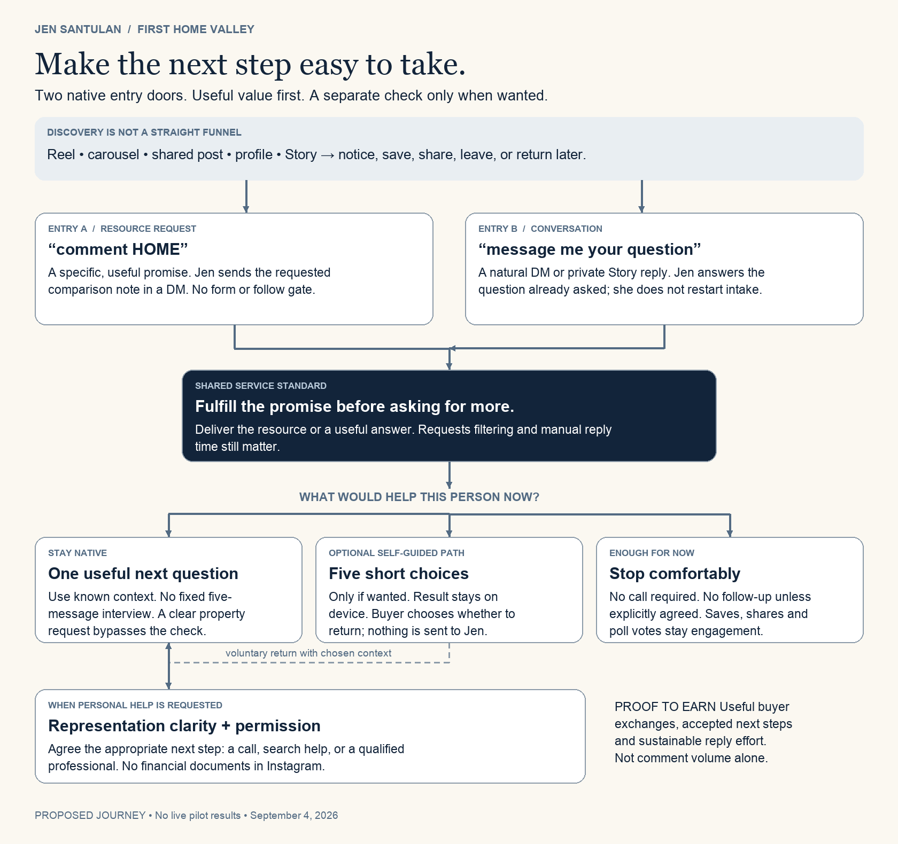
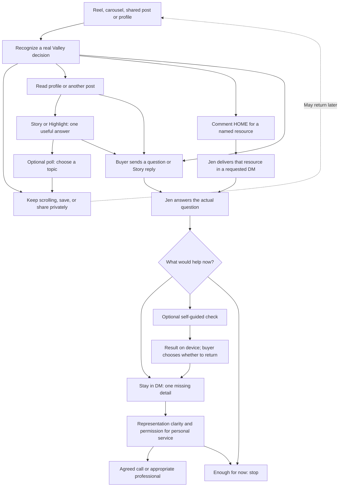

# Let the first useful conversation happen in Instagram

**Jen Santulan · September 4, 2026 · Private recommendation for review**

Integration note: this source-task report is preserved as the research recommendation. Its architecture/engine and no-transmission wording changes have now been applied locally; the optional copy-summary feature remains parked. Current implementation and metric correction: [integration review](../../lead-system/INTEGRATION.md).

Use familiar conversion mechanics when they make the next action easier. Give Jen two Instagram-native entry doors: a keyword request for a specific resource, and a natural question or Story reply. Deliver the promised value first; continue personally when the buyer wants help. Keep the five-step First Home Valley check as an optional self-guided aid.

**Direction corrected during this session:** Farrice explicitly reopened “comment HOME.” Earlier local bans are superseded. Distinctive voice is not a reason to reject a working acquisition pattern. Keyword CTAs are eligible for a controlled manual test; this is not permission to publish or automate.

**Why:** a clear, low-effort resource request can start the exchange without forcing someone to compose a personal question. That is a different decision from sending them to an external diagnostic. The current check does not save or transmit answers, so it adds a return task before Jen receives context. Keep proven request-and-delivery mechanics available while testing whether that extra diagnostic effort helps.

**Preserved:** Jen is the Valley umbrella; First Home Valley owns buyer education; Listing Launch owns property proof. 6-3-2 remains backstage, routing by the blocker someone names. No demographic or financial scoring. This recommendation changes the handoff, not those commitments.

## 1. The realistic journey

The map is a proposed behavioral model, not observed Jen conversion data. People enter at different points, pause for weeks, return through another post, or send a post to someone else before ever contacting Jen. No single sequence is required.

**An illustrative buyer:** someone receives Jen's condo-versus-house post from a co-buyer, saves it, and later sees a Story about comparing commute tradeoffs. They reply, “we keep choosing different areas.” Jen can suggest comparing the destinations each person needs to reach and ask which tradeoff is unresolved. They do not need to identify as a Two-Income Coordination Buyer. If they want to work through the wider decision together that evening, the check becomes useful. This is a scenario, not a recovered lead.

**Another valid buyer:** someone asks to see a specific property. Answer the property question and follow Jen's broker-approved showing process. Do not divert them through an education diagnostic. The check must never become an obstacle to a clear request.

## 2. What the evidence does and does not establish

| Evidence | Status and practical implication |
|---|---|
| Meta says messaging became Instagram's most popular way to share photos and videos. | **VERIFIED platform statement**, September 2025. It supports designing for person-to-person sharing; it does not prove buyers want agent DMs. The India interface test in the same article is not proof of Jen's current US interface. [Meta](https://about.fb.com/news/2025/09/in-india-instagram-debuts-a-reels-first-experience-for-its-mobile-app/) |
| Feed ranking uses multiple predictions, including interaction and profile interest. | **VERIFIED published explanation**, not current weight estimates. A save does not guarantee the saver sees Jen's next post; ranking is not an automatic retargeting campaign. [Meta system card](https://ai.meta.com/tools/system-cards/instagram-feed-ranking/) · [Meta explanation](https://about.fb.com/news/2023/06/how-ai-ranks-content-on-facebook-and-instagram/amp/) |
| Polls, question stickers, links and messaging are supported surfaces. | **VERIFIED documented capabilities.** Exact placement, settings, available controls and visibility on Jen's account remain **UNCONFIRMED**. The core path has a text-DM fallback. [Meta Blueprint](https://fbp.exceedlms.com/student/path/287735-invite-audience-to-interact-instagram-stories) · [Link announcement](https://about.fb.com/ja/news/2021/10/linkaccessstickers/) |
| Buffer finds stronger carousel engagement per person reached and an association between creator replies and engagement. | **VERIFIED observational findings.** The 2026 report uses Buffer-published posts, largely 2025 data, with some older format windows. This is selection-biased platform engagement evidence, not buyer conversion or causal proof. It supports testing useful carousels and answering genuine comments. [Study and methodology](https://buffer.com/resources/state-of-social-media-engagement-2026/) |
| The earlier Jen audit recorded 12 external-link taps and 1,589 profile visits. | **VERIFIED in the supplied local audit, not remeasured here.** About 0.76% is a ratio of recorded events, not a unique-buyer completion rate. Mixed visitor intent, attribution windows and menu relevance prevent blaming all of it on link friction. |
| The private check's prior receipt records 12/12 scripted routes passing and no answer transmission. | **VERIFIED local receipt and inspected implementation.** Human comprehension remains **UNTESTED**; production conversion remains **NO EVENT**. The earlier conversion evidence brief predates the completed prototype and canon reconciliation; its “not build-ready” statements are historical. |

**Behavioral judgment:** opening a new page introduces navigation, uncertainty about data use, and a memory task on return. Staying in DMs removes some of that effort but adds social exposure, typing and waiting. Thus “native” is not automatically easier for everyone. A private, self-paced check can be preferable for someone reluctant to explain themselves to an agent. **LIKELY mechanism; UNTESTED preference and effect for Jen.**

### Current real-estate examples

| Example inspected September 4 | What is actually evidenced | What Jen should borrow |
|---|---|---|
| Alyssa Curnutt's current site identifies her Instagram-local-content connection; a May 18, 2026 Zillow buyer review says they discovered her through Instagram. | **VERIFIED published site and review text; LIKELY self-reported discovery path.** No DM transcript, exact content touchpoint, or causal conversion claim. [Agent site](https://alyssacurnutt.com/about) · [Buyer review](https://www.zillow.com/profile/alyssacurnutt) | Local familiarity can precede buyer intent. A public review is more useful than an unsupported engagement-to-sales formula, but is still not an attribution audit. |
| Jimmy Conover's current site offers a Boise relocation planning call for people considering a move within 12 months. | **VERIFIED visible offer**, not booking or completion performance. It makes the external destination's purpose explicit. [Live page](https://jimmy-conover.com/) | A link earns its place when the visitor already wants a named outcome. Do not use a general calendar as the first response to early uncertainty. |
| BAM's August 13, 2026 interview report describes Conover manually asking one opening question, listening, then offering a call. | **VERIFIED reported practitioner method; UNCONFIRMED business attribution claims.** No audited conversion data. [Interview report](https://nowbam.com/the-dm-script-that-turns-new-followers-into-real-estate-leads/) | Borrow the personal reply and summary before invitation. Reject messaging every new follower: following Jen is not permission for prospecting. |

A July 13, 2026 Manychat article embeds Kurt Harfmann's relocation post and describes its “comment GUIDE” resource-delivery path. It also interviews Alexis Halikas, whose business sells coaching to agents rather than homes to first-time buyers. **VERIFIED published examples; vendor-reported execution/results, not audited Jen-equivalent conversion proof.** Borrow the specific resource and easy request. Do not transfer coaching metrics to residential buyers. [Manychat real-estate examples](https://manychat.com/blog/how-real-estate-agents-get-leads-on-social-media/)

Manychat also publishes Jenna Kutcher's keyword-to-webinar sales story. That is a useful counterexample to dismissing a familiar funnel as tired, but its offer, audience and sales cycle differ sharply from Jen's. Its vendor-reported performance is not a forecast for her. [Case study](https://manychat.com/blog/success-stories/jenna-kutcher/)

Direct Instagram pages were unavailable through the research browser. These examples use accessible agent-owned pages, a buyer-authored review and a dated interview report. We did not inspect their private DMs or infer a working automation. Older local competitor names were not promoted into newly verified examples.

## 3. Friction at every handoff

Effort ratings below are design judgments, not measured abandonment rates.

| Handoff | Buyer friction or failure | Recommended handling | Evidence to observe |
|---|---|---|---|
| Discovery → first slide or Reel | Low motor effort; high relevance threshold. Viewer may want entertainment. | Give one recognizable local decision immediately; no intake demand. | Reach and substantive arrivals, separately. |
| Carousel cover → later slides | Each swipe costs attention; the last slide may never be seen. | Give useful context on slide two; every slide should make sense without a future payoff. Keep one optional invitation understandable in the caption too. | Aggregate saves/shares and voluntary feedback. Do not invent per-slide completion metrics. |
| Post → save | Low effort; postponement can become forgetting. | Make it useful to return to. No outreach based on saving. | Aggregate saves only; a save is not a contact record. |
| Post → private share → co-buyer | Recipient lacks the original context; they may disagree or ignore it. | Make the shared object a question two people can discuss. Do not infer who received it. | Aggregate shares; self-reported referral only if volunteered. |
| Post → profile → follow | More evaluation: “Does she work here? Is this person credible?” | Existing Valley identity, recognizable education and genuine property proof should answer this. Specific profile changes need separate approval. | Profile activity, follows; neither identifies buyer intent. |
| Profile → Story/Highlight | Extra navigation; old or missing Stories can break the sequence. | Treat Highlights as optional reference, never mandatory orientation. Keep each Story self-contained and date market claims. | Current availability and entry context. |
| Story → poll | Small tap, limited meaning; voter may just prefer a topic. | Poll about an educational question, not income, relationships or readiness. Do not DM voters as leads. | Aggregate response and next-Story usefulness; no person-level voter export. |
| Story → question sticker | Typing and uncertainty about who can see the response. | For personal context, direct the viewer to the message/reply control. Never promise a sticker is anonymous. Do not repost responses without permission. | Voluntary questions; distinguish sticker responses from DM conversations. |
| Story/public comment → private DM | Social commitment; controls may route messages to Requests. Public Story comments are not private replies. | Answer general comments publicly. Invite a DM for personal specifics; do not ask for them in the comment. Verify message controls before launch. | Inbound request found, accepted, answered. |
| Public keyword → requested DM | Low typing effort; public visibility and message-request filtering can still deter people. | Promise a concrete object. Deliver it without a follow, email or qualification gate. If Jen cannot message, reply publicly inviting the person to message her for the same resource; do not claim delivery. | Unique requests, attempted delivery, acknowledged receipt and subsequent buyer questions separately. |
| DM request → Jen reply | Wait, missed Requests, canned response or premature questions. | Text first. Answer what was asked, then at most one necessary question. Check Requests during the agreed reply window. No unverified instant-response promise. | Time to first substantive reply; requests missed. |
| Jen reply → buyer response | Can feel like qualification or a disguised pitch. | Reuse known context. Give a useful answer that stands alone even if they leave. | Buyer replies with a meaningful clarification, not merely “thanks.” |
| Instagram → bio menu → page | Choice overload, wrong destination, loading, trust cost. | Do not make this the default. If a check is requested, give a direct, described link in the conversation or a dedicated Story link after approval. | Link acceptance distinct from confirmed opening. |
| Check start → result | Five choices plus navigation and optional note; “five taps” understates the actual interface. | Show honest effort. Offer a direct question route and a finish-without-contact route. Test skips and “not sure.” | Human comprehension, elapsed time, result usefulness. |
| Result → return to Jen | Prototype does not transmit context. Buyer may assume Jen received it or must repeat everything. | Explicitly say nothing was sent. Proposed preview-and-copy summary excludes free text; buyer chooses what to share and sends it manually. | Correct understanding; successful voluntary return. |
| Conversation → call/professional | Calendar feels like commitment; expertise and representation boundaries matter. | Ask if a call would help. Clarify representation before personal service; arrange timing manually once accepted. Secure lender process for documents. | Accepted next step versus held consultation, tracked separately. |
| “Not now” → future contact | Continued nudging can violate the person's expectation. | No follow-up without an explicit agreed scope/time. Content remains available without enrollment. | Permission record, not a nurture-sequence assumption. |

Message requests can be text-only until accepted; do not make voice notes or image delivery the first required exchange. [Meta message controls](https://about.fb.com/news/2024/01/introducing-stricter-message-settings-for-teens-on-instagram-and-facebook/)

## 4. Three activation models, with a firm recommendation

| Model | Actual experience | Why it can work | Cost / weakness | Role for Jen |
|---|---|---|---|---|
| **A. Resource request first** | Useful post → “comment HOME” → requested DM with the named resource → optional conversation | Specific reward, minimal composition effort, easy fulfillment and source association | Public request; Requests filtering; collectors can look like leads; manual delivery is slower than automation | **Include in the first controlled test.** Familiarity is an advantage when it clarifies the exchange. |
| **B. Conversation first** | Content or Story → natural question → useful reply → one missing detail if needed | Private context, direct service and flexibility; no asset required for a clear question | Blank-page effort for the buyer; typing and waiting; can drift into an interview | **Keep as the always-available door**, especially for specific property/process requests. |
| **C. Self-guided check first** | Direct described link → five choices → result → optional return to Jen | Self-paced thinking, less interpersonal exposure, a shared object to discuss with another person | Navigation, form effort and context return; high completion can still mean little desire for service | **Voluntary side route.** Promote only if observed preference and useful return justify it. |

**Firm recommendation: combine A and B for entry, keep C optional.** Run the same small resource through a keyword-comment CTA and a natural DM request. Give both the same quality of delivery, the same hours and the same optional invitation. Leave spontaneous questions welcome in either arm. Judge useful buyer exchanges and handling effort; do not choose the winner by comment count or taste.

**The formulas worth keeping:** recognizable problem → useful explanation → concrete next object; specific local observation → practical implication → one action; buyer request → fulfilled promise → permission to continue. Specificity, reduced composition effort and reliable fulfillment are plausible mechanisms. Published practitioner cases support testing them, not treating every execution as a proven winner.

**What can fail without invalidating the formula:** a vague or generic guide, a resource unrelated to the post, a bait-and-switch email gate, slow fulfillment, excessive qualifying questions, or a topic that attracts peers and collectors. Diagnose the failing component before discarding the pattern. Conversely, keyword fatigue in Jen's audience remains a hypothesis until her evidence supports it.

**Use the check when:** the buyer requests self-paced help, wants to compare several unresolved decisions, or wants something to review with another person. Its result must be more useful than the answer Jen can already give in two sentences. If the promised object is the check itself, deliver the link as requested; do not substitute a conversation they did not request.

**Stay native when:** the promised resource fits in a useful message, one answer resolves the question, context is already present, the person asks about a property, they do not want a link, or another professional must answer. A lender-bound question does not need five more intake questions from Jen.

**Decompose the value, not the intake.** Put one comparison exercise in a carousel; let a Story answer one common question; let the DM clarify the next decision. Do not distribute five intake questions across five Stories, join voter lists, or force people to reconstruct a result from a disappearing sequence.

**Automation decision is separate.** A manual pilot tests the promise, demand quality and conversation design; it cannot disprove the benefit of instant automated delivery. Log delays. If demand is useful but fulfillment repeatedly exceeds capacity, the next candidate is bounded resource-delivery automation with human conversation afterward. Current API eligibility, message windows, account access, cost and consent design require verification and explicit approval then. No automation is created now.

## 5. Ready-to-review scripts and manual test

The [native reply and test pack](native-scripts-and-manual-test.md) contains the actual carousel ending, three-frame Story pattern, first replies, optional-check offer, representation and consent language, safe exits, five-person comprehension protocol and a matched CTA test proposal.

All scripts are drafts for Jen and broker review. Nothing has been published, sent, installed, or scheduled. Five human tests and the live pilot remain **NOT RUN**. No traction is claimed.

## 6. Changes required before activation

These are a concrete change specification, not a silent replacement of the earlier approved architecture or prototype. Keep the baseline for comparison.

| Existing asset | Required change | Acceptance condition |
|---|---|---|
| 6-3-2 Architecture: Verdict, Instagram handoff, diagram, minimum build | Make “request → promised value → optional useful human answer” the default; diagnostic optional. Replace mandatory five-question sequence with progressive context. Preserve primary/secondary blocker routing. | A person can receive help, decline a link and reach an appropriate next step without completing the check. |
| Architecture: delivery promise | Replace “immediate delivery” with a realistic manual reply window; no instant promise unless Jen can meet it. | Jen can operate the stated window without adding automation. |
| Architecture: Measurement and Test | Diagnostic completion is self-service use, not qualification or commercial proof. Pilot handoff usability before the existing 12-post/three-ICP comparison. | Nobody counts a result view, poll vote or empty reply as a qualified conversation. |
| ENGINE-V2 §9 | Remove the diagnostic as the mandatory buyer door. Preserve one question, one useful answer and manual replies. | Warm arrivals are not diverted into a form. |
| ENGINE-V2 §12 | Correct “save = retargeting / saver sees her next post.” | Describe a possible ranking signal with no guaranteed repeat exposure. |
| Private prototype: intro and result | Replace any implication that choosing “personal reply” sends a request. Label this a local preview; rename routing badges as preview outcomes. | All five testers understand Jen receives nothing automatically. |
| Private prototype: handoff | Add an optional, visible summary from structured choices only; exclude the optional note and sensitive text. Offer manual copy and a clearly labeled route back to Jen. Never auto-send. | Buyer sees precisely what would be copied; can decline; return retains only chosen context. No storage, hidden analytics or URL answer payloads. |
| Private prototype: effort | Call it “five short choices,” not five taps or a proven three-minute completion. Later context could become optional, but test before changing result logic. | Actual observed time is recorded; no misleading effort promise. |
| Tracking definition | Add entry surface, source confidence, first useful reply, chosen path, next-step acceptance, time spent and missing data. Reuse the existing sheet design; do not build a new CRM. | Unknown origin remains unknown; assisted discovery is not silently last-touch credited. |

The public Linktree, Instagram profile, saved-reply installation, booking and CRM stay unchanged. The local keyword prohibition was reconciled with Farrice’s instruction in BRAND.yaml, ENGINE-V2 and the voice profile. Current account controls, Jen's reply capacity and her lender/broker handoff remain unconfirmed. The #6 and #3 case-detail checks and the missing #2 transaction proof remain open; these scripts use general education, not invented case histories.

**Professional boundaries:** representation questions are operational safeguards, not legal clearance. Jen's broker sets when agreements and disclosures are required; a “no” in DM does not replace the actual process. California DRE distinguishes state timing from association touring requirements. Fair-housing service uses buyer-defined objective criteria, not protected traits or proxies. Financial documents belong in an appropriate professional's secure process. [DRE](https://www.dre.ca.gov/Licensees/Advisories/Advisory_2024_11_14_Changes_to_Buyer_Representation.html) · [CRD](https://calcivilrights.ca.gov/housing/)

## Decision

**Recommended:** resource-keyword and natural-DM entry, native value first, optional check. **Parked:** mandatory diagnostic, fixed DM intake, automation and public changes. **Next action:** review the first-reply experience and observe five consenting adults using synthetic situations before approving a public test.

**We revise the recommendation if** keyword requests produce low buyer relevance despite good fulfillment, natural questions consistently produce better service outcomes, or people repeatedly prefer the check, complete it unaided, return useful context voluntarily and require less Jen time than the DM path—or if Jen cannot sustain the manual reply promise. Preference alone is not enough; comprehension and useful next-step evidence must also hold.

Research limits, source dates and verification details are preserved in the accompanying source ledger and receipt. This is a reasoned service-design recommendation supported by published evidence, not a proven conversion model.
