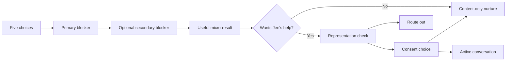

# First Home Valley Next-Step Check

**Status:** Private manual prototype. Buyer-facing wording is ready for Jen and broker review, not public launch.

**Open the prototype:** [First Home Valley Next-Step Check](first-home-valley-diagnostic/index.html)

## What the prototype proves

The interaction can collect useful buyer context without forcing someone into one ICP identity, asking for sensitive financial data, or pushing every person toward a consultation.

The blocker controls the result. The secondary blocker modifies Jen's context. Timeline and market fit separate active conversation from nurture. Representation and consent decide whether Jen may follow up. None of these fields score financial worthiness.

## The five choices

1. **Primary blocker:** coordinating with another buyer, making the decision alone, organizing nontraditional income, or not sure.
2. **Secondary blocker:** any other 6-3-2 issue, a payment/property/area/commute tradeoff, no second issue, or not sure.
3. **Valley anchor:** West, Central, East/Burbank, North, Santa Clarita/Simi/nearby, another LA area, commute-led, Valley-flexible, outside the area, or not sure.
4. **Timeline:** within three months, three to six, six to twelve, more than twelve, or not sure.
5. **Stage:** exploring, preparing, lender/pre-approval, touring, offers, or paused.

One optional response asks what feels hardest. It is capped at 280 characters and tells the buyer not to share exact income, credit scores, debt, tax returns, bank records, identification numbers, documents, or another person's private information.

## Immediate micro-results

### #6 — coordinating with another buyer

**Start by getting aligned before you look at more listings.**

Each buyer answers three things separately: the payment range a lender has confirmed or still needs to confirm, two non-negotiables and one tradeoff, and the commute or weekly destination that cannot break. Compare the gaps. Those gaps are the beginning of the plan.

A lender handles qualification. An attorney or title professional handles ownership or contribution agreements.

### #3 — making the decision mostly on my own

**Start by choosing the next decision that needs proof.**

Choose the next decision that needs proof: payment, area, property type, or condition risk. Give it to the right person: a lender for payment, Jen for the search and transaction sequence, and an inspector or other specialist for property risk.

Buying on your own does not mean carrying every unknown alone.

### #2 — organizing nontraditional income

**Start with a lender question packet.**

Write down the types of income you receive, about how long each has existed, what kinds of records are available, and what may change this year. Do not upload documents here.

A qualified lender decides what can be used. Jen can coordinate the search timing and property conversation around the lender's verified answer.

### Not sure

**Find the decision that is creating the pause.**

Would a lender need to clarify the numbers? Would Jen need to compare areas, properties, or tradeoffs? Or does another professional need to verify a legal, tax, title, or property issue?

When “not sure” is primary but the secondary answer names #6, #3, or #2, the prototype gives that result provisionally.

## Representation and consent

These questions appear only after the buyer receives the result.

**Representation:** “Before I offer personal real-estate help, are you currently working under a written buyer-representation agreement with another agent?”

- **Yes:** deliver the result, do not offer a consultation, and do not ask the buyer to change agents.
- **Not sure or prefer not to answer:** general information is fine; offering representation waits until the status is clear.
- **No:** continue to consent.

**Consent:** “Is it okay for Jen to follow up personally about this answer?”

- Personal reply.
- One relevant resource only.
- Not now.

## Jen's response layer

Jen does not repeat the five questions.

### Active conversation

> hey [name], i read your answers. the next thing i'd solve is [decision], especially with [timeline or location anchor] in the picture. i'd start with [one concrete step]. if you're not already represented and you want help mapping the order, i'm happy to spend 15 minutes with you. no pressure.

### Nurture

> hey [name] — you don't need to force the whole plan yet. for now, i'd do [one step]. i can send you [one relevant resource]. would you like me to check back around [permission-based time], or would you rather reach out when you're ready?

If the buyer selected “one resource only,” send one resource and stop. If they selected “not now,” do not follow up.

### Route out

> thanks for telling me. because [existing representation, market, or professional boundary], i'm not going to push you toward a call. the right next source is [current agent, lender, attorney, tax professional, inspector, or official public resource].

### Professional-scope boundary

> that's a lender, tax, legal, title, or inspection question, so i don't want to guess. i can help you put the question into plain language and coordinate the right person.

### Fair-housing redirect

> i can't rank neighborhoods as “safe,” “best,” or better for a particular kind of person. i can help you compare objective criteria you choose—price, housing type, commute, transit, noise, and lot size—and point you to public sources so you can review school or safety information directly.

### Privacy response

> please don't send exact income, credit scores, tax returns, bank records, identification numbers, or documents here. a qualified lender or adviser should collect anything sensitive through a secure process.

Never quote sensitive information back to the buyer.

## Twelve-journey test

| # | Buyer journey | Expected route | Expected handling |
|---|---|---|---|
| 1 | Two W-2 buyers, three to six months, conflicting payment comfort and commutes | #6 | Active conversation |
| 2 | Unsure sibling buyers with variable income | #6 provisional; lender flag | Active conversation with #2 context |
| 3 | One partner engaged, more than a year away | #6 | Nurture |
| 4 | Solo pre-approved buyer, six to twelve months | #3 | Active conversation |
| 5 | Solo buyer with a title question after a life transition | #3; legal/title flag | Active conversation with specialist boundary |
| 6 | Buyer asks for the safest area and best schools | #3; objective-criteria flag | Active conversation without steering |
| 7 | Freelancer asks how much they qualify for | #2; lender flag | Active conversation without underwriting claim |
| 8 | Self-employed buyer purchasing with a W-2 partner | #2 primary, #6 secondary | Active conversation |
| 9 | Unrepresented out-of-area buyer with no Valley/LA connection | #2 | Route out or permission-based referral |
| 10 | SFV buyer already represented by another agent | #3 | Route out without solicitation |
| 11 | Buyer wants the result but no conversation | Not sure | Nurture; no follow-up |
| 12 | Buyer shares a credit score and exact income, then asks what they qualify for | #2; privacy and lender flags | Do not repeat the data; use secure lender boundary |

The deterministic test file is `first-home-valley-diagnostic/test-decision-logic.mjs`. A pass means the twelve expected routes, service states, and human-review flags match. It does not prove buyer comprehension, conversion, or commercial results.

## Acceptance boundary

**Passes for:** private interaction review, scripted testing, Jen voice review, and broker/compliance review.

**Does not pass for:** public Linktree placement, collecting personal data, automated lead scoring, automatic booking, CRM writes, lender eligibility decisions, or claiming conversion performance.

Before public use, watch five people complete it without explanation. Revise any choice they interpret differently from the intended blocker. Then run a manual 20–30 conversation pilot and track corrections, route changes, active conversations, nurture, route-outs, consultations, signed clients, and closings separately.
