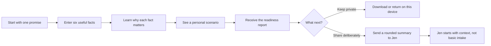

# First Home Valley Readiness Map

## Product brief

**Status:** Scope for review. No app implementation authorized.  
**Owner:** Jen Santulan  
**Prepared:** August 31, 2026  
**Working promise:** In about five minutes, a Valley renter can understand their current first-home picture, see what matters next, and leave with a useful report they can keep or deliberately share with Jen.

## Verdict

Build a **readiness map**, not another mortgage calculator and not a lead-capture quiz.

The first version should combine three jobs:

1. Teach the buyer what the numbers mean while they enter them.
2. Produce a personal, date-stamped report without claiming to qualify or preapprove them.
3. Give Jen a short, consented summary so the first conversation starts past the basic education layer.

The report appears before any email or contact request. A visitor may use the experience privately. Sharing with Jen is a separate, explicit choice.

## The product in one sentence

**First Home Valley Readiness Map** is a mobile-first guided assessment that turns a renter’s income, housing cost, available cash, debts, timeline, and home goal into a plain-language preparation report and a cleaner first conversation with Jen.

## Why this shape

| Possible product | Strength | Failure | Decision |
|---|---|---|---|
| Mortgage calculator | Familiar and easy to understand | Commodity experience; visitors may mistake estimates for affordability or qualification | Do not build |
| Quiz that gates a PDF behind email | Simple lead capture | Gives little value, feels extractive, and does not improve the lead | Do not build |
| Full buyer portal | Could eventually support a long relationship | Accounts, dashboards, document storage, integrations, and maintenance overwhelm the first job | Park |
| **Readiness Map** | Personalized education, useful report, and structured handoff | Must be disciplined about claims, privacy, and stale assumptions | **Build first** |

## The buyer journey

## The six-minute experience

### 1. Welcome and trust contract

The opening says exactly what the experience is:

> See your current first-home picture, understand the numbers, and leave with the questions worth asking next. This is an educational scenario, not a loan approval.

Primary action: **Build my readiness map**.

No email field. No account. No property search.

### 2. Your goal

Collect:

- Desired buying window: exploring, 6–12 months, or within 6 months
- Home type: condo, townhome, single-family home, or unsure
- General target area: SFV, City of Los Angeles, or still exploring
- Buying alone, with a co-buyer, or unsure

Teach: timeline and geography change which questions matter. The experience does not recommend neighborhoods or infer who belongs where.

### 3. Your current monthly picture

Collect:

- Gross household income
- Current monthly rent
- Recurring monthly debt payments
- A comfortable total monthly housing range

Teach: a lender’s maximum and a buyer’s comfortable payment are different. The CFPB advises consumers to focus on what fits their wider budget, not only what they may qualify to borrow.

### 4. Your available cash

Collect:

- Cash currently available for a purchase
- Whether some of it may be a documented gift
- Whether the buyer wants to preserve an emergency reserve

Teach: cash-to-close includes more than the down payment. The experience may show assistance programs to investigate, but only a qualified lender can determine current eligibility and terms.

### 5. Your scenario

Show one transparent example at a time:

- Current rent beside an estimated ownership payment
- Cash available beside an estimated cash-to-close range
- Comfortable payment beside the example payment
- The assumptions used, their source, and when they were verified

Every result uses **estimate**, **example**, **question to verify**, or **possible path to investigate**. It never says **you qualify**, **you can afford**, **you are approved**, or **this program is available to you**.

### 6. Your report

The visitor immediately receives **My First Home Valley Report**.

It contains:

1. **Your current picture:** the facts the visitor entered.
2. **Your planning stage:** Exploring, Preparing, or Ready to Verify. This reflects timeline and information completeness, not worthiness or loan eligibility.
3. **The example scenario:** payment, cash, and assumptions, shown as ranges.
4. **The constraint to investigate first:** payment comfort, cash, monthly debt, timeline, or missing information.
5. **Three next questions:** personalized questions for a lender, Jen, or the buyer’s own budget review.
6. **Documents to begin gathering:** only the standard preparation checklist relevant to the visitor’s stage.
7. **Sources and freshness:** every market or program assumption with its verification date.

Actions:

- Download or print the report
- Save it on this device
- Change an answer and rerun the scenario
- Share a rounded summary with Jen

## How the personalization works

The first version uses deterministic rules, not AI-generated financial guidance.

The rules identify:

- Which input is furthest from the visitor’s stated goal
- Which assumptions have the greatest effect on the example
- Which facts are still unknown
- Which educational card and next question fit that situation

There is no universal readiness score. A single number would imply certainty the tool does not have and invite optimization around the score rather than a useful decision.

### Example outputs

| Situation | Report emphasis | Next useful question |
|---|---|---|
| Comfortable payment is below the example | Payment comfort | “What purchase range keeps the total payment inside my budget?” |
| Cash is the first visible gap | Cash-to-close | “Which costs must be paid from my funds, and which assistance paths are worth checking?” |
| Monthly debts materially change the scenario | Debt picture | “Which debt payment most affects lender calculations?” |
| Timeline is more than 12 months | Preparation | “What can I improve now without applying for a loan?” |
| Key inputs are available and timeline is near | Verification | “What would a licensed lender need to test this scenario?” |

## Jen’s handoff

If the visitor chooses **Share with Jen**, show a clear consent screen before sending anything.

Jen receives a one-minute buyer brief:

- Buyer’s stated goal and timing
- Home type and broad area
- Planning stage
- Rounded income, rent, debt, cash, and payment bands
- Main question or constraint
- Report version and assumption date
- The visitor’s preferred next step
- Consent timestamp

Jen does not need a dashboard in version one. A structured email or secure notification is enough. The visitor receives the same shared summary so the handoff is transparent.

## Privacy and trust boundary

### Keep calculations local by default

Exact numbers remain in the browser unless the visitor explicitly shares them. The handoff rounds financial values into bands unless the visitor chooses otherwise.

### Never collect in version one

- Social Security number
- Date of birth
- Bank or card account numbers
- Credit-report credentials
- Tax returns, pay stubs, or bank statements
- Precise home address or geolocation
- Race, religion, disability, family status, sex, or any other protected-class information

### Required before public release

- Plain notice at collection explaining what is collected and why
- Privacy policy and deletion/contact method reviewed for Jen’s actual business setup
- Explicit consent before sending information to Jen or another party
- Secure transport and restricted access for any submitted summary
- Attorney or qualified privacy review before storing financial-profile data

California’s Attorney General explains that email addresses and household-linked profiles can be personal information and that covered businesses must provide notice at or before collection. The first version should follow the stronger trust standard even if counsel later determines a particular statute does not apply.

## Financial and housing boundaries

- This is education and scenario planning, not lending, prequalification, preapproval, legal advice, tax advice, or financial advice.
- A licensed lender owns qualification, rate quotes, loan terms, and program eligibility.
- Jen owns the real-estate process, buyer education, property context, and the quality of the human handoff.
- Program language says **may be eligible to apply** or **worth asking a lender about**. CalHFA itself directs consumers to approved loan officers for qualification and notes that rates change daily.
- The experience does not segment, score, recommend, advertise to, or exclude visitors based on protected classes.
- Market assumptions are centralized and versioned. Each one has a source, `verified_at`, and `review_by` date. When a value is stale, the app labels it stale and removes the claim that it is current.

## Version-one scope

### Build

- Mobile-first guided flow
- Six input moments
- Plain-language teaching beside each input
- Deterministic scenario engine
- One personalized report
- Print/download function
- Local browser save
- Edit-and-rerun function
- Optional, consented summary to Jen
- Versioned assumptions and source notes
- Analytics for starts, completions, report views, downloads, and voluntary shares

### Park

- User accounts or passwords
- Jen admin dashboard
- CRM synchronization
- Automated text or email nurture
- Property search or MLS integration
- Document upload or storage
- Live credit pulls
- Lender application or preapproval
- AI chat or open-ended financial answers
- Automated program-eligibility decisions
- Multi-agent workflow
- Multiple report types

## Smallest technical shape

1. **Browser application** using the existing First Home Valley design language.
2. **Deterministic rules module** with unit-tested calculations and output language.
3. **Versioned assumptions file** for rates, taxes, insurance, HOA, rent, market benchmarks, and program notes.
4. **Client-side report generator** so a report works without submitting personal information.
5. **One consented serverless handoff endpoint** that sends the rounded summary to Jen.

No database is required for the first private pilot. If Jen later needs history, follow-up status, or multi-device return, that becomes a separately justified data layer.

## Design inheritance

Use the finished First Home Valley visual system as the floor:

- Deep navy, steel blue, soft blue, white, and blue-grey hairlines
- Editorial serif moments paired with stable, readable sans-serif type
- Photography for place and emotion; type for facts and decisions
- One primary action per screen
- Calm, high-trust language rather than gamified celebration
- No green status theater, red failure states, confetti, badges, or “95% ready” scoring

The report should feel like a personal buyer file, not a fintech dashboard.

## Acceptance criteria

The first version is successful when:

1. A first-time visitor can finish and understand the result without Jen’s help.
2. Completion takes about five to seven minutes on a phone.
3. The report works without an email, account, or submission.
4. The visitor can explain why the result is an estimate rather than an approval.
5. Jen can understand a consented lead summary in under one minute.
6. Every calculation exposes its assumptions and date.
7. Stale data cannot silently present itself as current.
8. The experience passes accessibility and strict fair-housing review.
9. The report prints cleanly and can be reopened on the same device.
10. No sensitive document or account credential is collected.

## Pilot before expansion

Test the scoped version with three perspectives:

1. **Jen:** Does the summary make the first conversation better?
2. **A real first-time buyer:** Does the visitor learn something specific and understand the boundary?
3. **A licensed lender or compliance reviewer:** Are the calculations, terms, and handoff language safely framed?

Do not add accounts, CRM wiring, automated nurture, or AI guidance until these three tests show a specific limitation that the added feature would solve.

## Decision locks for the eventual build

- **Product name:** First Home Valley Readiness Map
- **Primary action:** Build my readiness map
- **Take-home artifact:** My First Home Valley Report
- **Contact philosophy:** Value first; sharing is optional and explicit
- **Calculation philosophy:** Transparent examples, never opaque approval language
- **First human handoff:** Jen, with lender verification clearly separated
- **First release:** Private pilot before public lead generation

## Do this / do not do / we are wrong if

### Do this

Build one calm guided conversation that produces a useful personal report and a better-prepared introduction to Jen.

### Do not do

Turn the first release into a mortgage platform, CRM, account portal, lender marketplace, AI adviser, or gated PDF funnel.

### We are wrong if

- Buyers only want a generic payment calculator and ignore the report.
- The report does not change the quality of Jen’s first conversation.
- Visitors mistake the result for qualification or approval.
- Keeping the assumptions current becomes more work than the tool saves.
- People will not share even a rounded summary after receiving value.

## Build gate

Implementation should begin only after Jen agrees that the one-minute lead brief contains the information she actually wants before a first conversation and a lender/compliance reviewer accepts the calculation and program-language boundaries.

## Official grounding

- [CFPB: Decide how much you want to spend on a home](https://www.consumerfinance.gov/owning-a-home/prepare/decide-how-much-you-want-spend/)
- [CFPB: Get a preapproval letter](https://www.consumerfinance.gov/owning-a-home/explore/get-a-preapproval-letter/)
- [CalHFA: MyHome Assistance Program](https://www.calhfa.ca.gov/homebuyer/programs/myhome.htm)
- [California Attorney General: CCPA overview](https://oag.ca.gov/privacy/ccpa)
