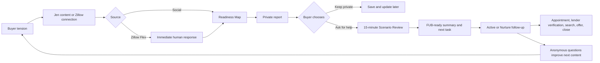

# First Home Valley Revenue-System Roundtable

## Ideation verdict

**Status:** Scope expansion for review. No application build, CRM integration, publishing, outreach, or paid distribution is authorized.

The First Home Valley Readiness Map is a strong product concept, but the current scope stops one step too early. It produces a better-informed buyer and a useful report; it does not yet define the operating path that turns that clarity into a conversation, an appointment, a represented buyer, or a closing.

The smallest coherent expansion is not a larger app. It is one measurable loop:



**Positioning:** Jen becomes **the honest Valley first-home translator**: the agent who explains the real decision before asking someone to buy.

**Automation principle:** Automation carries context. Jen carries trust.

## What the existing scope nails

| Strength | Why it matters |
|---|---|
| Value before capture | A buyer receives the report before being asked for contact information. The experience earns trust instead of extracting a lead. |
| Private-first financial inputs | Exact numbers stay on the buyer's device unless the buyer deliberately shares them. |
| Honest education | The Map explains comfortable payment, cash to close, timing, and next questions without pretending to qualify or preapprove. |
| No fake readiness score | Exploring, Preparing, and Ready to Verify describe a planning stage, not worthiness or eligibility. |
| Useful handoff | Jen receives a short, rounded summary rather than a pile of raw intake data. |
| Clear human boundaries | Jen owns buyer education and property guidance; a licensed lender owns qualification, rates, programs, and terms. |
| Scope discipline | Accounts, dashboards, document storage, credit pulls, AI financial advice, and MLS search remain parked. |
| Strong visual identity | First Home Valley already looks like a trusted personal buyer file rather than a generic fintech calculator. |
| Existing content inventory | The carousel, five Reel concepts, listing-video ability, math sheet, and demonstration create a real starting surface. |

## What the scope is missing

| Missing link | Consequence if omitted | Smallest correction |
|---|---|---|
| A named conversion event | “Share with Jen” is vague and passive | Offer an optional **15-minute First-Home Scenario Review** |
| Separate social and Zillow journeys | One sequence adds friction to high-intent Zillow connections | Social enters through the Map; Zillow gets immediate human response first and the Map second |
| Source attribution | Engagement cannot be connected to conversations or closings | Add `source`, `campaign`, and `content_id` to links |
| Follow Up Boss ownership | The system can duplicate team or Zillow nurture | Produce an FUB-ready summary and manual procedure before live integration |
| Stage-specific next actions | Every user receives the same generic CTA | Match the next step to Exploring, Preparing, or Ready to Verify |
| Appointment and conversion measurements | A high completion rate can masquerade as revenue proof | Track contact, appointment, held consultation, client, offer, and closing stages |
| A content-learning loop | Jen keeps guessing what to post | Turn recurring anonymous buyer questions and objections into the next content cycle |
| A return reason | An early buyer downloads once and disappears | Let the buyer reopen and update the dated report when circumstances change |
| A response contract | Automation can create a faster lead with no clear human owner | Name who responds, through which channel, and within what honest service window |
| Baseline data | “Three to five closings” remains untestable | Pull Jen's last 90–180 days by source before forecasting |

## The closing goal: useful ambition, not yet a forecast

Three to five closings per month is the outcome goal. It is not a responsible promise for the Readiness Map or social content.

The operating equation is:

```text
Closings =
leads or connections
× valid-contact rate
× appointment-set rate
× appointment-held rate
× consultation-to-client rate
× client-to-close rate
```

### Planning arithmetic

The following is scenario math, not an industry benchmark or a prediction of Jen's performance.

| End-to-end lead-to-close rate | Leads needed for 3 closings | Leads needed for 5 closings |
|---:|---:|---:|
| 5% | 60 | 100 |
| 10% | 30 | 50 |
| 15% | 20 | 34 |
| 20% | 15 | 25 |

Zillow's Flex Operational Blueprint says partners perform best at approximately 10–15 connections per agent each month and that performance may fall when agents carry more than 15. At that volume, three Zillow-only closings would require roughly a 20–30% connection-to-close rate; five would require roughly 33–50%. Those are arithmetic requirements, not evidence that Jen can or cannot do it.

The more credible path is a blended pipeline:

1. Improve the percentage of existing Flex connections that reach appointments and active-search milestones.
2. Add warmer, self-educated social and referral inbound.
3. Reactivate some long-horizon nurture leads with useful education instead of generic check-ins.
4. Measure all three cohorts separately before combining their results.

### Baseline Jen needs before forecasting

Pull the last 90–180 days separately for Zillow Flex, social, referral, sphere, and other sources:

- Leads or connections received
- First-response time
- Two-way contacts
- Appointments set and held
- Buyer consultations
- Committed or represented clients
- Lender-verified buyers
- Tours or showings
- Offers
- Pendings and closings
- Days between stages
- Follow-up attempts before response
- Current Follow Up Boss tag and stage completeness
- Nurture leads reactivated

Until this exists, the honest value statement is:

> This gives us a measurable system for improving buyer preparation and follow-up. We establish Jen's baseline, test whether the system improves the weakest conversion link, and forecast closings only from her real numbers.

## The real buyer pain points

### 1. “I do not know if I am actually ready.”

Zillow's 2025 prospective-buyer research found that only 28% of mortgage-intending prospects reported being preapproved, only 51% correctly understood preapproval, and 55% of prospective first-time buyers had paused to save for a down payment.

**System response:** Explain readiness as a set of questions and next steps, not a binary verdict.

### 2. “I am afraid the payment will be worse than I expect.”

Buyers need the total monthly picture, not a seductive principal-and-interest number.

**System response:** Compare a comfortable payment with a transparent example, surface assumptions, and let the buyer preserve a reserve.

### 3. “I think I need 20% down.”

More than half of prospective mortgage buyers in Zillow's 2025 study planned to put down less than 20%.

**System response:** Teach that 20% is one path while keeping eligibility and program decisions with a licensed lender.

### 4. “I do not want to be sold before I understand.”

First-time buyers report more stress than repeat buyers. Zillow found that 66% of successful first-time buyers described the process as at least somewhat stressful.

**System response:** Deliver the report privately first. Make conversation and sharing optional.

### 5. “I am only browsing.”

Browsing is not necessarily disengagement. Zillow reports that, during the 30 days after a buyer contacts an agent, the buyer returns to Zillow an average of 27 times and visits 77 listing pages.

**System response:** Treat early and quiet contacts as a lifecycle. Give them specific help and a way to return rather than a stream of “still looking?” messages.

### 6. “I cannot see what the agent adds beyond a listing portal.”

NAR's 2025 research says buyers place high importance on honesty, responsiveness, purchase-process knowledge, market knowledge, calls, texts, and timely property information. Merely being active on social media ranked much lower.

**System response:** Use social to demonstrate those service qualities before the first conversation.

## The real Jen and team pain points

| Pain point | What the system should improve |
|---|---|
| Good-looking content without a destination | Give each campaign one useful path without forcing a conversion line into every spoken video |
| Listing videos that show the property but not Jen's judgment | Add the buyer decision beneath the beauty |
| Repeating basic education on calls | Let the report teach foundations while Jen handles the hard cases |
| Zillow leads labeled weak too early | Separate Follow Up Now, Active, Nurture, and No Response behavior |
| Duplicate or inconsistent follow-up | Respect existing Flex, ISA, team, and FUB ownership |
| No source-to-close visibility | Add source codes and a simple cohort scorecard |
| Content planning from guesswork | Mine buyer questions and pipeline friction for weekly topics |
| More automation to maintain | Start with manual proof and automate only repeated, useful steps |

## Two entry paths, one system

### Social inbound

```text
Buyer question
then Reel, carousel, Story, or listing interpretation
then MATH response
then Readiness Map
then private report
then optional Scenario Review
then FUB-ready summary
then human response
```

Keep **MATH** during the pilot because the finished assets already use it. Renaming the keyword to MAP now creates avoidable asset drift. Reconsider the audience-facing keyword only after evidence.

### Zillow Flex

```text
Zillow connection
then immediate personal response, tour help, or appointment
then Readiness Map as preparation or useful second touch
then stage-specific report
then FUB disposition and next task
then human-led follow-up
```

The Map must never become homework Jen requires before helping a Zillow lead. It should make the next conversation better, not delay it.

## Jen's ownable social system

### Editorial position

> Jen tells Valley first-home buyers the truth before she asks them to buy.

Functional expression:

> Jen is the calm Valley first-home translator who turns confusing listings, monthly numbers, and next steps into a clear personal map.

### Recurring show

**Could This Be Your First Home?**

Jen uses a real listing to answer:

1. What life does this property actually enable?
2. Which costs, documents, or conditions should a first-time buyer verify?
3. What would make it fit or fail a buyer's stated plan?

This preserves Jen's clothing and personal taste as recognizable host identity. It preserves her good listing videos as proof of current market participation. It adds the missing reason to choose her: her judgment.

### Minimum weekly loop

Start with one pipeline-derived buyer tension, not three unrelated original ideas.

1. **Anchor Reel:** a myth, fear, property decision, or misunderstood number.
2. **Carousel or Story sequence:** a useful expansion of the same question.
3. **MATH invitation:** place the response trigger in the caption or Story and deliver the private Map immediately.
4. **Human follow-up:** only when a buyer requests it or shares the report.
5. **Learning receipt:** what question, response, or stage movement should change the next cycle?

Natural Stories, showing preparation, local observations, and personal/style moments can maintain familiarity around the anchor. They do not need to disappear or pretend to be direct-response content.

Jen's spoken closer should remain relational, such as “Let's take a look.” Put the MATH response in the caption or Story where it does not make the video sound like a funnel.

## Smallest automation layer

### Automate now or prepare for the pilot

- Deliver the Readiness Map immediately after the approved MATH trigger.
- Preserve `source`, `campaign`, and `content_id`.
- Generate the private report in the browser.
- Prepare the consented one-minute Jen summary.
- Produce an FUB-ready record containing source, stage, main constraint, preferred next step, consent, and response owner.
- Remind the human owner when a promised response is due.
- Produce a weekly anonymous topic queue from recurring questions.
- Draft content variants for Jen's review.

### Keep human-led

- First response to a live Zillow connection
- Buyer questions that need judgment
- Scenario Review
- Property interpretation
- Lender introductions
- Negotiation, offers, and client judgment
- Approval of anything published in Jen's voice

### Do not build yet

- A second CRM or Jen dashboard
- Live FUB automation before team fields, permissions, and ownership are confirmed
- An autonomous social publishing bot
- Generic automated nurture that duplicates Zillow or team follow-up
- AI financial advice or program eligibility
- Accounts, passwords, document storage, credit pulls, or MLS search
- Multiple buyer reports or a seller funnel inside this product

## Scope recommendation

### Add to the Readiness Map brief now

1. A 15-minute First-Home Scenario Review as an optional, stage-appropriate conversion event.
2. Separate social and Zillow entry paths.
3. Source, campaign, and content attribution.
4. A return-and-update path for the report.
5. A FUB-ready handoff schema and named response owner.
6. Leading and downstream funnel metrics by source.
7. A content-learning loop using aggregated, non-identifying questions.
8. A rule that the Map never delays a live appointment or replaces human service.

### Validate manually before implementation

- Whether the one-minute summary is genuinely useful in Follow Up Boss
- Which stage and task fields the team already uses
- Who owns Flex nurture and how duplicate contact is prevented
- Whether buyers accept the Scenario Review invitation
- Whether Map-assisted conversations are materially better
- Whether one anchor content loop is sustainable for Jen

### Park

- Live CRM integration
- Full nurture automation
- Automated distribution
- Dashboard and database
- More content formats
- Any promise tying the tool directly to 3–5 closings

## Jen's ChatGPT operator layer

### Verdict

Use Jen's existing ChatGPT access as a **private operating companion**, not as the public buyer experience and not as a replacement CRM.

The first version should be a ChatGPT Project named:

> **First Home Valley Operator**

OpenAI's current guidance says Projects keep related chats, uploaded files, project instructions, and connected sources together. ChatGPT Work can carry larger tasks through to reviewable files and, where enabled, can use projects, plugins, web research, recurring tasks, and reusable skills. Exact capabilities depend on plan, platform, region, rollout, and workspace settings.

This means Jen can use the subscription she already has before Farrice builds a custom agent or API integration.

### Project source pack

The project should contain only approved, reusable material:

- First Home Valley voice and visual guidance
- The content kit and approved listing-video format
- The Readiness Map product brief and report anatomy
- Current source ledger with verification and review dates
- Fair-housing and financial-claim boundaries
- Jen's approved response tone and service promise
- The FUB-ready summary schema, without live credentials
- A short list of approved calls to action
- Examples of strong and unacceptable outputs

Do not upload raw client financial documents, Social Security numbers, credit information, or unrestricted CRM exports. Use anonymized or rounded summaries until the team confirms privacy, retention, permissions, and workspace policy.

### Four repeatable chats

Keep each outcome in a separate project chat so the context remains shared without mixing every job together.

#### 1. Buyer conversation prep

**Input:** A consented, rounded lead summary or anonymized FUB note.

**Output:**

- What the buyer appears to be trying to decide
- The next useful question
- A draft personal text or email for Jen to approve
- The appropriate next milestone
- What ChatGPT cannot determine

This prepares Jen. It does not contact the buyer or make qualification judgments.

#### 2. Buyer question to content

**Input:** One anonymized buyer question, objection, or repeated pipeline constraint.

**Output:**

- One anchor Reel
- One carousel outline or Story sequence
- One Readiness Map teaching-card suggestion
- One human follow-up message for buyers with the same question
- Sources and freshness warnings

This becomes the content-learning loop: real buyer friction, turned into useful public education.

#### 3. Could This Be Your First Home?

**Input:** Verified listing facts, approved photography or video, known costs, and objective property information.

**Output:**

- A listing-video hook
- The lifestyle or practical use the property enables
- Three costs or conditions to verify
- Who the property may fit by stated budget, timing, and property preference, never protected characteristics
- One MATH invitation

Jen reviews the script before recording. The project must flag missing facts instead of inventing them.

#### 4. Weekly pipeline and content review

**Input:** Aggregated source and stage counts, plus anonymized questions from the week.

**Output:**

- The weakest current conversion link
- Which cohort needs attention
- The next buyer question worth answering publicly
- One experiment for the following week
- A short proof receipt: sent, replies, appointments, held consultations, clients, offers, pendings, and closings

ChatGPT may analyze the scorecard; Jen and the team remain responsible for the data and the operational decision.

### What ChatGPT Work can help produce

Subject to Jen's enabled features and workspace policy, ChatGPT Work can help prepare:

- Content and scripts for review
- Consultation briefs
- Follow-up drafts
- Source and claim audits
- Weekly spreadsheets or reports
- Updated buyer education documents
- Visual concepts and presentation revisions
- A private prototype or specification for the Readiness Map

It should not independently publish, send messages, edit the CRM, or make consequential buyer decisions without explicit approval and properly configured access.

### Smallest setup before custom development

1. Create the First Home Valley Operator Project.
2. Add the approved source pack and project instructions.
3. Create the four named chats above.
4. Test each chat on a fictional or anonymized example.
5. Compare the output with Jen's real judgment.
6. Revise the instructions before adding plugins, connected accounts, scheduled tasks, or API development.

This is the use-now companion. The public Readiness Map remains the buyer-facing product; Follow Up Boss remains the pipeline system; Jen's ChatGPT Project becomes the preparation and learning layer between them.

## Thirty-day leading-indicator pilot

Thirty days can test usability, conversation, appointment, and operating signals. It cannot prove stable closing output.

### Days 1–3: establish the baseline

- Pull Jen's recent Flex and social funnel data.
- Confirm the team's Follow Up Boss ownership, stages, and duplicate-nurture rules.
- Choose one response owner and one honest response standard.

### Week 1: prove the social loop

- Publish only after approval: one existing carousel, one Reel, and one Story route.
- Use source-coded links and the existing MATH keyword.
- Track Map starts, completions, voluntary shares, and Scenario Review requests.

### Week 2: prove the Flex support path

- Use the Map after appropriate new Flex conversations.
- Do not gate tours or appointments.
- Record whether the report improves the next conversation and stage decision.

### Week 3: test respectful re-entry

- With team approval and within existing consent rules, test the Map with a small set of stalled nurture contacts.
- Use a specific preparation question, not a generic “still looking?” message.

### Week 4: review leading indicators

- Map completion and voluntary-share rate
- Map-to-conversation and Scenario Review rate
- Appointment-held rate versus the prior baseline
- Next-milestone rate, such as lender verification or active search
- Jen's time saved and usefulness of the one-minute summary
- User understanding and trust

If the pilot includes fewer than roughly 20 eligible contacts, treat the month as usability and directional signal evidence, not conversion proof. Follow the cohorts for 90–180 days before drawing closing conclusions.

## Seven-minute demonstration for Jen

### 0:00–0:45: Reframe the problem

> Your content already looks good. I built the missing path that gives it a job and makes the first buyer conversation better.

### 0:45–1:45: Show the current carousel and one Reel

Explain that they begin with a real buyer tension and lead to one response: MATH.

### 1:45–2:35: Show the static math sheet

Present it as the useful first version and the precursor to a personal report.

### 2:35–3:35: Show the Readiness Map journey

Six inputs, education beside each input, a private report, and optional sharing. Emphasize that the buyer receives value before contact capture.

### 3:35–4:30: Show Jen's one-minute brief

Reveal goal, timing, stage, rounded financial bands, main constraint, source, and preferred next step.

### 4:30–5:20: Walk the two operating paths

For a social lead, move from content to the Map, the report, and an optional Scenario Review. For a Zillow lead, respond personally first, then use the Map to prepare the next action.

### 5:20–6:10: Show the human-plus-automation boundary

The system delivers, organizes, attributes, reminds, and prepares. Jen responds, interprets, advises, and builds the relationship.

### 6:10–7:00: Show the proof plan

> We are not guessing that more posts mean more closings. We will measure where your current leads stall, test whether this improves the next stage, and forecast from your real funnel.

End with one operational question:

> Which group currently wastes the most opportunity: new Zillow connections, long-term nurture, or people who take an appointment but never reach lender verification?

## Immediate content correction

The current co-buying cover says:

> You don't have to buy this alone. Most people aren't.

The cited content says 37% reported buying with someone other than a spouse. That does not support “most.” Replace the cover claim before publication with:

> You do not have to buy your first home alone.

The body should preserve the supported figure and the reminder that co-buying requires financing, ownership, exit, and legal agreements.

## Roundtable disagreement worth preserving

1. **CRM depth:** Real-estate production favors a structured FUB handoff immediately; social strategy and product strategy favor manual proof before live integration. Define the schema and manual process now, then defer the integration.
2. **Content volume:** A complete weekly show could accelerate learning but may burden Jen. Begin with a single original anchor and repurpose it across formats.
3. **Appointment pressure:** A conversion event is necessary, but forcing every report into a call would break the trust contract. Keep the Scenario Review optional and stage-appropriate.
4. **Keyword:** MAP matches the product name, but MATH already exists in finished assets. Keep MATH during the pilot.
5. **Pilot horizon:** Thirty days is enough for leading indicators, not closings. Run a 30-day operating test and follow revenue cohorts for 90–180 days.

## Claims grounding table

| Claim | Source | Status |
|---|---|---|
| Zillow recommends approximately 10–15 connections per agent monthly and warns that higher loads can reduce conversion | Zillow Flex Operational Blueprint | GROUNDED |
| Flex operations depend on segmentation, nurture, appointment conversion, and CRM upkeep | Zillow Flex Operational Blueprint | GROUNDED |
| Flex contact tags distinguish stages such as Nurture, Follow Up Now, No Response, and ZHL Opportunity | Zillow Premier Agent Contact Tags | GROUNDED |
| A contacted Zillow lead returns an average 27 times and visits 77 listing pages in 30 days | Zillow Premier Agent lead-conversion guidance | GROUNDED |
| Only 28% of mortgage-intending prospects were preapproved and 51% correctly understood preapproval | Zillow Consumer Housing Trends 2025 | GROUNDED |
| Fifty-five percent of prospective first-time buyers paused to save a down payment | Zillow Consumer Housing Trends 2025 | GROUNDED |
| Sixty-six percent of successful first-time buyers described the process as at least somewhat stressful | Zillow Consumer Housing Trends 2025 | GROUNDED |
| Buyers value calls, texts, responsiveness, process knowledge, and timely listing information more than mere social activity | NAR 2025 Generational Trends | GROUNDED |
| ChatGPT Projects can keep shared files, sources, chats, and project instructions together | OpenAI Projects documentation | GROUNDED |
| ChatGPT Work can produce reviewable work using available projects, files, tools, and enabled capabilities | OpenAI ChatGPT Work documentation | GROUNDED |
| Three to five closings likely requires a blended pipeline | Arithmetic plus unknown Jen baseline | SUPPLEMENTED |
| The Readiness Map will improve appointments or closings | Not yet tested | UNTESTED |
| Jen's current social content does or does not generate closings | No source-level baseline supplied | UNCONFIRMED |

## Composition ledger

| Slot | Contribution | Accepted change | Evidence of integration |
|---|---|---|---|
| Spine: client revenue system | Treat the Map as one link in source-to-close operations | Added two entry paths, funnel math, FUB-ready handoff, and cohort measurement | Scope recommendation and pilot |
| Differentiator: realtor social | Make Jen the honest Valley first-home translator | Added editorial position, recurring listing format, and one-anchor content loop | Social-system section |
| Mechanism: product-to-promotion | Require traffic, holding pattern, and a conversion event | Added the Scenario Review, return path, and feedback loop | System map and scope additions |
| Craft: existing First Home Valley assets | Preserve trust, visual identity, listing-video skill, and personal style | Existing assets become the front end of the buyer journey | Demo and editorial format |
| Risk gate: source and compliance evidence | Prevent qualification claims, duplicate nurture, stale data, and false closing promises | Kept lender boundary, manual CRM proof, source tracking, and long-horizon evaluation | Automation boundary and claims table |

**Owner:** Jen owns the buyer experience and human relationship. Farrice owns the scoped demonstration and system design. The team/FUB owner must be confirmed before operational integration.

**Integration rule:** One buyer journey, one report, one human conversion event, one existing CRM, and one measurable feedback loop.

**Expert-soup check:** PASS. Every seat changed a named decision; overlapping automation ideas were reconciled into manual proof before integration.

## Decision surface

### LOCKED

- First Home Valley remains a private-first buyer education experience.
- Jen's human judgment is the product; automation supports it.
- Social and Zillow use different entry sequences.
- The Map never delays a live lead response or tour.
- No closing promise is made before Jen's funnel baseline exists.

### PARKED

- Application implementation
- Live Follow Up Boss integration
- Automated nurture and social publishing
- Dashboard, accounts, database, and additional funnels
- Any claim that the system will create 3–5 closings per month

### NEXT DECISION

Confirm with Jen which current leak deserves the first pilot: new Zillow connections, long-term nurture, or post-appointment buyers who do not reach lender verification.

## Sources

- [Zillow Flex Operational Blueprint](https://www.zillow.com/premier-agent/operational-blueprint/)
- [Zillow Premier Agent Contact Tags](https://www.zillow.com/premier-agent/contact-tags/)
- [Zillow: Converting Your Leads and Connections](https://www.zillow.com/pro/converting-your-leads-and-connections/)
- [Zillow: Follow Up Boss product updates](https://www.zillow.com/pro/follow-up-boss-product-updates/)
- [Zillow Consumer Housing Trends 2025: Prospective Buyers](https://www.zillow.com/research/prospective-buyers-consumer-housing-trends-2025-35888/)
- [Zillow Consumer Housing Trends 2025: Buyers](https://www.zillow.com/research/buyers-housing-trends-report-2025-35688/)
- [NAR 2025 Home Buyers and Sellers Generational Trends](https://cms.nar.realtor/sites/default/files/2025-04/2025-home-buyers-and-sellers-generational-trends-04-01-2025.pdf)
- [OpenAI: Projects and chats](https://learn.chatgpt.com/docs/projects)
- [OpenAI: Use ChatGPT and ChatGPT Work](https://learn.chatgpt.com/docs/use-chatgpt)
- [OpenAI: ChatGPT Work Overview](https://learn.chatgpt.com/docs/enterprise/chatgpt-work-overview)
