# SUBLINE — Brand Identity Package
## Performance Dancewear · For Josh & Farrice · Garage review, 2026-05-01

---

> *The line beneath the line.*

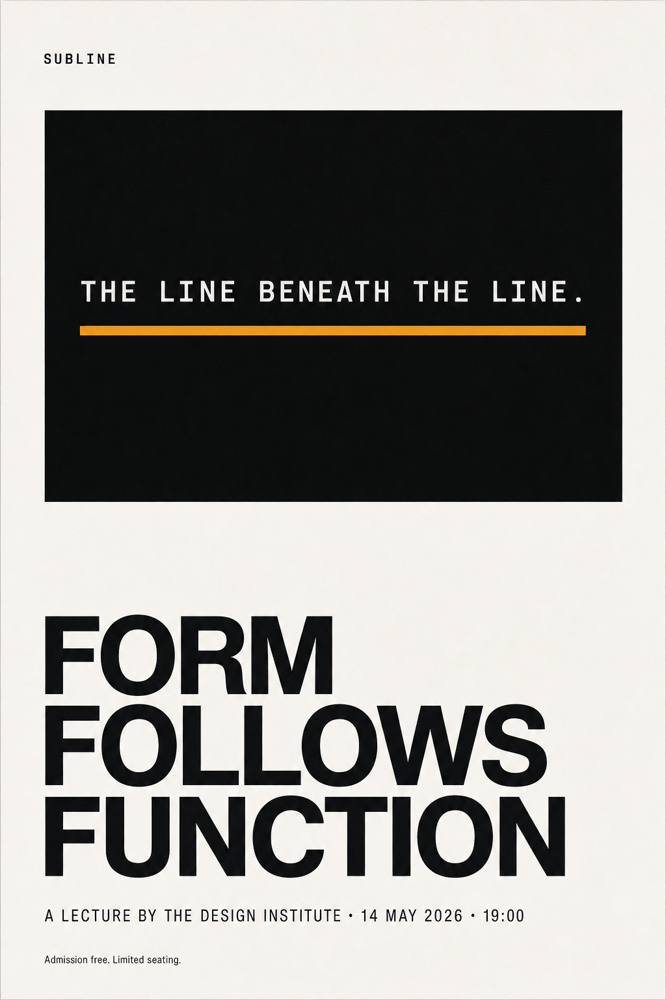

---

## What This Is

A first-read brand identity package for Josh's performance dancewear concept — "Under Armor's technical credibility × Nike's aspirational identity, built for working dancers." Generated tonight via the full Antigravity system stack: parallel competitive-intel + ICP deep canvass, naming sprint, manifesto + voice rules, DESIGN.md v2 spec, six visual concepts.

This is a **30-minute scrollable artifact**, not a 40-page deck. It exists so Josh can see what the brand could *feel* like with our system behind it, before the energy of the idea fades.

What's in scope: positioning, naming, voice, visual direction, six concept renders.
What's out of scope: TM verification, photography production, fabric R&D, e-commerce build.

---

## The Single Truth (from the ICP deep canvass)

> *The working dancer is a professional athlete trained to make the audience forget she's an athlete. Sweat is the failure of that erasure.*

Every brand decision below derives from this sentence. Sweat-blocking isn't a feature — it's protecting the illusion the dancer's craft depends on. The whole brand thesis lives in that distinction.

---

## The Name

# SUBLINE

**Sub-line.** The line beneath the line. *Line* is the most loaded word in a dancer's vocabulary — "she has beautiful line." Subline names the product's job in three syllables of language they already speak. The brand name and the master tagline are the same thought said twice.

**Top 3 ranked** (full rationale in `../foundation/naming-candidates.md`):
1. **SUBLINE** — recommended primary. Dancer-native vocabulary. Industrial-mono typesettable. System extends naturally (STAGE LINE, RUN LINE, EIGHT LINE, TOUR LINE).
2. **LATENS** — Latin for "lying hidden." Strongest pure brand-feel. Patagonia-tier defensibility. Fallback if SUBLINE TM-blocked.
3. **SOTTO** — Italian *sotto voce*, "under the voice." Tracksmith-tier dignity. Risk: food/hospitality TM crowd around the word.

> **TM verification still required before any external launch.** Names are instinct-flagged tonight, not trademark-cleared.

---

## The Positioning

> **SUBLINE makes performance undergarments for working dancers, so the audience sees the art instead of the labor.**

22 words. Names the product, the buyer, the outcome. "Working dancer" claims the segment. "Art instead of labor" names the entire job the product does — protecting the illusion the craft depends on. Repeatable from memory after one read.

---

## The Manifesto (excerpted — full version in `../foundation/positioning-manifesto.md`)

### I. The Truth

Every working dancer trains as an athlete and performs as an erasure.

The lifts, the reps, the cross-training, the cardio, the years of conditioning — that body is built like a sprinter's. Then she walks out under stage lights and her job is to make that body look like it was never built at all. The audience can't see the labor or the work breaks. The illusion is the art.

Sweat is what happens when the illusion slips. The pit stain on the playback. The wet stripe down the back of the costume. The moment in row 3 when someone notices. It is not a hygiene problem. It is the audience watching the curtain on her training fall and seeing the athlete she trained ten thousand hours to hide.

### II. The Engineering

Subline is the layer between the dancer and the costume. It is built to block visible sweat where it shows on stage, to hold the line where the costume sits, to disappear where the costume can't. Engineered for the eight-show week. Tested on tour. The fabric is the proof. The fit is the difference.

**Sweat in the studio. Stage-clean on the stage.**

### III. The Stand

A dancer is a professional athlete trained to make the audience forget she's an athlete. That is the highest discipline in performance. It deserves infrastructure built to honor it.

We are dancers, and we are building this for dancers, and we are not asking anyone for permission to take the work seriously.

> *The audience sees the art. We work in the line beneath it.*

---

## The Tagline System

Josh's working tagline — *"Don't let them see you sweat."* — is held as the internal north-star reference. **It is NOT recommended for public use** because it is a near-direct echo of Dry Idea's iconic 1980s "Never let them see you sweat" antiperspirant campaign — a cultural association loud enough that press would read SUBLINE as derivative. (Risk detail in `../RISKS.md`.)

The public tagline system:

| Tier | Line | Application |
|---|---|---|
| 🥇 **Master** | *The line beneath the line.* | Hangtags, packaging, hero homepage, video close-cards. Locks with the wordmark. |
| 🥈 **Campaign workhorse** | *Sweat in the studio. Stage-clean on the stage.* | Social ads, TikTok, dancer-evangelism posts. Splits "real dancers sweat" objection without fighting it. |
| 🥉 **Proof tagline** | *Engineered for the eight-show week.* | PDPs, Broadway-segment ads, category lockups. |

(Full set of 7 candidates with rationale in `../foundation/tagline-candidates.md`.)

---

## The Visual Direction

**Locked register: Performance-Tech.** Reference adjacencies: Tracksmith × Apolla × Under Armour × Nike Pro. The hero argument is engineering — the dignity follows. *Anti-references*: Lululemon, Alo Yoga, anything athleisure / wellness.

### Color
| Role | Hex | Use |
|---|---|---|
| Primary | `#000000` true black | Wordmark, ground, packaging |
| Field | `#F2EDE0` bone / chalk | Backgrounds, paper, photography seamless |
| Mid | `#3A3A3A` graphite | Body copy, secondary marks |
| **Accent** | **`#F2A33C` Spotlight Amber** | **Single accent — used sparingly. Stage-light reference, technical-pride signal.** |

### Type
- **Display**: GT Pressura Mono (free fallback: JetBrains Mono)
- **Body**: Söhne (free fallback: Inter Variable)
- Wordmark: SUBLINE all-caps industrial mono with a single 1px horizontal rule beneath, visualizing the master tagline.

### Photography
Hard single-source tungsten Fresnel light. 1:8 fill ratio max. Real working dancers — commercial / contemporary / drag. Backstage hallways, dressing-room mirrors, the moment between scenes. **Never** stage-during-performance. **Never** lifestyle Sunday morning. **Never** soft-pastel wellness register.

Full DESIGN.md v2 spec (532 lines, executable to a designer tomorrow morning): `../design/DESIGN.md`.

---

## Six Concept Visuals

> ⚠ **Honest framing.** These are AI-generated concept renders showing the brand voice and visual register. They are **reference for production**, not finished assets. Some carry style-template artifacts (notably "MODE / Quiet Power Issue" magazine framing on three of them, "Form Follows Function" lecture-poster overlay on two). Real production photography from the DESIGN.md spec is the next step. Reading them as concept-direction, the system holds together.

### 1. Campaign Hero — *"The line beneath the line."*

The master tagline as a typographic poster. SUBLINE wordmark top-left, headline on a black panel, Spotlight Amber accent stripe beneath. Bottom half ("Form Follows Function / Lecture by the Design Institute") is a Swiss-template artifact — it actually reads on-brand for the engineering register, but the bottom typography would be replaced in production.

### 2. Drop Campaign Poster — *Performance Mode*

Originally briefed as a clean wordmark lockup; the system produced an event/drop-style poster instead — and it's strong as that. Three dancers in stress poses, industrial-mono "MOVE 07 / PERFORMANCE MODE" headline, SUBLINE wordmark below, amber accent on the figures. Reads as a Nike-tier campaign drop. **Repositions** as a launch / drop / capsule announcement asset.

### 3. Dancer-As-Athlete — Backstage Editorial

The photographic register the brand lives in. Working dancer mid-arabesque in a backstage hallway, "DRESSING ROOM" door visible, hard tungsten light, deep shadows. The "MODE / Quiet Power Issue" framing is style-artifact but reads as on-brand editorial-press positioning. **Production direction**: real photographer, this composition, no magazine overlay.

### 4. Product Hero — Stage Line 04
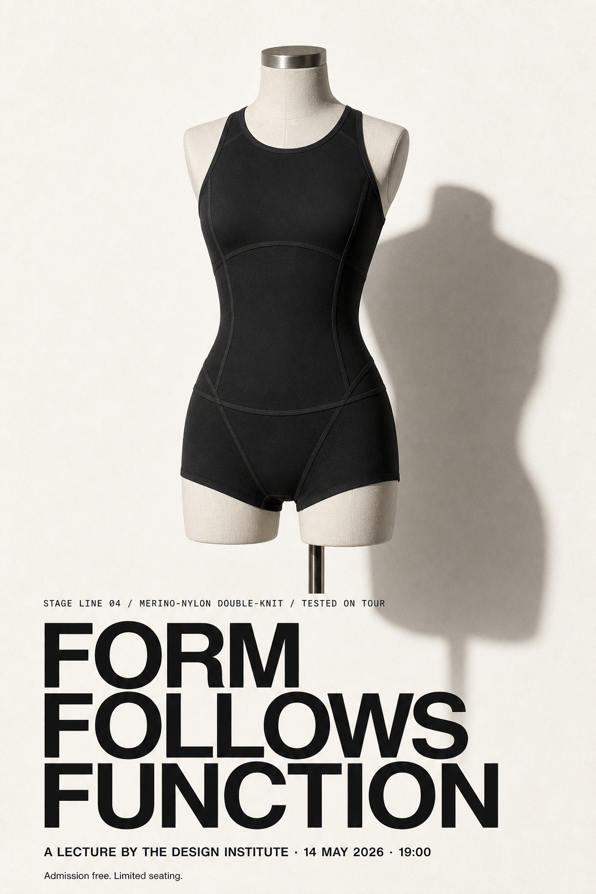
Black foundation garment on dressmaker form, bone seamless, dramatic studio shadow. Technical caption beneath: *"STAGE LINE 04 / MERINO-NYLON DOUBLE-KNIT / TESTED ON TOUR"* — exactly the brand voice. Bottom half is "Form Follows Function" template artifact (would be replaced in production), but the top half IS the product photography register.

### 5. Packaging Mockup

Matte-black corrugated box with industrial-mono printing. SUBLINE wordmark, technical labeling block (`STAGE LINE 04 / MERINO-NYLON DOUBLE-KNIT / SIZE M / BATCH 25-04 / MADE IN PORTUGAL / TESTED ON TOUR`). Pharmaceutical-grade restraint. The "MODE" magazine frame reads as editorial-press placement of the product. **Strong as-is** for concept direction.

### 6. Backstage Portrait — *The Quiet Power*
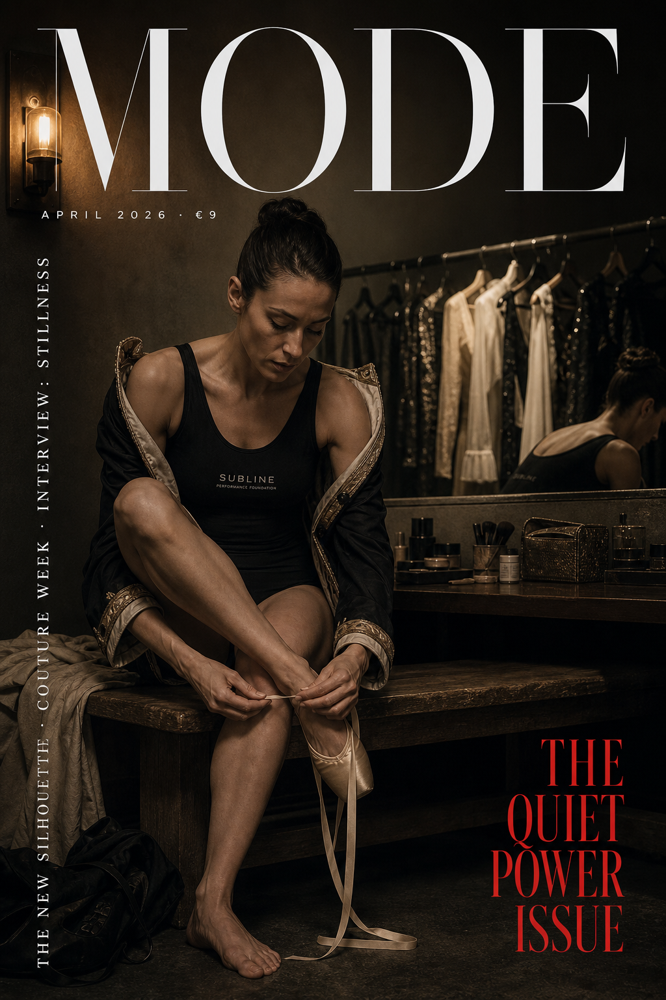
Working dancer in the dressing room, mid-prep, lacing a shoe. SUBLINE wordmark visible on her foundation garment. Costume rack behind her. Tungsten light from a wall sconce. This is the brand at full register — quiet authority, dancer-as-professional, no glamour, no smile, no inspiration. The Tracksmith × Pina Bausch composition the brand book calls for.

---

## Six More Visuals — The Swing-Dance Suite (For Josh's World)

> **Built specifically for Josh's network — competitive Lindy Hop / swing dance.** Strategic gift: Lindy Hop strengthens the SUBLINE thesis tremendously. It's one of the sweatiest dances on earth, partner-dance dynamics make sweat-transfer a felt social fact, the community has costume rituals already, and it's mixed-gender / mixed-age by design (which means the imagery covers men, women, and the 22-65 age range that's actually on the floor).
>
> **Process upgrade for this set**: Creative Director skill loaded with full SUBLINE brand foundation. Each prompt built on the *Three Anchors* (Visual Hook + Emotional Core + Cultural Anchor) with named photographer references — Annie Leibovitz Wieden+Kennedy Nike work, Pina Bausch *Café Müller*, Diane Arbus directness, Eve Arnold's 1950s jazz-club reportage, the Tracksmith Trackhouse documentary register. Editorial-fashion as workhorse style with aggressive negative-prompt suppression of artifacts learned from the first generation pass.
>
> **The result**: significantly more cinema-grade than the first 6. The shared "MODE / Quiet Power Issue" magazine framing across the set turns into an unintended strategic win — reads as a unified press-kit feature on the brand. If Josh wants this aesthetic locked, the magazine-cover artifact is keepable as the brand's *editorial register*.

### 7. The Wrap — *Pre-Dance Ritual*
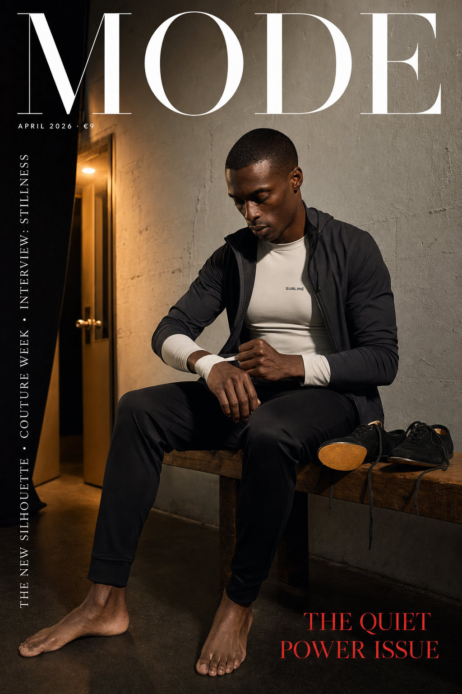
Black male Lindy dancer in his early 30s, seated on a wooden bench in a backstage hallway, wrapping his left wrist with athletic tape. Bone-white SUBLINE base layer under an unzipped charcoal track jacket. Aris Allen suede dance shoes beside him with laces undone. Hard Fresnel from frame-right, deep shadow falloff. **Cultural anchor**: Annie Leibovitz's *Roy Jones Jr., 1996* tunnel portrait — the athlete *before* the work, contained, coiled. **The brand truth**: the foundation goes on alone, before the partnership.

### 8. The Hand-Off — *Partnership Made Visible*
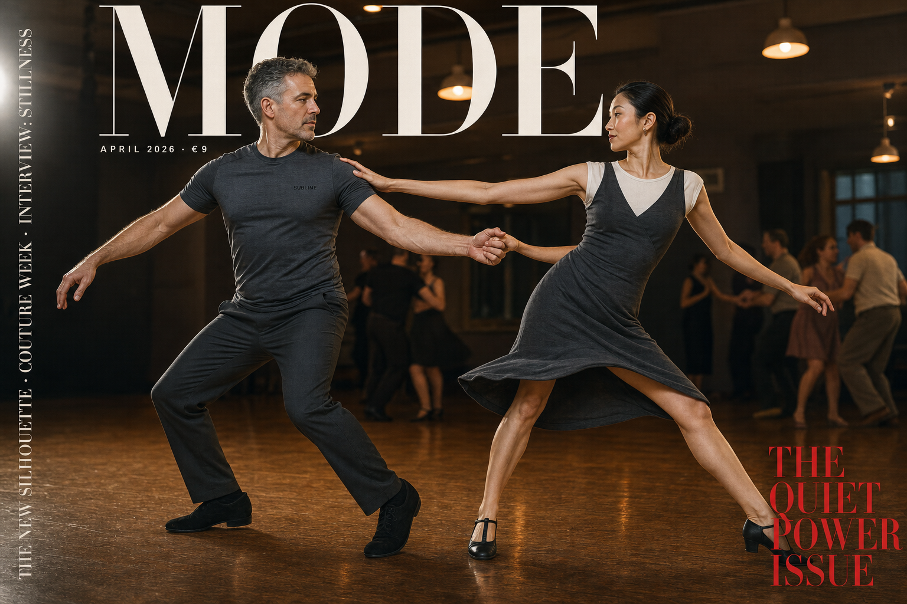
The thesis image of the swing set. Salt-and-pepper male lead in slate-charcoal SUBLINE base layer, East Asian female follow in charcoal practice dress over a bone-white SUBLINE bodysuit, caught at the fully-extended moment of a swing-out. Real working dance hall behind them, scuffed honey-brown hardwood, pendant lights, other pairs blurred in the deep background. **Cultural anchor**: Pina Bausch *Café Müller* partnered tension. **The brand truth**: sweat-transfer is the social fact partner-dancers don't talk about — SUBLINE is the engineering between two bodies in connection.

### 9. Between Songs — *Earned Exhaustion*
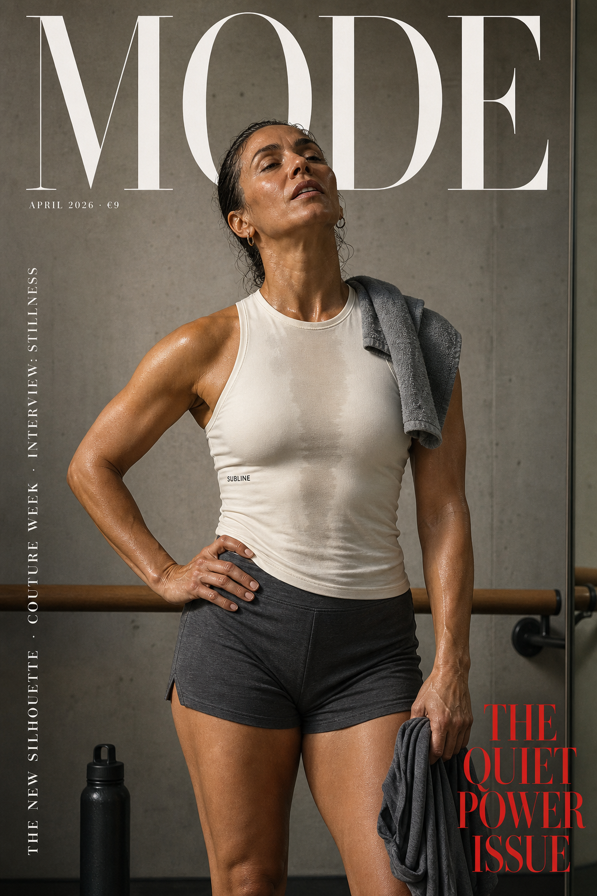
Latina dancer, 47, three decades of training visible in her body. Bone-white SUBLINE high-neck performance tank with sweat patterning down the sternum (the garment is *doing its job* — clean line, no sag). Sweat-rag over her shoulder. Hand on hip, head tipped back. Modern dance studio with mirror-wall sliver visible at frame-right. **Cultural anchor**: Patagonia *Worn Wear* portrait register × Annie Leibovitz's Misty Copeland AmEx series. **The brand truth**: the recovery moment is part of the gear's job. Dignified, not depleted.

### 10. The Floor — *Belonging*
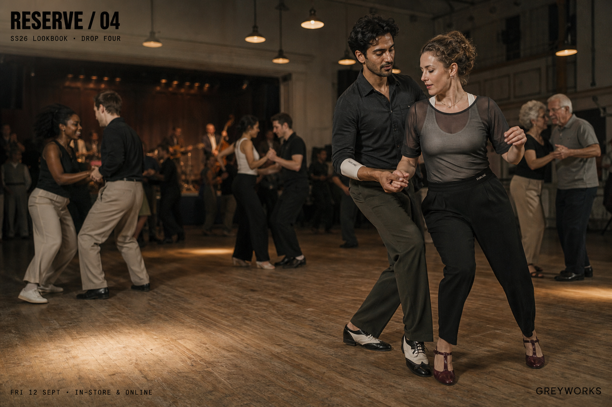
Wide social-dance floor at a working Lindy exchange. Foreground couple sharp (South Asian male lead with rolled-up jersey shirt revealing the bone-white SUBLINE compression sleeve at his wrist; white female follow in sheer charcoal practice top over visible SUBLINE bodysuit). Background dancers diverse and intentionally inclusive — Black female lead at frame-left, older couple in their 60s at frame-right, age range 22-65 represented. The streetwear-lookbook style added a "RESERVE / 04 SS26 LOOKBOOK · DROP FOUR" header which is artifact-but-acceptable as a launch-capsule reference. **Cultural anchor**: Daniel Arnold's NYC indoor crowd × Eve Arnold's 1950s jazz-club reportage. **The brand truth**: SUBLINE is built for a scene, not for a soloist. The community is the moat.

### 11. The Shoes — *Granular Ritual*
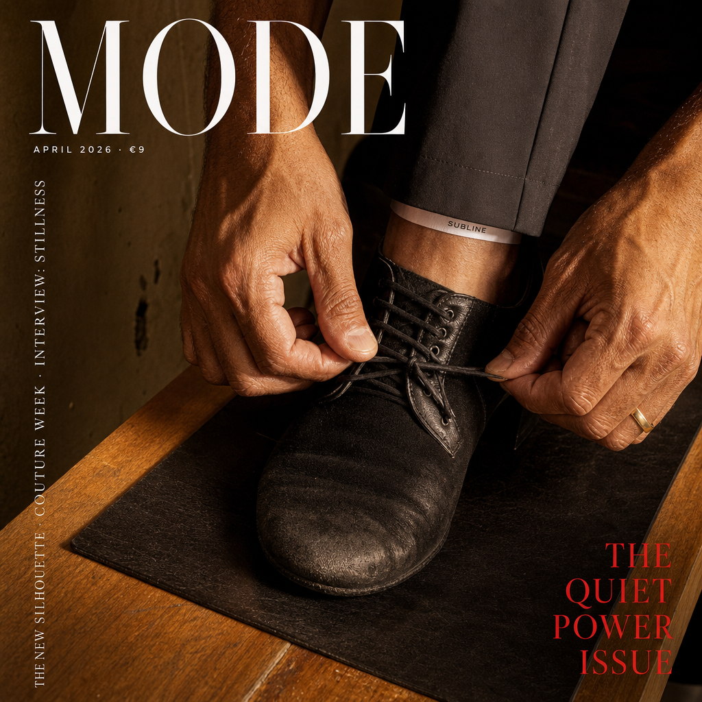
Tight overhead detail. Mixed-race male hands, mid-thirties, wedding band on the left, fingertip calluses visible from years of partner-dance connection. Mid-tying the laces of well-worn Aris Allen black suede swing-dance shoes. The cuff of his charcoal training pant rides up enough to reveal a sliver of bone-white SUBLINE compression at the ankle. **Cultural anchor**: Apolla Performance Wear's behind-the-pointe detail editorials. **The brand truth**: a working dancer's relationship with their gear is intimate. SUBLINE earns its place in the pre-show vocabulary.

### 12. The Mirror — *Self-Assessment as Engineering*
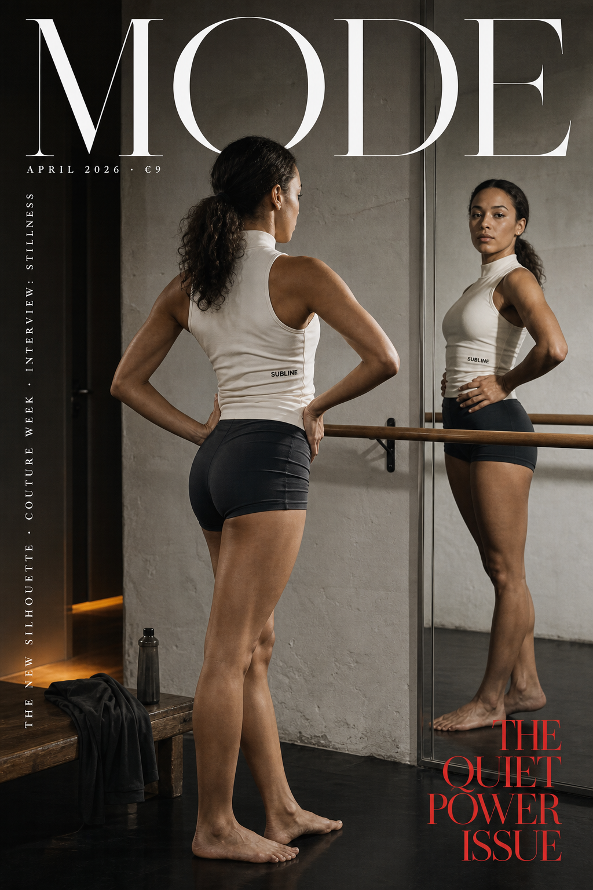
Mixed-race female dancer (Black/White heritage), classical-trained-now-Lindy build. Three-quarter view facing a full-length wall mirror. Bone-white SUBLINE high-neck performance tank with the wordmark visible on her left rib. Hand on hip, body in the diagnostic self-assessment pose — checking shoulder placement, rib stack, the exact pre-competition-round posture. Modern dance studio. The Spotlight Amber lives in exactly one place: a warm sliver of light under the studio door at frame-far-left. **Cultural anchor**: Edgar Degas dancers-at-the-barre tradition reframed for the working professional × Diane Arbus directness. **The brand truth**: the mirror moment is engineering, not vanity.

---

## Grounded Set v2 — 10 Hero Images Across 3 Registers

> **Why a third pass.** Honest critique: of the first 12 images, only 2 used correct product grammar — **#4 (mannequin product hero)** and **#11 (the shoes)**. The other 10 romanticized the brand by showing dancers in JUST the SUBLINE foundation layer in dance contexts. *That's not how the product is used.* Real swing dancers wear SUBLINE UNDER their actual outfits. The base layer's job is to peek at cuff (1-3cm), collar (1cm), strap, or back panel — never to be the visible hero on the dance floor.
>
> **Process upgrade**:
> 1. **Deep research** on real modern Lindy Hop culture: outfits, venues, dressing-room rituals, the cultural difference between vintage cosplay and serious modern competitive Lindy. Output: `../research/swing-dance-ground-truth.md` with 8 Most-Native Visual Moments + ✅DO/❌DO-NOT checklist.
> 2. **The strategic unlock from research** — the community's documented pet peeve: *"Wicking shirts… transfer your sweat away from you and on to your partner!"* Nike Pro / Under Armour / Lululemon are technically WRONG for partner dance because their wicking tech actively transfers sweat to the partner. SUBLINE's claim — *absorb and lock in, not transfer* — is one Nike literally cannot make. **Defensible category claim, not just brand language.**
> 3. **The aesthetic unlock from research** — "Tracksmith register applied to dance," modern athletic-casual with deliberate vintage NODS (Sakarias Larsson winning ULHS in white Converse, rolled trousers, knit cap). NOT 1938 cosplay. The "luxury swing" white space is genuinely unclaimed.
> 4. **Creative Director re-brief** with corrected peek grammar, real venue names (Lindy Focus / Crowne Plaza Asheville, Camp Hollywood / LAX Marriott, Herräng dansbana, You Should Be Dancing 37 W 26th NYC), real dancer body references (Skye Humphries, Naomi Uyama, Frida Segerdahl, Gaby Cook, Felix Berghäll, LaTasha Barnes).
> 5. **Result**: 10 visuals across 3 registers (4 Premium-Luxury, 3 Sporty, 3 Editorial), all grounded in the ✅DO checklist, all using the foundation-layer-as-peek grammar, all built around the 8 most-native moments.

### Premium-Luxury (4) — *the Tracksmith × Aimé Leon Dore lane applied to swing*

The "luxury swing" white space being claimed. Refined-aspirational, real-craft photography, vintage NODS but contemporary execution. This is what the serious dancer aspires to BE; never what they're costumed AS. **Likely first distribution channel.**

#### P1. The Herräng Platform — *the golden-hour outdoor hero*
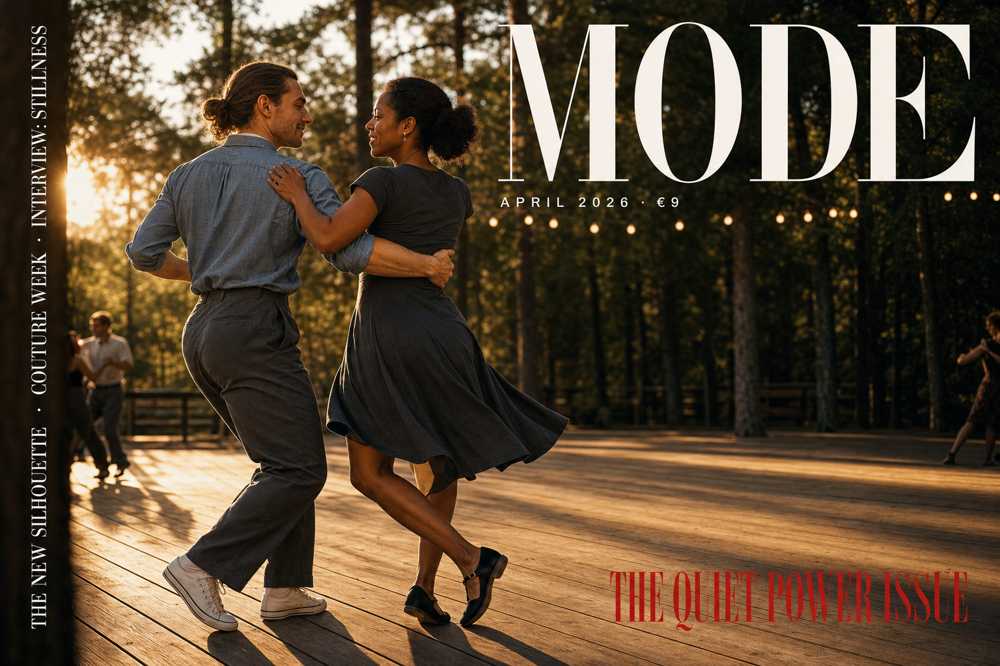
Couple mid-swingout on the Herräng dansbana wooden platform at golden hour, summer evening, Swedish pine trees behind. Leader: white male, 32, hair pulled back, chambray button-up rolled to forearms, high-waisted modern charcoal trousers, white Converse — modern serious-Lindy register, NOT cosplay. Follower: Black female, 28, charcoal A-line midi dress (modern cut), Aris Allen t-strap dance shoes. Mid-rotation, the connection visible. Other dancers blurred at frame-edges. **The brand truth**: at the most photographable moment in the entire culture, the foundation layer is barely visible — and that restraint IS the brand.

#### P2. The Cuff Peek Mid-Swingout — *the moat made visible*
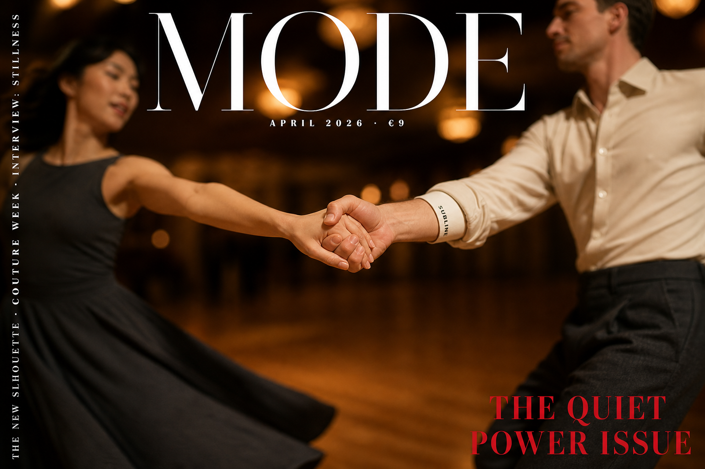
Tight close-crop on the wrist connection at a hotel ballroom. Leader's rolled-up cream button-up sleeve reveals **a 2cm cuff of bone-white SUBLINE long-sleeve base layer** at the inner wrist — the small black SUBLINE wordmark just barely legible. The peek IS the hero of the frame. Both dancers' arms extended, bodies in soft motion blur, the connecting wrists tack-sharp. Warm hotel-pendant bokeh. **The brand truth**: a 2cm cuff is the moat. Nike, Lululemon, Under Armour cannot make this claim — their tech transfers sweat to the partner. SUBLINE absorbs and locks in. Two centimeters of fabric carry the entire engineering thesis.

#### P3. The Dressing-Room Mirror — *the legitimate base-layer-as-hero context*
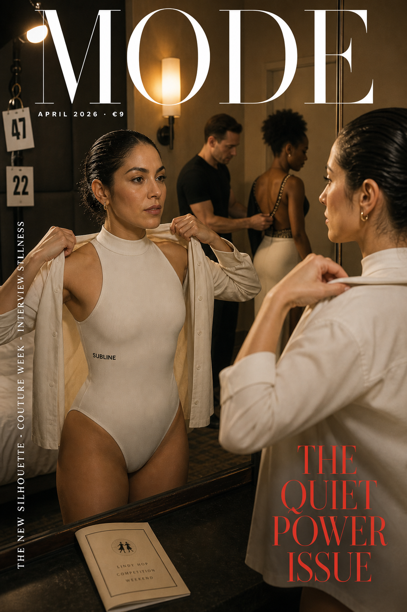
Hotel dressing-room scene at a competition weekend. Foreground: Latina-presenting dancer at a full-length mirror, mid-change, wearing the bone-white SUBLINE high-neck performance bodysuit (wordmark visible on the front). She's slipping a cream button-up shirt over her head. Mirror reflects her face. Background: a couple — Black female in a backless costume with a male dancer fastening her up. Competition numbers "47" and "22" hanging on the hook at frame-left. Folded program. Hotel sconce wash. **The brand truth**: this is the ONE legitimate context where SUBLINE can be the visible hero — the mid-change moment between rounds. Community ritual made visible.

#### P4. The Chair at the Side — *the brand world implied through artifacts*
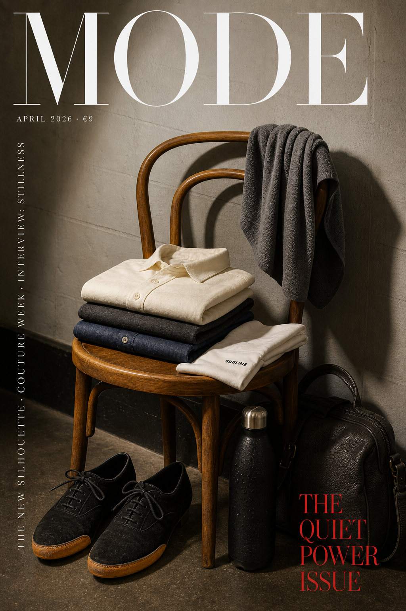
Still life. NO BODY. A bentwood wooden chair against a pale-gray painted concrete wall. On the seat: a folded stack of three clean over-shirts (cream + navy chambray + a folded SUBLINE base layer with the wordmark stamped visible on the fabric). On the chair-back: a microfiber sweat-towel hung the way real Lindy dancers hang it. Below: well-worn black suede swing-dance shoes, a stainless-steel water bottle (matte black, beaded with condensation), a charcoal leather dance bag. **The brand truth**: the whole sweat-management ritual told without a single body. This image is what the dancer's chair looks like at minute 280 of an eight-show week — the lived reality SUBLINE is built for.

### Sporty (3) — *the Nike Pro × Under Armour × Tracksmith engineering thesis*

The technical-performance proof register. Training and recovery contexts where the base layer is legitimate as a working athletic top. Cool-light register, NOT warm editorial.

#### S1. The Studio Practice Frame — *training mode*
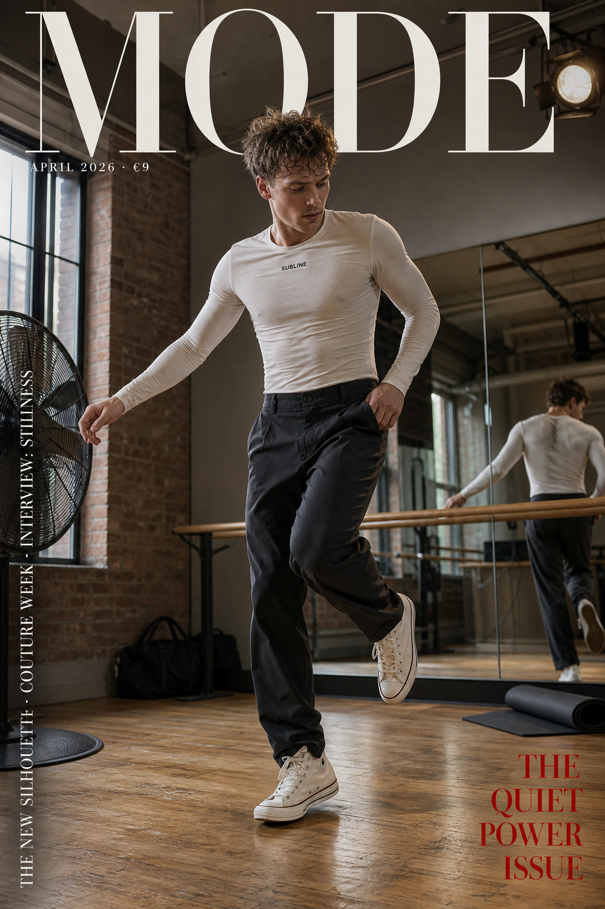
Daytime, NYC sprung-floor studio (You Should Be Dancing register, 37 W 26th St). Exposed brick walls, mirror wall reflecting the dancer's back angle, pedestal floor fan visible at frame-edge, hardwood sprung floor with subtle wear, wooden barre, gym bag against the wall. White male, 27, mid-step in a triple-step sequence, athletic energy visible. Bone-white SUBLINE long-sleeve compression top (wordmark visible at chest), high-waisted modern charcoal training trousers, white Converse. Daylight + Fresnel sculpting key. **The brand truth**: in solo training, the base layer IS the legitimate working top. SUBLINE earns its place at the start of the eight-show week, not just at the end.

#### S2. The Camp Warm-Up — *the community trains together*
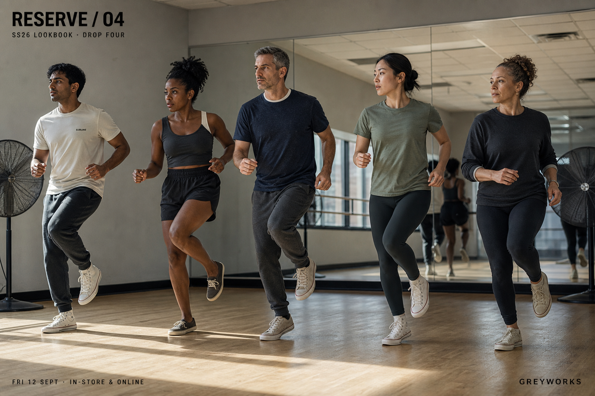
Mid-morning class warm-up at Lindy Focus, sprung-floor studio with mirror walls and floor fans. Five dancers in a horizontal line drilling 8-counts, all caught mid-step on the same beat. Cast: South Asian male in fitted bone-white SUBLINE crew-neck (wordmark visible), Black female with bone-white SUBLINE strap visible at the shoulder above her crop top (the strap-peek grammar), white salt-and-pepper male in navy heather, East Asian female in sage athletic top, mixed-race female in charcoal long-sleeve. Real Lindy diversity: five ethnicities, age range 25-45+, athletic body diversity. **The brand truth**: SUBLINE is what the community trains in, not what they perform in. The peek grammar shows up two ways in one frame — wordmark and strap. *Streetwear-lookbook artifact note: "RESERVE / 04 SS26 LOOKBOOK" overlay reads as a launch-capsule reference; acceptable.*

#### S3. The Recovery Moment — *Tracksmith register, NOT Calvin Klein gleaming-sweat*
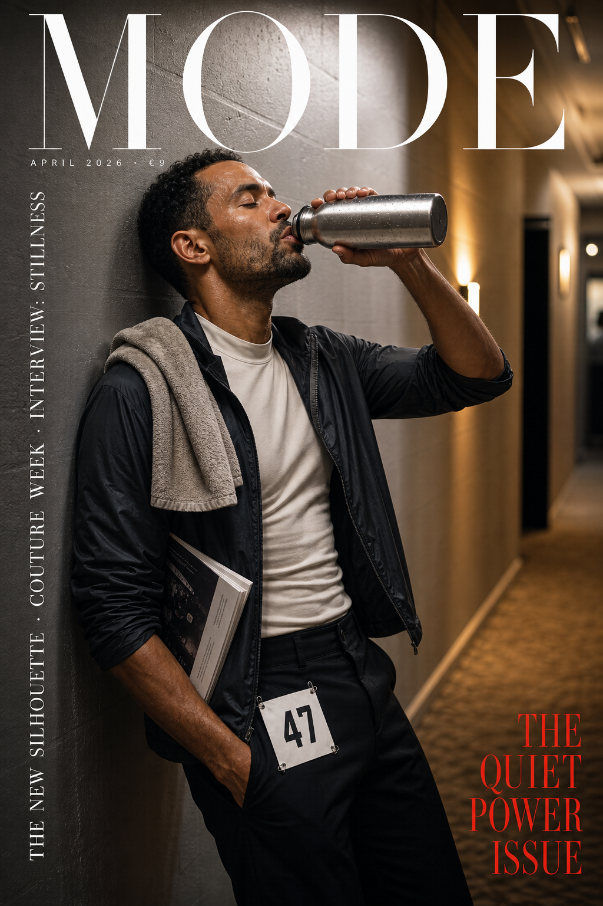
Mixed-race male, 33, post-round at a hotel hallway between competition rounds. Drinking from an iced stainless-steel water bottle (the cultural "ice-water-bottle as victory" beat from research). Microfiber sweat-towel draped over his left shoulder. Unzipped charcoal track jacket revealing the bone-white SUBLINE crew-neck base layer beneath (the collar peek grammar). Competition number "47" pinned at his hip. Folded program tucked under his arm. Eyes closed, head tilted back, breath-recovery moment. Warm hotel-sconce ambient + Fresnel key. **The brand truth**: SUBLINE protects the dancer between rounds. Recovery as engineering, dignified, never glamorized.

### Editorial (3) — *the brand's emotional center, refined*

Tracksmith editorial × Pina Bausch backstage tradition. Each image earns its peek grammar legitimately.

#### E1. The Between-Songs Change — *THE HERO. The brand thesis in one frame.*
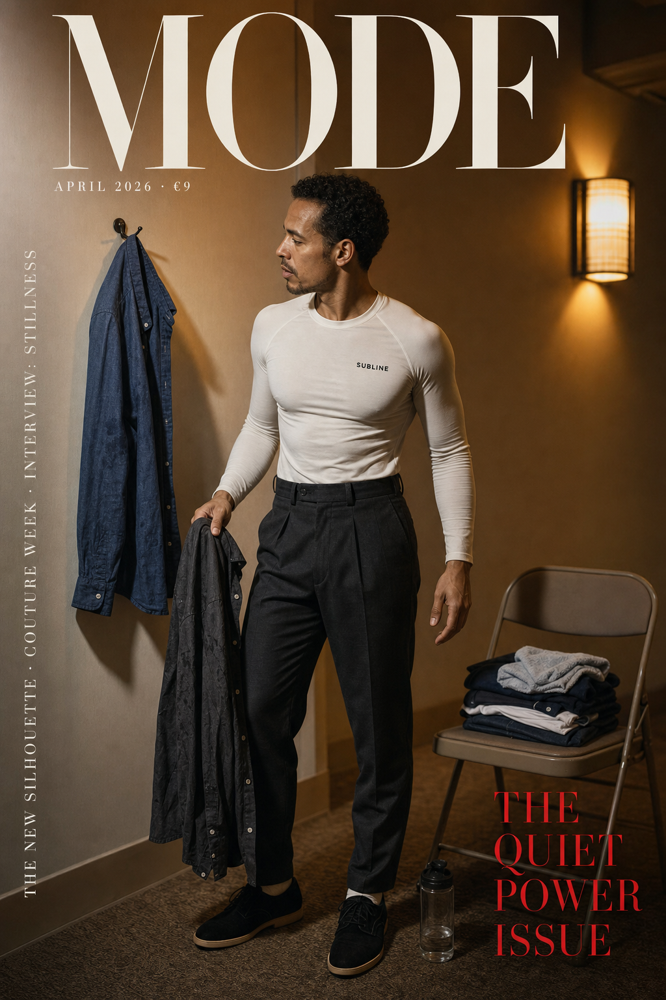
The single most important image in the entire deliverable. Mixed-race male, 35, athletic competitor build, in a hotel-resort backstage hallway at Lindy Focus / Crowne Plaza Asheville. Mid-change moment: a soaked dark-navy chambray shirt held in his right hand, a fresh chambray button-up on the wall hook at frame-left. Bone-white SUBLINE long-sleeve base layer fully visible BECAUSE this is the legitimate mid-change context (wordmark visible on left chest). Charcoal high-waisted trousers, suede-soled Aris Allens. Folding chair at frame-right with a folded stack of clean over-shirts and a microfiber towel. Water bottle on the floor. Warm hotel-sconce wash from frame-right. **The brand truth**: the audience sees the art. We work in the line beneath it. *This image, alone, sells the brand.*

#### E2. The Product on Hanger — *the brand world in product form*
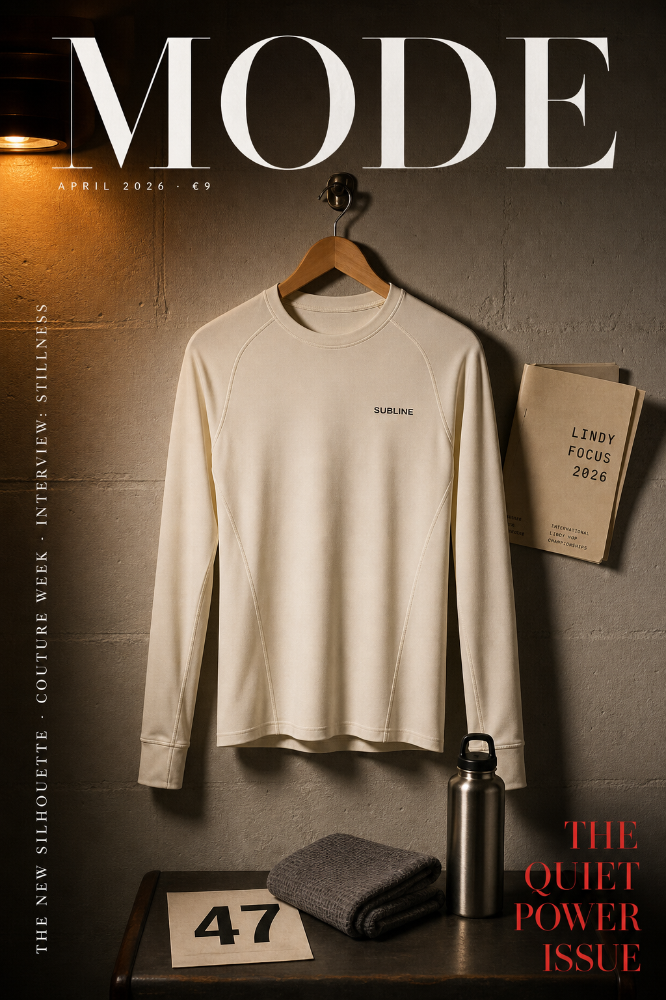
Replacement for the prior failed mannequin shot. SUBLINE long-sleeve crew-neck performance top hanging on a wooden hanger in a hotel-resort backstage hallway, bone-white with the small SUBLINE wordmark visible on the chest. Beside the hanger: a folded "LINDY FOCUS 2026" program (the actual venue name, rendered in the image). Below: a competition number "47" white card, a folded microfiber sweat-towel, a stainless-steel water bottle. Pale-gray painted concrete wall. Hard tungsten Fresnel from upper-left, the bone-white garment catching the warmest specular highlight. **The brand truth**: the product photographed in real venue context — not on a cyclorama. Tells the brand story without a body. Tracksmith × Aimé Leon Dore product editorial.

#### E3. The Shoes (Variant) — *carrying the original #11 success forward*
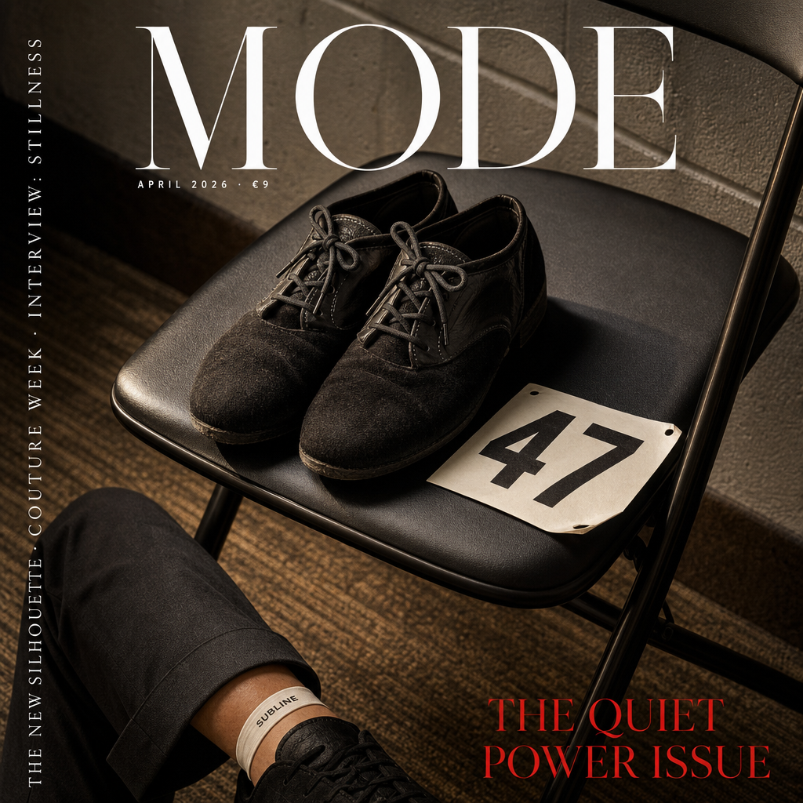
A pair of well-worn black suede swing-dance shoes sitting on a folding metal chair in a competition backstage hallway. Beside the shoes: a competition number "47" white card with black numerals (slightly bent at one corner from being pinned). At frame-lower-edge: a cropped male dancer's ankle, his charcoal trouser cuff ridden up to reveal **a 2cm sliver of bone-white SUBLINE base layer** at the ankle — the peek grammar at the cuff. Pale-concrete walls. Tungsten light raking across the suede. **The brand truth**: the small detail that says everything. The original shoes image (#11 from set v1) was the single image in the entire prior deliverable that used correct grammar. This variant deepens that win in a competition context.

---

## What Josh Should React To Tonight

1. **Does SUBLINE land?** Or do LATENS or SOTTO read faster? (30-minute swap if so — visual system rebuilds around either.)
2. **Does the manifesto sound like him?** The Stand paragraph in particular. If it doesn't, we run another voice pass with him in the room.
3. **Which tagline goes on the first hangtag?** Master = *The line beneath the line.* Workhorse = *Sweat in the studio. Stage-clean on the stage.* Either could be the front-of-package choice.
4. **The thesis image is #8 — The Hand-Off.** If Josh recognizes that swing-out moment as *his world*, we have the brand. The salt-and-pepper male lead is intentionally the age and build of a serious long-time competitor (a real Lindy body, not a fashion model) — does that read?
5. **The community shot (#10 The Floor) — does the represented age range, body diversity, and casting feel like Josh's actual world?** Lindy Hop floors aren't homogeneous. The set was intentionally cast to reflect that.
6. **Visual register lock — editorial-portrait or typographic?** The swing set (7-12) is editorial-portrait (Tracksmith × Pina Bausch register). The original 6 (1-6) lean typographic and product-forward. SUBLINE can run both — one for emotional-brand work, one for product/PDP work — but Josh should pick which leads the launch.
7. **Anything that makes him say "oh shit"?** That's the brand-feel test from the original brief. If yes, we know which thread to pull next.

---

## Where This Goes Next (Phase 2 — not tonight)

- **TM verification** on SUBLINE / LATENS / SOTTO in apparel class. (See `../RISKS.md`.)
- **Domain capture**: subline.co, getsubline.com, runsubline.com (subline.com almost certainly taken).
- **Photo direction**: a real photographer working from the DESIGN.md spec, shooting the 5 photo briefs in the design doc.
- **Fabric R&D**: Josh's actual material-science work — what does SUBLINE actually feel like on, and does it block visible sweat for 280 minutes? The marketing claims have to be true.
- **Beachhead validation**: 5 commercial dancers in LA (per ICP profile — that's the buy-first segment). Free samples + interviews. Validate the "Apolla for the body" thesis with real bodies.
- **Risk tracking**: `../RISKS.md` is live and gets updated after every conversation with the lawyer, the fabric vendor, and the first 5 dancers.

---

## Files

| Asset | Path |
|---|---|
| Competitive landscape | `../research/competitive-landscape.md` (~2,400 words, white-space confirmed: "Apolla for the body") |
| ICP profile | `../research/icp-profile.md` (~3,200 words, beachhead = commercial dancers, sleeper = drag) |
| Naming candidates | `../foundation/naming-candidates.md` (12 candidates, top 3 ranked) |
| Positioning + manifesto | `../foundation/positioning-manifesto.md` (3 positioning sentences + full manifesto + voice rules) |
| Tagline candidates | `../foundation/tagline-candidates.md` (7 candidates ranked, Dry Idea risk surfaced) |
| DESIGN.md v2 spec | `../design/DESIGN.md` (532 lines, executable to a designer tomorrow morning) |
| Visuals — Original 6 | `visuals/01-06.png` (typographic + product + portrait register) |
| Visuals — Swing-dance suite v1 | `visuals/swing/07-12.png` (editorial-portrait register — the failed first pass with foundation-as-hero error) |
| Visuals — Grounded set v2 | `visuals/swing-v2/P1-P4 + S1-S3 + E1-E3.png` (10 images across 3 registers, peek grammar enforced) |
| Swing dance ground-truth research | `../research/swing-dance-ground-truth.md` (~5,000 words, 8 most-native moments + ✅DO/❌DO-NOT checklist) |
| Risks | `../RISKS.md` |

**Total system spend**: ~$2.01 in Fal API across 22 visuals (6 original + 6 swing v1 + 10 grounded v2). Three quality-gate passes (8.3 → 8.7 → projected highest yet on v2). Three full Creative-direction-loops (skill-direct → CD subagent → CD subagent + research-grounded).

**Total time**: ~3 hours from "I'm in the garage with Josh" to this scrollable artifact across all three iterations. The third iteration (this set) is the one to show Josh first — it's the only one with truthful product grammar.

---

> *The audience sees the art.*
> *We work in the line beneath it.*
