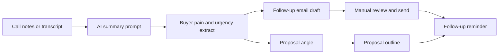

# Proof Demo 1 - AI Workflow Integration Sprint

## Demo Niche

Solo B2B consultant who gets inquiry calls but loses momentum after the call because notes, follow-up, proposal angle, and next-step reminders live in separate places.

## Before

```text
Inquiry call happens.
Notes sit in a doc or notebook.
Follow-up email is rewritten from scratch.
Proposal angle is reconstructed from memory.
No next-step reminder exists unless the consultant remembers.
Good conversations go quiet.
```

## Misfire

The consultant does not need a giant AI transformation. They need one reliable post-call workflow that turns messy notes into:

- summary
- buyer pain
- objection
- proposed next step
- follow-up email draft
- proposal angle
- reminder checklist

## After Workflow



## Prompt Pack

### Prompt 1: Call Summary

```text
You are helping me summarize a sales or discovery call.

Input:
[paste rough notes]

Return:
1. buyer's stated goal
2. current situation
3. pain language in their words
4. stakes if they do nothing
5. objections or hesitation
6. decision maker / timing clues
7. recommended next step

Use plain language. Do not invent details.
```

### Prompt 2: Follow-Up Draft

```text
Using the call summary below, write a concise follow-up email.

Constraints:
- sound human and direct
- reference the buyer's words
- name the problem clearly
- include one next step
- do not overpromise
- no hype

Call summary:
[paste summary]
```

### Prompt 3: Proposal Angle

```text
Turn this call summary into a proposal angle.

Return:
1. one-line diagnosis
2. desired outcome
3. recommended scope
4. what is out of scope
5. proof needed
6. risk to reduce
7. first paid step
```

## SOP

1. Paste notes within 30 minutes of the call.
2. Generate the summary.
3. Highlight buyer words.
4. Generate follow-up email.
5. Manually edit before sending.
6. Generate proposal angle only if there is a real next step.
7. Add follow-up reminder for 2 business days later.

## Acceptance Checklist

| Check | Pass? |
|---|---|
| Uses buyer's actual words |  |
| Does not invent facts |  |
| Follow-up has one next step |  |
| Proposal angle is scoped |  |
| Reminder is created |  |
| User can repeat without help |  |

## Sales Use

This demonstrates the AI Workflow Integration Sprint without requiring account access. The buyer can understand the value in one repeated task before trusting a deeper implementation.
