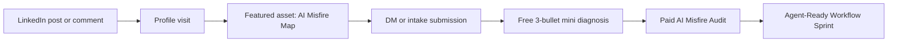

# Hybrid LinkedIn Signal Engine

## Autopilot Intent Lock

- **Goal interpreted as**: Turn the Hybrid Sequence into a cash-first LinkedIn signal system, not a rebrand project.
- **Deliverable**: A usable operating pack for signal capture, daily buyer development, research intelligence, and proof-building.
- **Audience/User**: Farrice, as Creative Strategist + AI Operating Partner, testing the AI Misfire Audit and agent-ready operating system offer.
- **Success criteria**: People understand the pain, click the Featured asset, send one SOP/prompt/workflow/failed output, and move into a diagnostic or paid audit conversation.
- **Confidence**: High.

## Operating Verdict

Use the **Hybrid Sequence**:

> Creative Strategist + AI Operating Partner: turning customer language and founder judgment into agent-ready marketing systems.

The next move is not a full profile overhaul. It is a **signal engine**:

1. A public asset people can click.
2. A low-friction submission path for SOPs, prompts, workflows, and failed AI outputs.
3. A daily buyer-development loop that does not require living on LinkedIn.
4. A research radar that feeds posts with current, buyer-relevant insight.
5. A tracker that tells us whether this is creating cash signal or just content applause.

## The Core Funnel



## Featured Section Architecture

### Slot 1: The AI Misfire Map

**Job**: Turn curiosity into a concrete submission.

**Featured title**:

> The AI Misfire Map

**Subtitle**:

> Send one failed AI output, SOP, prompt, workflow, or content system. I will show where your AI is being forced to guess.

**CTA**:

> DM me "GUESS" on LinkedIn with one example, or use the intake template inside.

**Why this comes first**:

Most buyers are not ready to book a call from one post. They need a low-friction way to hand you the problem. The submission itself is the signal.

### Slot 2: Before/After Proof Demo

**Job**: Show the mechanism.

**Featured title**:

> Before/After: One Workflow Made Agent-Readable

**Subtitle**:

> A controlled demo showing why normal instructions make AI guess, and how semantic work primitives improve execution.

**CTA**:

> If this looks like a problem inside your workflow, send me yours.

### Slot 3: Paid Offer

**Job**: Give ready buyers a commercial path.

**Featured title**:

> AI Misfire Audit

**Subtitle**:

> A focused audit for founder-led teams using AI but still rescuing the output.

**CTA**:

> Send one workflow. If the problem is real, I will scope the audit.

## The Intake Asset

Use the companion file:

`deliverables/ai-misfire-audit-intake-asset.md`

This is written to become:

- a Google Doc
- a LinkedIn Featured document
- a Tally/Typeform/Google Form source
- a DM response template

### Minimum Submission Fields

Do not overcomplicate the first version.

Ask only for:

1. Name
2. Business or role
3. Email or LinkedIn URL
4. What kind of asset are they sending? SOP, prompt, workflow, failed output, content process, sales process, delivery process, other
5. Paste or attach the asset
6. What were they hoping AI would do?
7. What went wrong?
8. How often does this happen?
9. What happens if this stays broken?
10. Are they open to a paid audit if the diagnosis is useful?

### Submission Rule

The asset should accept imperfect inputs. If someone only sends a messy prompt or screenshot, that is enough. The point is not clean data. The point is discovering where hidden operating knowledge is causing AI to guess.

## Daily Buyer-Development Loop

Use this as the default 45-minute day.

### 5 Minutes: Research Pulse

Read the latest research radar output or manually scan:

- AI agents in business
- AI adoption failures
- prompt fatigue
- founder-led service delivery
- LinkedIn content and buying behavior
- customer language, voice of customer, and positioning

Pick one idea that connects to the thesis:

> If the work is not agent-readable, the agent is forced to guess.

### 15 Minutes: Strategic Commenting

Comment on 5 to 8 posts from:

- founders using AI in public
- agency owners talking about fulfillment
- consultants/coaches talking about content, offers, delivery, or delegation
- operators discussing SOPs, AI workflows, or quality control
- creators posting about AI failures, productivity, or content systems

Comment format:

```text
The part most teams miss here is [specific operating layer].

AI can usually handle [surface task], but it starts guessing when [hidden judgment/context/rule] is missing.

That is why [specific consequence].
```

Quality bar:

- No "great post."
- No generic agreement.
- Add one insight, one reframing, or one useful distinction.
- Do not pitch unless the person explicitly signals the problem.

### 10 Minutes: Warm DM Follow-Up

Only DM people who:

- engaged with your post
- replied to your comment
- viewed your profile and match the buyer segment
- publicly discussed a relevant pain

DM:

```text
Appreciate you engaging with that.

Quick question: where is AI already close to useful in your business, but still wrong enough that someone has to correct it?

If you have one prompt, SOP, workflow, or failed output, I can show you where the system is being forced to guess.
```

### 10 Minutes: Draft Or Improve One Signal Asset

Create one of:

- post draft
- comment bank
- mini diagnosis
- proof snippet
- intake refinement
- objection answer

### 5 Minutes: Log The Signal

Update:

`deliverables/ai-misfire-signal-tracker.csv`

Minimum metrics:

- post/comment source
- person/company
- buyer segment
- pain language
- asset submitted
- diagnostic sent
- call booked
- paid audit interest
- follow-up date
- next action

## What To Automate And What Not To Automate

### Automate

- research collection from public web sources
- trend scanning
- source summarization
- prospect category discovery
- draft briefs
- comment idea generation
- CRM/tracker updates after manual review
- content idea clustering

### Do Not Automate

- LinkedIn scraping through unauthorized bots
- mass profile scraping
- auto-commenting
- auto-liking
- auto-DM sending
- fake engagement
- pretending to have read someone's work

LinkedIn's own policies prohibit software, scripts, crawlers, bots, or browser extensions that scrape profiles/data or automate actions such as messaging, commenting, liking, sharing, or driving inauthentic engagement. So the correct automation boundary is: **automate research and preparation; keep human judgment in the public interaction loop.**

## Apify / Apollo / "Apply" Data Tool Position

You mentioned "Apply," likely meaning either **Apify** or **Apollo**.

Do not wire this into LinkedIn scraping yet.

Use a compliant path:

- If it is **Apify**: use it for public web research, Google search results, website discovery, public company pages, YouTube/TikTok/Reddit sources where the actor and data use are permitted.
- If it is **Apollo**: use it for prospect list building only inside its permitted workflows, then manually review before outreach.
- If it is a different tool: confirm the exact product before connecting anything.

The rule:

> The tool can help build a research queue. It should not become an invisible spam machine.

## Research Automation Design

### Name

Hybrid LinkedIn Research Radar

### Job

Give Farrice current, buyer-relevant topics he can speak on as an insider, not a generic AI commentator.

### Inputs

Core lanes:

1. AI agents and workflow redesign
2. AI trust, governance, and failure modes
3. founder-led service businesses
4. marketing systems and customer language
5. LinkedIn thought leadership and hidden buyers
6. consultant/agency delivery quality
7. semantic work primitives and context engineering

### Daily Output

The radar should return:

1. **3 timely topics** worth responding to.
2. **Why the ICP cares**.
3. **The obvious take to avoid**.
4. **Farrice's stronger angle**.
5. **One LinkedIn post hook**.
6. **One strategic comment angle**.
7. **One CTA tied to the AI Misfire Map**.
8. **Sources**.

### Topic Scoring

Score each topic 1 to 5:

| Criterion | Question |
|---|---|
| Buyer pain | Does this connect to money, time, trust, quality, or growth? |
| Farrice fit | Can Farrice speak from psychology, strategy, content, or systems? |
| Timeliness | Is the conversation active now? |
| Differentiation | Can we say something beyond generic AI hype? |
| Conversion path | Can this naturally invite someone to send a workflow or failed output? |

Publish only topics scoring 18+ out of 25.

## First 7 Days

### Day 1

- Use the Featured intake asset.
- Put the AI Misfire Map into the Featured section.
- Create the tracker.
- Publish Post 1: "Your AI is not bad. It is blind."

### Day 2

- Comment on 8 ICP-relevant posts.
- DM only warm engagers.
- Ask for one failed AI output, SOP, or workflow.

### Day 3

- Publish a proof-demo post.
- Add a simple before/after screenshot or text excerpt if available.
- CTA: "Comment GUESS and I will send the before/after."

### Day 4

- Run a mini-diagnosis on any submitted asset.
- If no submissions, do a public teardown of a generic AI workflow or your own internal before/after.

### Day 5

- Publish the founder-judgment post.
- DM warm engagers from Days 1 and 3.

### Day 6

- Package one mini diagnosis into a proof snippet.
- Add it to the tracker.

### Day 7

- Review metrics.
- Decide whether to keep the same CTA, sharpen the pain, or change the buyer segment.

## Signal Thresholds

This is working if, within 14 days:

- 3+ people repeat the problem language back to you.
- 2+ people send a workflow, prompt, SOP, or failed AI output.
- 1+ person agrees to a diagnostic conversation.
- 1 paid audit closes or has a clear next step.

This is not working yet if:

- people like the posts but no one sends an asset
- only AI peers respond
- people understand the concept but do not connect it to cost, speed, trust, or quality
- the CTA creates curiosity but not submissions

## Red Team

### Risk 1: The Featured asset is too conceptual.

Fix: lead with "send me one failed output" before explaining the system.

### Risk 2: Research becomes a content treadmill.

Fix: every research topic must produce either a buyer insight, a comment angle, or a submission CTA.

### Risk 3: Automation becomes platform-risky.

Fix: automate off-platform research and prep, not LinkedIn actions.

### Risk 4: The offer sounds advanced but not urgent.

Fix: tie every post to the correction tax: rework, founder bottlenecks, delivery drift, bad content, slow approvals, and quality risk.

### Risk 5: The audience sends low-quality assets.

Fix: accept messy inputs but qualify before doing deep free work. Free diagnosis is three bullets only.

## Sources Used For Market Grounding

- LinkedIn Help: [Prohibited software and extensions](https://www.linkedin.com/help/linkedin/answer/a1341387/prohibited-software-and-extensions)
- LinkedIn: [User Agreement](https://www.linkedin.com/legal/user-agreement)
- Apify: [API Documentation](https://docs.apify.com/api)
- Apify: [Actor Runs API](https://docs.apify.com/api/v2/actors-actor-runs)
- Edelman + LinkedIn: [2025 B2B Thought Leadership Impact Report](https://www.edelman.com/expertise/Business-Marketing/2025-b2b-thought-leadership-report)
- McKinsey: [The State of AI in 2025](https://www.mckinsey.com/capabilities/quantumblack/our-insights/the-state-of-ai)
- Gartner: [Over 40% of Agentic AI Projects Will Be Canceled by End of 2027](https://www.gartner.com/en/newsroom/press-releases/2025-06-25-gartner-predicts-over-40-percent-of-agentic-ai-projects-will-be-canceled-by-end-of-2027)
- IBM: [Context Engineering: The Foundation for Trusted Agentic AI](https://www.ibm.com/think/insights/context-engineering-foundation-trusted-ai)

