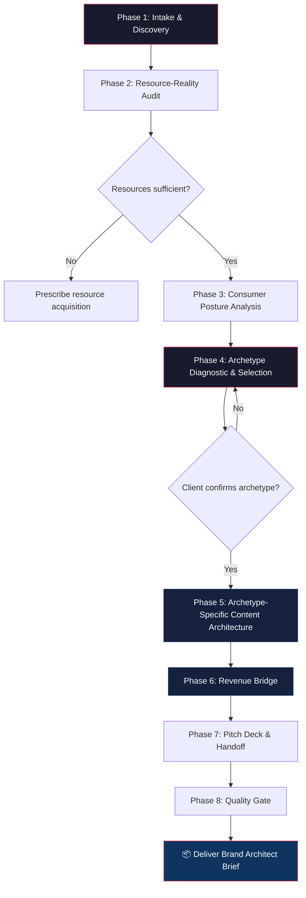

# Oren Brand Archetypes — Complete Service Model & Deployment Guide

> The full AD20 on everything we built: what it is, how to deploy it, where the money is, and the highest-leverage compound plays.

---

## What This System Does

This is the **front door to all social media strategy**. Before you discuss content calendars, team structure, taste evaluation, or production — you answer one question: **"What should this brand DO on social?"**

Five archetypes. One selection per brand. Selected through resource-reality audits, not aspiration. Each produces a different content ecosystem, a different funnel mechanic, and a different revenue pathway.

> [!IMPORTANT]
> This is not content pillar thinking. This is not "post educational, inspirational, and promotional content." This is a single strategic commitment that constrains everything downstream — and the constraint IS the strategy.

---

## The 5 Archetypes at a Glance

| Archetype | Best For | Requires | Funnel Mechanic | Risk Level |
|-----------|----------|----------|----------------|------------|
| **Oracle** | Brands with deep expertise | Expert on camera who can storytell | Education → Trust → Product Credibility → Purchase | 🟢 Lowest |
| **Helper** | Practical value brands | Relatable creator (not expert) | Practical Value → Ambient Recognition → Paid Ad Lift → Purchase | 🟢 Low |
| **Catalyst** | Transformation brands | Educational capacity, multiple staff OK | Aspiration → Community Belonging → Brand as Enabler → Purchase | 🟡 Medium |
| **Performer** | Entertainment-driven brands | Creative talent, visual product, risk tolerance | Entertainment → Brand Affinity → Omnipresent Recognition → Purchase | 🟠 Higher |
| **World Builder** | Creative moonshot brands | Budget, creative director/team, high risk tolerance | Cultural Relevance → "They Get Us" → Organic Brand Love → Purchase | 🔴 Highest |

### Key Distinctions That Matter

- **Oracle vs. Helper**: Oracle requires genuine expertise and positions as authority. Helper requires relatability and positions as "on the journey with you."
- **Catalyst vs. Helper**: Catalyst is aspirational ("who you could become"). Helper is practical ("how to fix this"). Catalyst shared because it inspires. Helper shared because it works.
- **Performer vs. World Builder**: Performer creates entertainment WITH the product omnipresent. World Builder creates culture ADJACENT to the product. Performer needs creative talent. World Builder needs creative budget.

---

## The 15-Workflow System Map

### Tier 1 — Foundation (Entry Points)

These are where every engagement starts. Run these before anything else.

| Workflow | What It Produces | Deploy When |
|----------|-----------------|-------------|
| `/oren-archetype-diagnostic` | Archetype Match Report + Fit-Scoring Matrix + Content Roadmap | First engagement with any brand; auditing unfocused social |
| `/oren-resource-audit` | Resource Inventory + Archetype Eligibility Matrix | Pre-qualifying which archetypes a brand can actually execute |
| `/oren-archetype-workshop` | Facilitated Workshop Deliverable + Content Brainstorm | Running the selection exercise with a client or team |
| `/oren-boring-industry-excavation` | 10+ Content Angles from "boring" industries | Client says "our industry is boring" — the #1 objection killer |

> [!TIP]
> `/oren-boring-industry-excavation` is also a **client acquisition tool**. Run it for a prospect BEFORE they become a client. It dismantles their biggest objection and demonstrates your value simultaneously.

### Tier 2 — Archetype Architects (The Builders)

After archetype selection, route to the specific architect that builds the full content ecosystem.

| Workflow | Archetype | Core Output |
|----------|-----------|-------------|
| `/oren-oracle-architect` | Oracle | 3-Layer Funnel (Education → Development → Product) + Calendar |
| `/oren-performer-architect` | Performer | Show Concept + Omnipresence Strategy + Episode Bible |
| `/oren-world-builder-architect` | World Builder | Creative Brief + Immersive Content Series + Risk Assessment |
| `/oren-catalyst-architect` | Catalyst | Aspiration Ladder + Community Engine + Content Type Matrix |
| `/oren-helper-architect` | Helper | Utility Matrix + Organic-to-Paid Bridge + Host Framework |
| `/oren-two-account-architect` | Oracle (variant) | Dual Content Strategy + Cross-Pollination + Editorial Calendars |

### Tier 3 — Revenue & Delivery (The Money Layer)

Where "content strategy" becomes "business strategy."

| Workflow | What It Produces | Deploy When |
|----------|-----------------|-------------|
| `/oren-archetype-revenue-bridge` | Funnel Mechanic + Offer Architecture + Metrics Dashboard + Revenue Timeline | Connecting archetype to actual revenue generation |
| `/oren-archetype-pitch-deck` | Professional 8-12 Page Strategy Brief + Exemplar Proof | Packaging strategy as a premium client deliverable |
| `/oren-exemplar-library` | Industry-Matched Brand Examples + Tactical Breakdown | Building presentations, proving archetype viability |

### Tier 4 — Master Orchestration (The Full Package)

| Workflow | What It Produces | Deploy When |
|----------|-----------------|-------------|
| `/oren-brand-architect-pipeline` | Complete 8-phase engagement: Intake → Resource Audit → Consumer Posture → Archetype Selection → Content Architecture → Revenue Bridge → Pitch Deck → Quality Gate | Full-service engagement: raw concept → structured brand strategy |

---

## The Arbitrage Service Model

> [!IMPORTANT]
> **Why this is arbitrage**: You have 96 expert agents producing boardroom-quality output in hours. A traditional agency charges $15K–$50K and takes 4–6 weeks. You deliver the same quality in 48 hours at a fraction of the cost. The gap between your production cost and your delivery price is the arbitrage.

### Three Service Tiers

| Tier | What's Included | Price | Delivery | When to Offer |
|------|----------------|-------|----------|---------------|
| **Sprint** | Archetype selection + 20 content ideas + resource audit | $500–$1,000 | 24 hours | Lead magnet upsell, "foot in the door" offer, testing fit |
| **Standard** | Full pipeline — all 7 documents (intake through pitch deck) | $2,500–$3,500 | 48–72 hours | Primary service offering, most clients land here |
| **Premium** | Full pipeline + consumer posture + competitive archetype map + 30-day content calendar | $5,000–$7,500 | 5–7 days | Enterprise brands, funded startups, agencies |

### What Each Tier Delivers

````carousel
### Sprint Tier ($500–$1,000)

**Documents produced:**
1. Resource Inventory (1 page)
2. Archetype Selection Report with fit-scoring (1-2 pages)
3. 20+ Content Ideas mapped to archetype (2 pages)

**Total**: ~4-5 pages

**Best for**: Brands that just need strategic clarity. They know something's wrong with their social but can't name it. The Sprint gives them the diagnosis and a starter content bank.

**Lead-in offer**: Run `/oren-boring-industry-excavation` as a free sample → Sprint as the paid next step.
<!-- slide -->
### Standard Tier ($2,500–$3,500)

**Documents produced:**
1. Intake Brief (1-2 pages)
2. Resource Inventory (1 page)
3. Consumer Posture Card (1 page)
4. Archetype Selection Report with fit-scoring (1-2 pages)
5. Content Architecture Document (3-5 pages)
6. Revenue Bridge (1-2 pages)
7. Brand Architect Brief — compiled strategy (8-12 pages)

**Total**: 8-12 page comprehensive strategy document

**Best for**: Brands ready to commit. They want a real plan they can hand to their team and say "this is what we're doing." The Standard tier is the core revenue engine.
<!-- slide -->
### Premium Tier ($5,000–$7,500)

**Everything in Standard, plus:**
- Full Dai Media consumer posture analysis
- Competitive archetype map (what competitors are doing on social)
- 30-day content calendar with production specs per piece
- Platform-specific implementation guide
- Ongoing support recommendations

**Total**: 15-20 page strategy package + operational calendar

**Best for**: Brands with budget who want zero ambiguity. The Premium tier means they could hand this to any social media manager on Earth and that person could execute without asking a single question.
````

---

## The Master Pipeline: How a Full Engagement Flows



### Phase-by-Phase Breakdown

| Phase | Workflow(s) Used | Key Output | Decision Gate |
|-------|-----------------|------------|---------------|
| 1. Intake | Interview protocol | Intake Brief | — |
| 2. Resource Audit | `/oren-resource-audit` | Eligibility Matrix | If zero archetypes viable → prescribe resources first |
| 3. Consumer Posture | `/consumer-posture-profile` (premium) or abbreviated | Consumer Posture Card | — |
| 4. Archetype Selection | `/oren-archetype-diagnostic` | Scored Match Report | Client confirms selection before proceeding |
| 5. Content Architecture | Route to specific architect (`/oren-oracle-architect`, etc.) | Content Type Matrix + Calendar + 20+ Ideas | — |
| 6. Revenue Bridge | `/oren-archetype-revenue-bridge` | Funnel + Offer + Metrics + Timeline | — |
| 7. Pitch Deck | `/oren-archetype-pitch-deck` | Compiled 8-12 page Brand Architect Brief | — |
| 8. Quality Gate | Checklist audit | Final deliverable | All boxes checked before handoff |

---

## 12 Cross-Expert Stacking Chains

These are the compound plays — where the Oren archetype system connects to other expert domains to produce outputs no single system could generate alone.

### Foundation Stacks (Archetype → Expert Depth)

| Chain Name | Sequence | What It Produces | Deploy When |
|-----------|----------|-----------------|-------------|
| **Oracle + Kallaway** | Oracle architect → `/obsession-script-architect` | Oracle content engineered for psychological obsession | Oracle brands wanting addictive educational content |
| **Oracle + Diandra** | Oracle architect → `/diandra-semantic-lanes` | Oracle authority deployed on LinkedIn with AI retrieval optimization | Oracle brands whose primary platform is LinkedIn |
| **Oracle + Wright** | Oracle architect → `/wright-scene` | Oracle content with magazine-quality narrative depth | Oracle brands in story-rich industries |
| **Performer + Georgi** | Performer architect → `/georgi-hook` | Performer content with dopamine-engineered hooks | Performer brands competing with pure entertainment creators |
| **Performer + Enrico** | Performer architect → `/enrico-expand` | Performer content scaled on Instagram with proven entertainment formats | Performer brands focused on Instagram/Reels |
| **World Builder + Grace** | World Builder architect → `/grace-city-blueprint` | World Builder deployed as full media company | Brands with budget for highest-risk archetype |
| **Catalyst + Dai Media** | Catalyst architect → `/consumer-posture-profile` | Catalyst content targeting the radical individual, not demographics | Premium catalyst engagements |
| **Helper + Junyuh** | Helper architect → `/junyuh-pillars` | Helper content organized into branded content pillars | Helper brands needing structural content organization |

### Arbitrage Service Stacks (Revenue-Generating Compounds)

| Chain Name | Sequence | What It Produces | Deploy When |
|-----------|----------|-----------------|-------------|
| **Identity-First Brand Architecture** | `/consumer-posture-profile` → `/oren-resource-audit` → `/oren-archetype-diagnostic` | Archetype selected from consumer identity + resources | Premium engagements where "who is your customer?" hasn't been answered |
| **Archetype-to-Cash Pipeline** | `/oren-archetype-revenue-bridge` → Kallaway Ramp → `/offer-stack` | Complete revenue system: archetype → funnel → product/service offer | Client asks "how does this make money?" |
| **Hidden Drama Content** | `/oren-boring-industry-excavation` → `/wright-detail` → `/wright-scene` | B2B content that reads like magazine-quality narrative | B2B brands ready to make "boring" compelling |
| **Founder + Brand LinkedIn Engine** | `/oren-two-account-architect` → `/profile-conversion` → `/high-dwell` | Complete dual-account LinkedIn system with cross-pollination | Oracle brands with strong founder on LinkedIn |

### Advanced Compound Chains

| Chain Name | Sequence | What It Produces |
|-----------|----------|-----------------|
| **Positioning-First Archetype** | `/dunford-positioning-diagnostic` → `/oren-archetype-diagnostic` → architect | Maximum competitive differentiation |
| **Expert Newsletter Empire** | `/oren-oracle-architect` → `/sinem-publication-setup` → `/sinem-revenue-architect` | Oracle content as Substack with 4-layer revenue |
| **Brand Story + Archetype** | `/storybrand` → `/oren-brand-architect-pipeline` | Narrative positioning + content execution |
| **Addictive Entertainment** | `/oren-performer-architect` → `/georgi-hook` → `/georgi-copy` | Performer content engineered for dopamine response |
| **Creator-as-Brand** | `/junyuh-identity` → `/oren-brand-architect-pipeline` | Personal brand with "I Am The Niche" identity mapped to archetype |
| **Perception-First Reframe** | `/oren-resource-audit` → Rory Sutherland Perception Engineering | Resource limitations reframed as strategic advantages |
| **Archetype-as-Product** | `/oren-archetype-pitch-deck` → Cole's Vehicle Selection | Archetype deliverable packaged as sellable product |

---

## High-Leverage Use Cases

> [!NOTE]
> These are the non-obvious applications — the ways this system generates revenue beyond the obvious "run the pipeline for a client" play.

### Use Case 1: The Archetype Arbitrage Service (Primary Revenue)

**What**: Package the full pipeline as a productized consulting engagement.
**Price**: $2,500–$5,000 per engagement.
**Deliverable**: Complete brand strategy brief — archetype selection, 20+ content ideas, production specs, revenue architecture.
**Why it's arbitrage**: Traditional agencies charge $15K–$50K and take 4–6 weeks. You deliver the same quality in 48 hours.

### Use Case 2: The "Boring Industry" Lead Magnet (Client Acquisition)

**What**: Run `/oren-boring-industry-excavation` as a free diagnostic for prospects.
**Flow**: Prospect says "our industry is boring" → you run the excavation → deliver 10+ content angles → they see the value → upsell to Sprint tier.
**Why it works**: You're solving their #1 objection before they even become a client.

### Use Case 3: The Archetype Self-Assessment Quiz (Top of Funnel)

**What**: Build a 5-8 question quiz mapping to the resource audit + archetype qualifying questions.
**Flow**: Prospect takes quiz → gets preliminary archetype recommendation → sees the framework's power → books Sprint engagement.
**Why it works**: Self-service qualification. The quiz does your sales call for you.

### Use Case 4: Ghostwriting Archetype Layer (Service Enhancement)

**What**: Before ghostwriting for ANY client, run `/oren-archetype-diagnostic` to determine which archetype their content should embody.
**Why it works**: Voice without strategic archetype means posts drift between educational, motivational, and practical without coherence. The archetype becomes the strategic constraint that makes every post unmistakably part of a larger system.

### Use Case 5: The Archetype Audit (Foot-in-the-Door Offer)

**What**: Audit an existing brand's social feed, diagnose which archetype(s) they're accidentally running, identify strategic incoherence, and prescribe a single archetype with transition plan.
**Price**: $500–$1,500.
**Why it works**: Lighter-weight engagement that leads directly to the full Brand Architect Sprint.

### Use Case 6: The Archetype Certification (Scale Product)

**What**: Package the entire methodology as a certification program for other strategists.
**Components**: Workshop facilitation guide, resource audit template, exemplar library, pitch deck generator.
**Why it works**: Nicolas Cole "Context Multiplier" — same IP deployed as a training product. Other creators, agencies, and freelancers pay to become "Archetype-Certified Brand Strategists."

---

## Revenue Architecture by Archetype

Each archetype monetizes differently. This is what you teach clients in the Revenue Bridge.

| Archetype | Best Offers | Price Psychology | Sales Process | Time to Revenue |
|-----------|------------|-----------------|---------------|----------------|
| **Oracle** | Courses, consulting, premium products, memberships | HIGH — expertise justifies premium | Education-first → "if you want me to do it for you" → premium | 1-3 months |
| **Performer** | Physical products, brand partnerships, merch, experiences | VARIES — affinity drives impulse + aspiration | Product is scenery → recognition builds → purchase feels natural | 3-6 months |
| **World Builder** | Premium/luxury products, creative services, media licensing | HIGH — cultural capital justifies premium | Longest cycle: build world → attract aligned audience → reveal product | 6-12 months |
| **Catalyst** | Programs, challenges, toolkits, community subs, coaching | MID-HIGH — transformation justifies investment | Inspire → prove transformation is possible → offer the vehicle | 1-3 months |
| **Helper** | SaaS, tools, affordable products, affiliates, templates | LOW-MID — practical value = accessible pricing | Be useful → ambient recognition → paid ads perform better → purchase | 2-4 months |

---

## Core Patterns (The Operating System)

These are the principles that govern everything. Violate them and the system breaks.

### 1. Resource-Reality Gate
The archetype is selected FROM the resource audit, not the other way around. No resources = no archetype. Don't prescribe World Builder to a team with zero creative talent.

### 2. Single-Archetype Discipline
One archetype per brand. The constraint IS the strategy. If a brand's feed shows education one day, entertainment skits the next, motivational quotes the third — that's strategic incoherence.

### 3. The Omnipresence Principle
For Performer and World Builder, the product is EMBEDDED, not promoted. The product appears in every frame without being discussed. The test: a viewer watches 10 posts and knows what the brand sells without being explicitly told.

### 4. Niche Audience Math
Small audience ≠ failure. 2,000 engaged followers in a high-value niche beats 100,000 passive followers in a commodity space. Calculate audience VALUE, not audience SIZE.

### 5. The Exercise-as-Deliverable Model
Content strategy is presented as a FACILITATED EXERCISE, not a delivered document. The client generates ideas, not you. This creates ownership → execution.

### 6. The Risk Hierarchy
Oracle (safest) → Helper → Catalyst → Performer → World Builder (highest risk). Match risk tolerance to archetype. Don't prescribe World Builder to a conservative brand.

---

## Quick-Start Decision Tree

```
START HERE
    │
    ├── Does the brand have a genuine expert who can be on camera?
    │   ├── YES → Does the expert have a strong personal brand?
    │   │   ├── YES → Oracle + Two-Account Method (/oren-two-account-architect)
    │   │   └── NO → Oracle (/oren-oracle-architect)
    │   └── NO ↓
    │
    ├── Does the brand have creative talent and a visual product?
    │   ├── YES → Are they willing to take creative risks?
    │   │   ├── YES, big risks + budget → World Builder (/oren-world-builder-architect)
    │   │   └── YES, moderate risks → Performer (/oren-performer-architect)
    │   └── NO ↓
    │
    ├── Is the brand about helping people become better?
    │   ├── YES → Is it aspirational or practical?
    │   │   ├── Aspirational → Catalyst (/oren-catalyst-architect)
    │   │   └── Practical → Helper (/oren-helper-architect)
    │   └── NO ↓
    │
    └── Run /oren-resource-audit — the resources will tell you.
```

---

## Deployment Checklist

When deploying this system for a client engagement:

- [ ] Load `genius.md` before any workflow execution
- [ ] Run resource audit FIRST — never skip this
- [ ] Confirm archetype selection WITH the client before building architecture
- [ ] Use fit-scoring matrix (1-10 across 5 dimensions) — never "you could be Oracle or Helper"
- [ ] End every session with: selected archetype + resource inventory + 15-20 content ideas + buy-in confirmation
- [ ] Revenue bridge is NOT optional — this is what makes it business strategy
- [ ] Pitch deck quality gate: would a skeptical CMO be convinced?
- [ ] Stack with cross-expert chains for premium engagements

---

## File Reference

| File | Location | Purpose |
|------|----------|---------|
| SKILL.md | [skills/oren-brand-archetypes/SKILL.md](file:///Users/farricecain/Google%20Antigravity/skills/oren-brand-archetypes/SKILL.md) | Workflow registry and service tiers |
| genius.md | [skills/oren-brand-archetypes/genius.md](file:///Users/farricecain/Google%20Antigravity/skills/oren-brand-archetypes/genius.md) | 12 core patterns + 29 stacking chains |
| Amplification Report | [oren-archetype-amplification-report.md](file:///Users/farricecain/.gemini/antigravity/brain/02d65ab4-1ff2-4143-a62b-ddba111430f5/artifacts/oren-archetype-amplification-report.md) | Gap scan + depth analysis + proposed expansions |

### All 15 Workflows

| Workflow | File |
|----------|------|
| `/oren-archetype-diagnostic` | [oren-archetype-diagnostic.md](file:///Users/farricecain/Google%20Antigravity/.agent/workflows/oren-archetype-diagnostic.md) |
| `/oren-resource-audit` | [oren-resource-audit.md](file:///Users/farricecain/Google%20Antigravity/.agent/workflows/oren-resource-audit.md) |
| `/oren-archetype-workshop` | [oren-archetype-workshop.md](file:///Users/farricecain/Google%20Antigravity/.agent/workflows/oren-archetype-workshop.md) |
| `/oren-boring-industry-excavation` | [oren-boring-industry-excavation.md](file:///Users/farricecain/Google%20Antigravity/.agent/workflows/oren-boring-industry-excavation.md) |
| `/oren-oracle-architect` | [oren-oracle-architect.md](file:///Users/farricecain/Google%20Antigravity/.agent/workflows/oren-oracle-architect.md) |
| `/oren-performer-architect` | [oren-performer-architect.md](file:///Users/farricecain/Google%20Antigravity/.agent/workflows/oren-performer-architect.md) |
| `/oren-world-builder-architect` | [oren-world-builder-architect.md](file:///Users/farricecain/Google%20Antigravity/.agent/workflows/oren-world-builder-architect.md) |
| `/oren-catalyst-architect` | [oren-catalyst-architect.md](file:///Users/farricecain/Google%20Antigravity/.agent/workflows/oren-catalyst-architect.md) |
| `/oren-helper-architect` | [oren-helper-architect.md](file:///Users/farricecain/Google%20Antigravity/.agent/workflows/oren-helper-architect.md) |
| `/oren-two-account-architect` | [oren-two-account-architect.md](file:///Users/farricecain/Google%20Antigravity/.agent/workflows/oren-two-account-architect.md) |
| `/oren-archetype-revenue-bridge` | [oren-archetype-revenue-bridge.md](file:///Users/farricecain/Google%20Antigravity/.agent/workflows/oren-archetype-revenue-bridge.md) |
| `/oren-archetype-pitch-deck` | [oren-archetype-pitch-deck.md](file:///Users/farricecain/Google%20Antigravity/.agent/workflows/oren-archetype-pitch-deck.md) |
| `/oren-exemplar-library` | [oren-exemplar-library.md](file:///Users/farricecain/Google%20Antigravity/.agent/workflows/oren-exemplar-library.md) |
| `/oren-brand-architect-pipeline` | [oren-brand-architect-pipeline.md](file:///Users/farricecain/Google%20Antigravity/.agent/workflows/oren-brand-architect-pipeline.md) |
