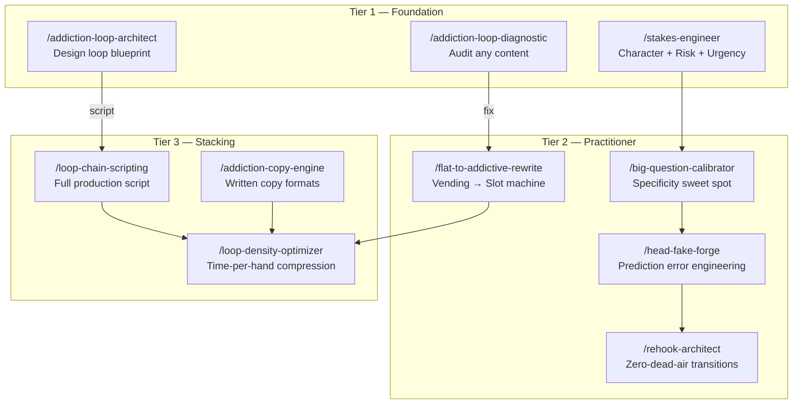

# Walkthrough: Kallaway Addictive Storytelling Domain Forge

## What Was Built

A complete 10-workflow skill domain operationalizing Kallaway's "Neuroscience of Addictive Storytelling" — the Four-Step Addiction Loop (Stakes → Big Question → Head Fake → Rehook) — into the Antigravity ecosystem.

**Composite Quality Score: 8.7/10** ✅

---

## Domain Architecture

## Files Created (23 total)

### Skill Domain (`skills/kallaway-addictive-storytelling/`)
| File | Purpose |
|------|---------|
| [SKILL.md](file:///Users/farricecain/Google%20Antigravity/skills/kallaway-addictive-storytelling/SKILL.md) | Domain manifest with workflow map + stacking chains |
| [genius.md](file:///Users/farricecain/Google%20Antigravity/skills/kallaway-addictive-storytelling/genius.md) | Core intelligence: 8 patterns, 3 exemplars, 5 moves, quality rubric |
| [addiction-loop-anatomy.md](file:///Users/farricecain/Google%20Antigravity/skills/kallaway-addictive-storytelling/references/addiction-loop-anatomy.md) | Structural quick-reference with diagrams + benchmarks |
| 10 workflow files | Full practitioner-grade workflows across 3 tiers |

### Slash Commands (`.agent/workflows/`)
10 command wrappers registered and ready:
`/addiction-loop-diagnostic` · `/addiction-loop-architect` · `/stakes-engineer` · `/head-fake-forge` · `/rehook-architect` · `/big-question-calibrator` · `/flat-to-addictive-rewrite` · `/loop-chain-scripting` · `/addiction-copy-engine` · `/loop-density-optimizer`

## Strategic Position

This domain fills the **retention substrate** gap in the Kallaway ecosystem:

| Layer | Domain | Question Answered |
|-------|--------|-------------------|
| **What to build** | Content Psychology | "Which content format + structure wins?" |
| **How to keep them watching** | **Addictive Storytelling** ← NEW | "Why can't they stop consuming?" |
| **What to implant** | Audience Obsession | "What should they think about at 2 AM?" |

## Key Stacking Chains
- **Full Build**: `/addiction-loop-architect` → `/loop-chain-scripting` → `/loop-density-optimizer`
- **Audit + Fix**: `/addiction-loop-diagnostic` → `/flat-to-addictive-rewrite`
- **Precision Components**: `/stakes-engineer` → `/big-question-calibrator` → `/head-fake-forge` → `/rehook-architect`
- **Cross-Domain**: `/addiction-loop-architect` → `/obsession-script-architect` (loop + obsession payload)

## Verification
- ✅ 23/23 files confirmed present
- ✅ Chain runner logged: Composite 8.7/10 (Intent: 9, Expert: 9, Adversarial: 8)
- ✅ Notion trace logged
