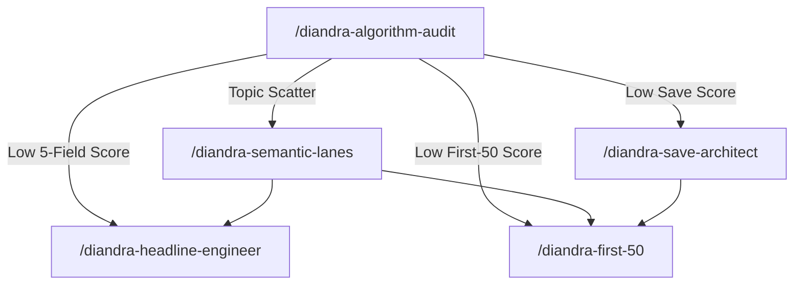

# Diandra Escobar Skill Expansion — LinkedIn 2026 Algorithm Intelligence

## What Changed

Expanded the Diandra Escobar LinkedIn Growth Mastery skill from v3.0 (14 workflows) → **v3.1 (19 workflows)** with deep integration of LinkedIn's 2026 unified Llama 3 retrieval model architecture.

---

## Files Modified

### [genius.md](file:///Users/farricecain/Google%20Antigravity/skills/diandra-escobar-linkedin-growth/genius.md)
- **+6 patterns** (13-18): 5-Field Author Signal, 60-Token Audition, Depth-Over-Breadth, Save Economy, Percentile Threshold, Small Account Advantage
- **+4 hidden knowledge items**: Negative Signal Trap, Generative Recommender Sequence, Pod Detection Layer, Adam Bird Correction
- **+2 exemplars**: Algorithm Post That Saved Itself, Small Account Client Win
- **+1 anti-exemplar**: Pod-Boosted Post

### [SKILL.md](file:///Users/farricecain/Google%20Antigravity/skills/diandra-escobar-linkedin-growth/SKILL.md)
- Version 3.0 → 3.1, workflow count 14 → 19
- New "Algorithm Intelligence" section with 5 workflows

---

## Files Created

### Workflows (5)

| Workflow | Slash Command | What It Does |
|----------|--------------|-------------|
| [15-algorithm-suppression-audit.md](file:///Users/farricecain/Google%20Antigravity/skills/diandra-escobar-linkedin-growth/workflows/15-algorithm-suppression-audit.md) | `/diandra-algorithm-audit` | 6-layer forensic audit of what's suppressing reach |
| [16-ai-optimized-headline-engineer.md](file:///Users/farricecain/Google%20Antigravity/skills/diandra-escobar-linkedin-growth/workflows/16-ai-optimized-headline-engineer.md) | `/diandra-headline-engineer` | Headlines scoring on AI matching + human conversion |
| [17-first-50-hook-rewriter.md](file:///Users/farricecain/Google%20Antigravity/skills/diandra-escobar-linkedin-growth/workflows/17-first-50-hook-rewriter.md) | `/diandra-first-50` | Audit + rewrite first 50 words for retrieval filter |
| [18-save-worthy-content-architect.md](file:///Users/farricecain/Google%20Antigravity/skills/diandra-escobar-linkedin-growth/workflows/18-save-worthy-content-architect.md) | `/diandra-save-architect` | Re-architects posts for save behavior (1 save ≈ 5x likes) |
| [19-semantic-lane-strategy.md](file:///Users/farricecain/Google%20Antigravity/skills/diandra-escobar-linkedin-growth/workflows/19-semantic-lane-strategy.md) | `/diandra-semantic-lanes` | 90-day topic commitment with anti-scatter guardrails |

### Slash Commands (5)

| Command | Path |
|---------|------|
| `/diandra-algorithm-audit` | [diandra-algorithm-audit.md](file:///Users/farricecain/Google%20Antigravity/.agent/workflows/diandra-algorithm-audit.md) |
| `/diandra-headline-engineer` | [diandra-headline-engineer.md](file:///Users/farricecain/Google%20Antigravity/.agent/workflows/diandra-headline-engineer.md) |
| `/diandra-first-50` | [diandra-first-50.md](file:///Users/farricecain/Google%20Antigravity/.agent/workflows/diandra-first-50.md) |
| `/diandra-save-architect` | [diandra-save-architect.md](file:///Users/farricecain/Google%20Antigravity/.agent/workflows/diandra-save-architect.md) |
| `/diandra-semantic-lanes` | [diandra-semantic-lanes.md](file:///Users/farricecain/Google%20Antigravity/.agent/workflows/diandra-semantic-lanes.md) |

---

## Diagnostic → Fix Pipeline

The 5 new workflows interlock as a pipeline:

---

## Quality Gate

| Metric | Score |
|--------|-------|
| Intent Alignment | 10/10 |
| Expert Standard | 9/10 |
| Adversarial Resilience | 8/10 |
| **Composite** | **9.0/10 ✅** |

Traced to Notion: [trace link](https://www.notion.so/Expanded-Diandra-Escobar-LinkedIn-Growth-skill-with-2026-algorithm-intelligence-6-new-genius-md-pa-33f49875a89781998e14cfe37380d143)
