# /recommend Evolution Walkthrough

## What Changed

Transformed `/recommend` from a 4-layer keyword-matching engine into a **10-step autonomous orchestration engine** powered by 8 cross-domain intelligence fusions.

---

## Architecture: Before vs After

```mermaid
graph TD
    subgraph "BEFORE: 4-Layer Engine"
        B1["Parse Intent"] --> B2["Expert Match"]
        B2 --> B3["Workflow Match"]
        B3 --> B4["Compound Detection"]
        B4 --> B5["Context Retriever"]
        B5 --> B6["Produce Recommendation"]
        B6 --> B7["Anti-Hoarding Check"]
        B7 --> B8["Offer Execution"]
    end

    subgraph "AFTER: 10-Step Orchestration Engine"
        A0["Step 0: Most-Aware Bypass"] -->|"skip engine"| A10
        A0 -->|"continue"| A1
        A1["Step 1: Anti-Hoarding Recall"] -->|"already have it"| A10
        A1 -->|"new request"| A2
        A2["Step 2: Intelligence Diagnostic"] --> A2a["Awareness Stage"]
        A2 --> A2b["Emotional Subtext"]
        A2 --> A2c["Revenue Proximity"]
        A2a -->|"unaware"| A3["Step 3: Discovery Mode"]
        A2a -->|"problem aware"| A4["Step 4: Expert Match"]
        A2b -->|"detected"| A2d["Emotional Gate\n(Phase 1 before Phase 2)"]
        A2d --> A4
        A3 --> A4
        A4 --> A5["Step 5: Workflow Match"]
        A5 --> A6["Step 6: Compound Detection"]
        A6 --> A7["Step 7: Context Retriever"]
        A7 --> A8["Step 8: Prereq + Revenue Check"]
        A8 --> A9["Step 9: Produce Recommendation\n+ Pre-Mortem + Mission Blueprint"]
        A9 --> A10["Step 10: Offer Execution"]
    end
```



---

## Changes Made

### [expert_router.py](file:///Users/farricecain/Google%20Antigravity/execution/expert_router.py)

**4 Data Structures Added:**

| Structure | Purpose | Size |
|-----------|---------|------|
| `PREREQUISITES` | Workflow dependency chains | 18 workflows mapped |
| `AWARENESS_SIGNALS` | Schwartz awareness stage patterns | 5 stages, 40+ patterns |
| `EMOTIONAL_SUBTEXT_PATTERNS` | Hidden emotional state detection | 6 emotions, 25+ patterns |
| `REVENUE_DISTANCE` | Expert-to-income proximity scoring | 4 tiers, 48 experts |

**5 Functions Added:**

| Function | Input | Output |
|----------|-------|--------|
| `classify_awareness(query)` | User query string | `{stage, routing, description, confidence}` |
| `detect_emotional_subtext(query)` | User query string | `[{emotion, matched_patterns, pre_expert, pre_workflow, message}]` |
| `score_revenue_distance(expert)` | Expert name | `0-3` integer (or `-1` for unknown) |
| `check_prerequisites(workflow)` | Workflow name | `["prereq1", "prereq2"]` list |
| `diagnose(query)` | User query string | Full diagnostic: awareness + emotions + revenue scores |

**5 CLI Subcommands Added:**

```bash
python3 execution/expert_router.py awareness "query"   # Classify awareness stage
python3 execution/expert_router.py emotion "query"      # Detect emotional subtext
python3 execution/expert_router.py revenue "expert"     # Score revenue distance
python3 execution/expert_router.py prereqs "workflow"   # Check prerequisites
python3 execution/expert_router.py diagnose "query"     # Full intelligence diagnostic
```

---

### [recommend.md](file:///Users/farricecain/Google%20Antigravity/.agent/workflows/recommend.md)

**Complete rewrite** from 223 lines / 8 steps to 260+ lines / 10 steps:

| New Step | Fusion Source | What It Does |
|----------|-------------|--------------|
| Step 0: Most-Aware Bypass | Fusion 2 (Schwartz) | Skip engine entirely when user knows what they want |
| Step 1: Anti-Hoarding Recall | Fusion 8 | Check existing assets before recommending new work |
| Step 2: Intelligence Diagnostic | Fusions 2, 5, 7 | One-call pre-routing: awareness + emotion + revenue |
| Step 3: Discovery Mode | Fusion 1 (Nate B. Jones) | Predictive intent, not interrogative ("I think you need X") |
| Steps 4-7: 4-Layer Engine | Preserved | Expert → Workflow → Compound → Context |
| Step 8: Prereq + Revenue | Fusions 4, 7 | Auto-prepend prerequisites, show revenue distance |
| Step 9: Enhanced Output | Fusions 3, 4, 6, 7 | Pre-mortem, prerequisite chains, mission blueprints |
| Step 10: Execution Offer | Enhanced | Emotional override tracking, swarm/campaign offers |

**Matching Priority reordered**: Revenue proximity moved from tie-breaker #4 to **#1**.

---

## Verification Results

All 5 diagnostic tests pass:

```
TEST 1: Most Aware Bypass
  Input:  "run /proof-copy-engine on my draft"
  Result: ⚡ MOST_AWARE → instant_execution ✅

TEST 2: Emotional Subtext
  Input:  "I've tried everything and nothing works"
  Result: 🔴 EXHAUSTION → @dr-k /drk-triage ✅

TEST 3: Missing Prerequisite
  Input:  prereqs for /nuclear-vsl
  Result: /mechanism-discover → /storybrand → /nuclear-vsl ✅

TEST 4: Revenue Proximity
  Input:  stefan-georgi vs dr-k
  Result: 💰 stefan-georgi = 0 (Direct) vs 🏗️ dr-k = 3 (Foundation) ✅

TEST 5: Awareness Classification
  Input A: "my content isn't working and I don't know why"
  Result:  🔍 PROBLEM_AWARE → diagnostic_first ✅
  Input B: "should I use storybrand or insight vectors?"
  Result:  ⚖️ PRODUCT_AWARE → comparison_mode ✅
```

---

## Key Design Decisions

1. **Emotional gate is always surfaced, never suppressed** — User can override, but we always flag it. Source: McRaney's "emotional processing precedes cognitive change."
2. **Revenue proximity is now tie-breaker #1** — When multiple experts match equally, the one closer to income wins. This was previously buried at #4.
3. **Discovery Mode is now predictive, not interrogative** — Instead of "What do you want?" we say "I think you need X — what's wrong with that?" Source: Nate B. Jones Intent Signal Field.
4. **Anti-Hoarding moved to Step 1** (was Step 8) — Check existing assets *before* routing, not after. This prevents the "1,000 extractions, forgot to use them" pattern.
5. **Prerequisites auto-prepend** — If `/nuclear-vsl` requires `/mechanism-discover`, the chain is shown automatically. No more "right skill, wrong sequence" failures.
