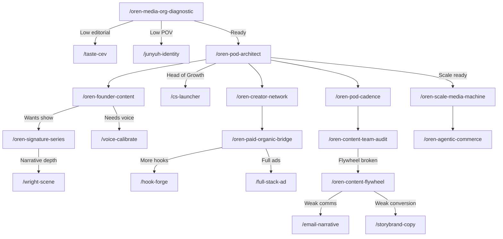

# Walkthrough: Oren Content-Team Architecture

## Overview

Built Oren's **5th skill domain** — `oren-content-team-architecture` — a 12-workflow system for transforming any brand into a content-first media company using pod-based team structures, marketing flywheels, and AI-powered commerce integration.

---

## What Was Built

### Infrastructure
| File | Purpose |
|:-----|:--------|
| [genius.md](file:///Users/farricecain/Google%20Antigravity/skills/oren-content-team-architecture/genius.md) | 13 core patterns — the operating system |
| [SKILL.md](file:///Users/farricecain/Google%20Antigravity/skills/oren-content-team-architecture/SKILL.md) | Skill manifest — 12 workflows, 3 tiers |

### Tier 1 — Foundation (4 workflows)
| Slash Command | Workflow | Produces |
|:-------------|:---------|:---------|
| `/oren-media-org-diagnostic` | [oren-media-org-diagnostic.md](file:///Users/farricecain/Google%20Antigravity/skills/oren-content-team-architecture/workflows/oren-media-org-diagnostic.md) | 5-gate readiness scorecard (POV, patience, editorial, process, product-content) |
| `/oren-pod-architect` | [oren-pod-architect.md](file:///Users/farricecain/Google%20Antigravity/skills/oren-content-team-architecture/workflows/oren-pod-architect.md) | Pod structure blueprint with hiring seq + role specs (iPhone/Mid/Enterprise) |
| `/oren-content-flywheel` | [oren-content-flywheel.md](file:///Users/farricecain/Google%20Antigravity/skills/oren-content-team-architecture/workflows/oren-content-flywheel.md) | 5-node flywheel map with connection scores + priority fixes |
| `/oren-brand-media-blueprint` | [oren-brand-media-blueprint.md](file:///Users/farricecain/Google%20Antigravity/skills/oren-content-team-architecture/workflows/oren-brand-media-blueprint.md) | 90-day transformation plan with 3 phase gates + milestone tracker |

### Tier 2 — Practitioner (5 workflows)
| Slash Command | Workflow | Produces |
|:-------------|:---------|:---------|
| `/oren-pod-cadence` | [oren-pod-cadence.md](file:///Users/farricecain/Google%20Antigravity/skills/oren-content-team-architecture/workflows/oren-pod-cadence.md) | Weekly + monthly operating rhythm + meeting architecture + 10-asset standard |
| `/oren-paid-organic-bridge` | [oren-paid-organic-bridge.md](file:///Users/farricecain/Google%20Antigravity/skills/oren-content-team-architecture/workflows/oren-paid-organic-bridge.md) | Bidirectional paid-organic pipeline + testing framework + kill criteria |
| `/oren-creator-network` | [oren-creator-network.md](file:///Users/farricecain/Google%20Antigravity/skills/oren-content-team-architecture/workflows/oren-creator-network.md) | Creator sourcing + onboarding kit + performance scorecard system |
| `/oren-content-team-audit` | [oren-content-team-audit.md](file:///Users/farricecain/Google%20Antigravity/skills/oren-content-team-architecture/workflows/oren-content-team-audit.md) | 6-dimension audit (volume, quality, people, process, integration, agency) |
| `/oren-founder-content` | [oren-founder-content.md](file:///Users/farricecain/Google%20Antigravity/skills/oren-content-team-architecture/workflows/oren-founder-content.md) | Founder archetype + format selection + production protocol + calendar |

### Tier 3 — Stacking (3 workflows)
| Slash Command | Workflow | Produces |
|:-------------|:---------|:---------|
| `/oren-signature-series` | [oren-signature-series.md](file:///Users/farricecain/Google%20Antigravity/skills/oren-content-team-architecture/workflows/oren-signature-series.md) | Series bible + episode framework + pilot protocol (5 architecture patterns) |
| `/oren-scale-media-machine` | [oren-scale-media-machine.md](file:///Users/farricecain/Google%20Antigravity/skills/oren-content-team-architecture/workflows/oren-scale-media-machine.md) | Multi-pod scaling readiness + resource sharing + 12-week timeline |
| `/oren-agentic-commerce` | [oren-agentic-commerce.md](file:///Users/farricecain/Google%20Antigravity/skills/oren-content-team-architecture/workflows/oren-agentic-commerce.md) | 3-layer commerce architecture + post-purchase loop + metrics framework |

---

## Registry Updates

- [SKILL_INDEX.md](file:///Users/farricecain/Google%20Antigravity/SKILL_INDEX.md) — New entry added: `oren-content-team-architecture` (12 workflows, 0 prompts)
- [AGENT_INDEX.md](file:///Users/farricecain/Google%20Antigravity/AGENT_INDEX.md) — Oren's capabilities expanded with `content-team architecture`, `media company transformation`, `pod-based team design`

---

## Cross-Expert Stacking Map

---

## Verification

| Check | Status |
|:------|:-------|
| 12 workflow files exist | ✅ |
| 12 slash command wrappers exist | ✅ |
| SKILL_INDEX registered | ✅ |
| AGENT_INDEX updated | ✅ |
| No collision with existing 4 Oren domains | ✅ |
| genius.md + SKILL.md infrastructure | ✅ |

**Total new files created: 26** (1 genius.md + 1 SKILL.md + 12 workflows + 12 slash commands)

---

## Oren's Domain Coverage (5 Skill Domains)

| Domain | Workflows | Focus |
|:-------|:----------|:------|
| `oren-taste-development` | 5 | Taste calibration + CEV evaluation |
| `oren-repositioning` | 3 | Brand repositioning + creative direction |
| `oren-luxury-psychology` | 3 | Premium market positioning |
| `oren-operational-systems` | 3 | Scalable infrastructure |
| **`oren-content-team-architecture`** | **12** | **Content-first org transformation** |
| **Total** | **26 workflows** | |
