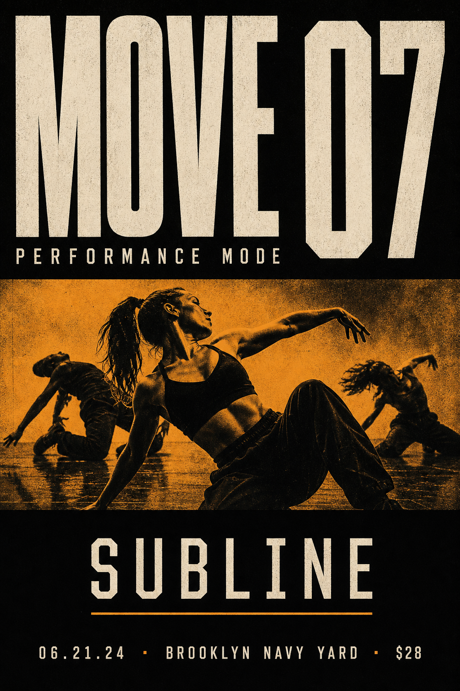
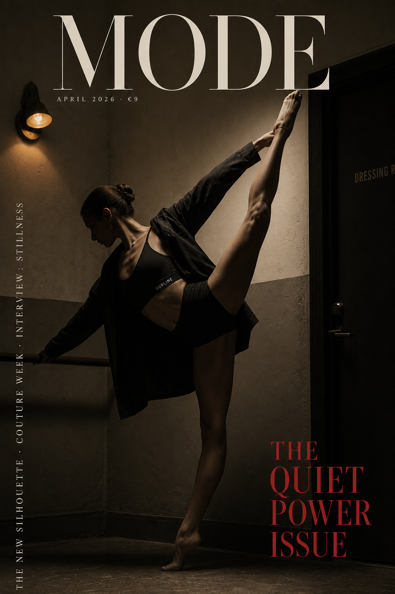
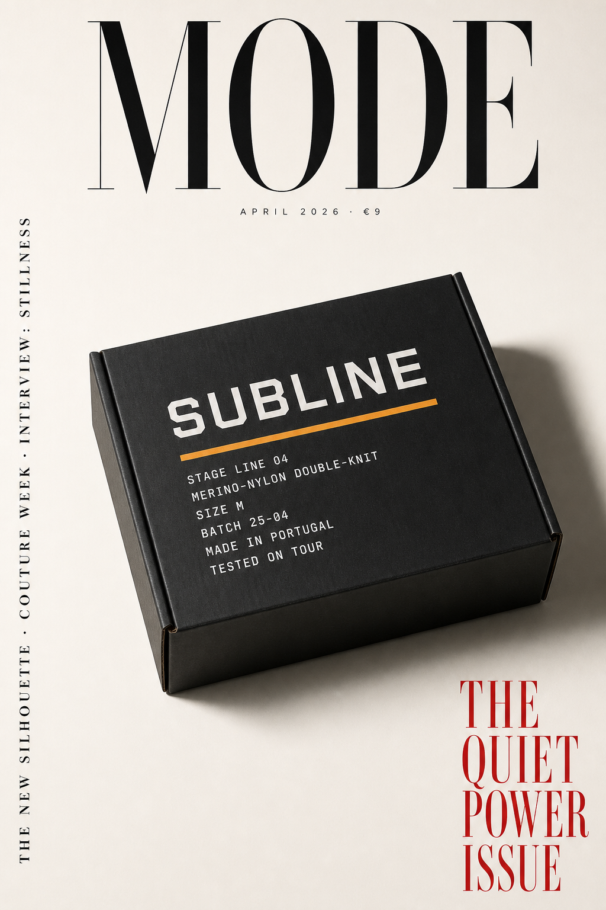

# SUBLINE — Brand Identity Package
## Performance Dancewear · For Josh & Farrice · Garage review, 2026-05-01

---

> *The line beneath the line.*

---

## What This Is

A first-read brand identity package for Josh's performance dancewear concept — "Under Armor's technical credibility × Nike's aspirational identity, built for working dancers." Generated tonight via the full Antigravity system stack: parallel competitive-intel + ICP deep canvass, naming sprint, manifesto + voice rules, DESIGN.md v2 spec, six visual concepts.

This is a **30-minute scrollable artifact**, not a 40-page deck. It exists so Josh can see what the brand could *feel* like with our system behind it, before the energy of the idea fades.

What's in scope: positioning, naming, voice, visual direction, six concept renders.
What's out of scope: TM verification, photography production, fabric R&D, e-commerce build.

---

## The Single Truth (from the ICP deep canvass)

> *The working dancer is a professional athlete trained to make the audience forget she's an athlete. Sweat is the failure of that erasure.*

Every brand decision below derives from this sentence. Sweat-blocking isn't a feature — it's protecting the illusion the dancer's craft depends on. The whole brand thesis lives in that distinction.

---

## The Name

# SUBLINE

**Sub-line.** The line beneath the line. *Line* is the most loaded word in a dancer's vocabulary — "she has beautiful line." Subline names the product's job in three syllables of language they already speak. The brand name and the master tagline are the same thought said twice.

**Top 3 ranked** (full rationale in `foundation/naming-candidates.md`):
1. **SUBLINE** — recommended primary. Dancer-native vocabulary. Industrial-mono typesettable. System extends naturally (STAGE LINE, RUN LINE, EIGHT LINE, TOUR LINE).
2. **LATENS** — Latin for "lying hidden." Strongest pure brand-feel. Patagonia-tier defensibility. Fallback if SUBLINE TM-blocked.
3. **SOTTO** — Italian *sotto voce*, "under the voice." Tracksmith-tier dignity. Risk: food/hospitality TM crowd around the word.

> **TM verification still required before any external launch.** Names are instinct-flagged tonight, not trademark-cleared.

---

## The Positioning

> **SUBLINE makes performance undergarments for working dancers, so the audience sees the art instead of the labor.**

22 words. Names the product, the buyer, the outcome. "Working dancer" claims the segment. "Art instead of labor" names the entire job the product does — protecting the illusion the craft depends on. Repeatable from memory after one read.

---

## The Manifesto (excerpted — full version in `foundation/positioning-manifesto.md`)

### I. The Truth

Every working dancer trains as an athlete and performs as an erasure.

The lifts, the reps, the cross-training, the cardio, the years of conditioning — that body is built like a sprinter's. Then she walks out under stage lights and her job is to make that body look like it was never built at all. The audience can't see the labor or the work breaks. The illusion is the art.

Sweat is what happens when the illusion slips. The pit stain on the playback. The wet stripe down the back of the costume. The moment in row 3 when someone notices. It is not a hygiene problem. It is the audience watching the curtain on her training fall and seeing the athlete she trained ten thousand hours to hide.

### II. The Engineering

Subline is the layer between the dancer and the costume. It is built to block visible sweat where it shows on stage, to hold the line where the costume sits, to disappear where the costume can't. Engineered for the eight-show week. Tested on tour. The fabric is the proof. The fit is the difference.

**Sweat in the studio. Stage-clean on the stage.**

### III. The Stand

A dancer is a professional athlete trained to make the audience forget she's an athlete. That is the highest discipline in performance. It deserves infrastructure built to honor it.

We are dancers, and we are building this for dancers, and we are not asking anyone for permission to take the work seriously.

> *The audience sees the art. We work in the line beneath it.*

---

## The Tagline System

Josh's working tagline — *"Don't let them see you sweat."* — is held as the internal north-star reference. **It is NOT recommended for public use** because it is a near-direct echo of Dry Idea's iconic 1980s "Never let them see you sweat" antiperspirant campaign — a cultural association loud enough that press would read SUBLINE as derivative. (Risk detail in `RISKS.md`.)

The public tagline system:

| Tier | Line | Application |
|---|---|---|
| 🥇 **Master** | *The line beneath the line.* | Hangtags, packaging, hero homepage, video close-cards. Locks with the wordmark. |
| 🥈 **Campaign workhorse** | *Sweat in the studio. Stage-clean on the stage.* | Social ads, TikTok, dancer-evangelism posts. Splits "real dancers sweat" objection without fighting it. |
| 🥉 **Proof tagline** | *Engineered for the eight-show week.* | PDPs, Broadway-segment ads, category lockups. |

(Full set of 7 candidates with rationale in `foundation/tagline-candidates.md`.)

---

## The Visual Direction

**Locked register: Performance-Tech.** Reference adjacencies: Tracksmith × Apolla × Under Armour × Nike Pro. The hero argument is engineering — the dignity follows. *Anti-references*: Lululemon, Alo Yoga, anything athleisure / wellness.

### Color
| Role | Hex | Use |
|---|---|---|
| Primary | `#000000` true black | Wordmark, ground, packaging |
| Field | `#F2EDE0` bone / chalk | Backgrounds, paper, photography seamless |
| Mid | `#3A3A3A` graphite | Body copy, secondary marks |
| **Accent** | **`#F2A33C` Spotlight Amber** | **Single accent — used sparingly. Stage-light reference, technical-pride signal.** |

### Type
- **Display**: GT Pressura Mono (free fallback: JetBrains Mono)
- **Body**: Söhne (free fallback: Inter Variable)
- Wordmark: SUBLINE all-caps industrial mono with a single 1px horizontal rule beneath, visualizing the master tagline.

### Photography
Hard single-source tungsten Fresnel light. 1:8 fill ratio max. Real working dancers — commercial / contemporary / drag. Backstage hallways, dressing-room mirrors, the moment between scenes. **Never** stage-during-performance. **Never** lifestyle Sunday morning. **Never** soft-pastel wellness register.

Full DESIGN.md v2 spec (532 lines, executable to a designer tomorrow morning): `design/DESIGN.md`.

---

## Six Concept Visuals

> ⚠ **Honest framing.** These are AI-generated concept renders showing the brand voice and visual register. They are **reference for production**, not finished assets. Some carry style-template artifacts (notably "MODE / Quiet Power Issue" magazine framing on three of them, "Form Follows Function" lecture-poster overlay on two). Real production photography from the DESIGN.md spec is the next step. Reading them as concept-direction, the system holds together.

### 1. Campaign Hero — *"The line beneath the line."*

The master tagline as a typographic poster. SUBLINE wordmark top-left, headline on a black panel, Spotlight Amber accent stripe beneath. Bottom half ("Form Follows Function / Lecture by the Design Institute") is a Swiss-template artifact — it actually reads on-brand for the engineering register, but the bottom typography would be replaced in production.

### 2. Drop Campaign Poster — *Performance Mode*

Originally briefed as a clean wordmark lockup; the system produced an event/drop-style poster instead — and it's strong as that. Three dancers in stress poses, industrial-mono "MOVE 07 / PERFORMANCE MODE" headline, SUBLINE wordmark below, amber accent on the figures. Reads as a Nike-tier campaign drop. **Repositions** as a launch / drop / capsule announcement asset.

### 3. Dancer-As-Athlete — Backstage Editorial

The photographic register the brand lives in. Working dancer mid-arabesque in a backstage hallway, "DRESSING ROOM" door visible, hard tungsten light, deep shadows. The "MODE / Quiet Power Issue" framing is style-artifact but reads as on-brand editorial-press positioning. **Production direction**: real photographer, this composition, no magazine overlay.

### 4. Product Hero — Stage Line 04

Black foundation garment on dressmaker form, bone seamless, dramatic studio shadow. Technical caption beneath: *"STAGE LINE 04 / MERINO-NYLON DOUBLE-KNIT / TESTED ON TOUR"* — exactly the brand voice. Bottom half is "Form Follows Function" template artifact (would be replaced in production), but the top half IS the product photography register.

### 5. Packaging Mockup

Matte-black corrugated box with industrial-mono printing. SUBLINE wordmark, technical labeling block (`STAGE LINE 04 / MERINO-NYLON DOUBLE-KNIT / SIZE M / BATCH 25-04 / MADE IN PORTUGAL / TESTED ON TOUR`). Pharmaceutical-grade restraint. The "MODE" magazine frame reads as editorial-press placement of the product. **Strong as-is** for concept direction.

### 6. Backstage Portrait — *The Quiet Power*

Working dancer in the dressing room, mid-prep, lacing a shoe. SUBLINE wordmark visible on her foundation garment. Costume rack behind her. Tungsten light from a wall sconce. This is the brand at full register — quiet authority, dancer-as-professional, no glamour, no smile, no inspiration. The Tracksmith × Pina Bausch composition the brand book calls for.

---

## What Josh Should React To Tonight

1. **Does SUBLINE land?** Or do LATENS or SOTTO read faster? (30-minute swap if so — visual system rebuilds around either.)
2. **Does the manifesto sound like him?** The Stand paragraph in particular. If it doesn't, we run another voice pass with him in the room.
3. **Which tagline goes on the first hangtag?** Master = *The line beneath the line.* Workhorse = *Sweat in the studio. Stage-clean on the stage.* Either could be the front-of-package choice.
4. **Does the visual register feel right?** The backstage-editorial direction (visuals 3 and 6) vs the typographic-broadcast direction (visuals 1 and 2) — both are inside the system, but Josh should pick which leads.
5. **Anything that makes him say "oh shit"?** That's the brand-feel test from the original brief. If yes, we know which thread to pull next.

---

## Where This Goes Next (Phase 2 — not tonight)

- **TM verification** on SUBLINE / LATENS / SOTTO in apparel class. (See `RISKS.md`.)
- **Domain capture**: subline.co, getsubline.com, runsubline.com (subline.com almost certainly taken).
- **Photo direction**: a real photographer working from the DESIGN.md spec, shooting the 5 photo briefs in the design doc.
- **Fabric R&D**: Josh's actual material-science work — what does SUBLINE actually feel like on, and does it block visible sweat for 280 minutes? The marketing claims have to be true.
- **Beachhead validation**: 5 commercial dancers in LA (per ICP profile — that's the buy-first segment). Free samples + interviews. Validate the "Apolla for the body" thesis with real bodies.
- **Risk tracking**: `RISKS.md` is live and gets updated after every conversation with the lawyer, the fabric vendor, and the first 5 dancers.

---

## Files

| Asset | Path |
|---|---|
| Competitive landscape | `research/competitive-landscape.md` (~2,400 words, white-space confirmed: "Apolla for the body") |
| ICP profile | `research/icp-profile.md` (~3,200 words, beachhead = commercial dancers, sleeper = drag) |
| Naming candidates | `foundation/naming-candidates.md` (12 candidates, top 3 ranked) |
| Positioning + manifesto | `foundation/positioning-manifesto.md` (3 positioning sentences + full manifesto + voice rules) |
| Tagline candidates | `foundation/tagline-candidates.md` (7 candidates ranked, Dry Idea risk surfaced) |
| DESIGN.md v2 spec | `design/DESIGN.md` (532 lines, executable to a designer tomorrow morning) |
| Visuals (6 PNGs) | `visuals/01-06.png` |
| Risks | `RISKS.md` |

**Total system spend tonight**: ~$0.49 in Fal API (visual generation, including 3 regenerations to clear style-template artifacts). Subagent compute amortized.

**Total time**: ~45 minutes from "I'm in the garage with Josh" to this scrollable artifact.

---

> *The audience sees the art.*
> *We work in the line beneath it.*
