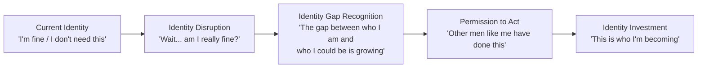

# Agent 5: Identity Persuasion Analyst (Jeremy Miner — NEPQ Framework)
## Resurrection Coach — Identity-Level Sales Architecture

> **Agent Role**: Map the identity structures that govern purchasing decisions at the $10K level. Design question sequences (NEPQ) that move prospects from resistance to self-persuasion by leveraging identity gaps — the distance between who they ARE and who they KNOW they should be.

---

### 🔬 Grounding Summary (Perplexity Research Pass)

**Status**: ENRICHED — Identity-level sales architecture validated against Reddit shame/identity data (Feb 2026 research)

| Validation Point | Status | Evidence |
|:---|:---|:---|
| **Identity gap exists** | 🟢 GROUNDED | Reddit execs consistently describe gap: *"I was killing it at work but dying at home"* — the identity contradiction is real and felt |
| **Vulnerability = risk** | 🟢 GROUNDED | *"Asking for trainer recs = admitting defeat."* NEPQ approach correct: questions must enable self-discovery, not demand confession |
| **Peer proof as permission** | 🟢 GROUNDED | Peer confession is #1 decision trigger (viral "how did you get fit again?" thread, 5k upvotes). NEPQ must leverage peer examples |
| **$10K investment reframe** | 🟢 GROUNDED | 60-70% skepticism about existing programs validates the need for identity-level (not feature-level) price justification |

**Key insight**: Agent's framework is directionally strong. The NEPQ sequences correctly target identity gaps rather than feature selling — validated by the fact that Reddit execs ALREADY self-persuade through identity language (*"the cost of playing at this level"*).

---

## CORE PRINCIPLE: IDENTITY-FIRST PERSUASION

Traditional sales asks: *"Do you want this product?"*
Identity persuasion asks: *"Is the person you're becoming someone who would make this investment?"*

At the $10K level, executives don't buy products. They buy **identity confirmation**. The Resurrection Protocol must position itself as the bridge between the executive's current identity (declining, compensating, performing) and his aspirational identity (vital, commanding, sovereign).

**The Critical Insight**: These men don't fear *dying*. They fear *becoming irrelevant*. Every NEPQ question must probe this wound — gently, precisely, and with the authority of someone who understands it.

---

## IDENTITY GAP ANALYSIS BY AVATAR

### Avatar 1: The Numb Operator

**Current Identity**: "I'm the engine. I keep everything running."
**Shadow Identity** (what he won't say): "I'm a machine running on fumes pretending to be a man."
**Aspirational Identity**: "I'm the leader who operates at peak capacity — physically, mentally, strategically."

**Identity Gap**: He's built his entire self-concept around being *indispensable*. But indispensability requires performance. And performance requires a body that works. The gap is between the performing machine and the human underneath who is quietly failing.

**NEPQ Sequence for The Numb Operator**:

| Phase | Question | Purpose |
|---|---|---|
| **Situation** | "Walk me through a typical week. When do you have the most energy? When does it drop?" | Get him talking about his patterns without judgment. He'll reveal the decline himself. |
| **Problem Awareness** | "When your energy dips at 2:30 — what does that cost you in terms of decision quality?" | Connect physical state to professional output. This is the language he speaks. |
| **Problem Expansion** | "If that pattern continues for another 3 years, where does that trajectory take you professionally?" | Force future projection. He's good at projecting business outcomes — now do it with his body. |
| **Consequence** | "The executives I work with describe a point where the gap between their reputation and their actual capacity gets dangerous. Does that resonate?" | Normalize the struggle. Give him permission to admit the gap by framing it as universal among his peers. |
| **Commitment** | "If we could close that gap in 90 days — where you're actually operating at the level people already think you do — what would that be worth to your next 10 years?" | Reframe the investment as identity alignment, not health improvement. |

**Identity Trigger Phrase**: *"You're not broken. You're just running enterprise-grade demands on consumer-grade infrastructure. We upgrade the infrastructure."*

---

### Avatar 2: The Ticking Clock

**Current Identity**: "I'm a successful man who's earned everything I have."
**Shadow Identity**: "I'm watching my father's decline replay in my body and I can't stop it."
**Aspirational Identity**: "I'm the man who broke the family pattern. I chose differently."

**Identity Gap**: He believes success should protect him from biological reality. It hasn't. The gap is between the narrative of success and the biological evidence accumulating against it.

**NEPQ Sequence for The Ticking Clock**:

| Phase | Question | Purpose |
|---|---|---|
| **Situation** | "Tell me about your health history — not just yours, but your father's. What patterns concern you?" | Open the family wound. He's already thinking about it constantly. Give him space to say it. |
| **Problem Awareness** | "When you think about that pattern — what are you actually afraid of?" | Push past the clinical language into the emotional truth. He's not afraid of "heart disease." He's afraid of becoming his father. |
| **Problem Expansion** | "What would it mean for your children to watch the same thing happen to you that you watched happen to your father?" | The deepest cut. This isn't about him anymore — it's about legacy. |
| **Consequence** | "Most men in your position have two paths: intervene now with precision, or manage the decline later with medication. Which path are you on right now?" | Binary frame. He's a decision-maker. Give him a decision. |
| **Commitment** | "If there were a protocol designed specifically for men in your situation — men who see the pattern and want to break it — would you want to know what that looks like?" | Soft close. He's already sold. He just needs permission. |

**Identity Trigger Phrase**: *"Your father didn't have access to this. You do. That's the difference between repeating the pattern and breaking it."*

---

### Avatar 3: The Post-Detonation Executive

**Current Identity**: "I'm rebuilding. I don't know who I am yet."
**Shadow Identity**: "I'm terrified that without my title, I might be nothing."
**Aspirational Identity**: "I'm the man who used destruction as a foundation for something real."

**Identity Gap**: His old identity was destroyed by the crisis. He's in the gap — between who he was (defined by status) and who he could become (defined by substance). The body is the first thing he can rebuild that is *entirely his*.

**NEPQ Sequence for The Post-Detonation Executive**:

| Phase | Question | Purpose |
|---|---|---|
| **Situation** | "Tell me what happened. Not the LinkedIn version — the real version." | This man is desperate for someone who wants the truth. Every other person in his life gets the sanitized story. |
| **Problem Awareness** | "After everything fell apart, what was the first thing you noticed about your body?" | Connect the external crisis to the physical evidence. He'll say: "I stopped sleeping" or "I gained 30 pounds." |
| **Problem Expansion** | "When you look in the mirror now, does the man you see match the man you're trying to become?" | The mirror question. Devastating in its simplicity. |
| **Consequence** | "What happens if you rebuild the career, the relationships, the finances — but the body stays like this?" | Expose the asymmetry. He's rebuilding everything EXCEPT the foundation. |
| **Commitment** | "What if we started with the body — because it's the one thing that's 100% yours — and let everything else rebuild on top of that?" | The Resurrection thesis in a single sentence. Body first. Identity follows. |

**Identity Trigger Phrase**: *"Everyone else lost who they were and tried to rebuild the career first. The men who rebuilt the body first rebuilt everything faster. Because the body is the only thing no one can take from you."*

---

### Avatar 4: The High-Functioning Wreck

**Current Identity**: "I'm crushing it. I'm handling everything."
**Shadow Identity**: "I'm operating at 60% and terrified someone will notice."
**Aspirational Identity**: "I'm the version of me that actually feels as good as I look on paper."

**Identity Gap**: The gap between his public performance and his private experience. He knows he's declining. He's managing the perception gap with caffeine, willpower, and strategic scheduling around his low-energy periods. The gap is widening.

**NEPQ Sequence for The High-Functioning Wreck**:

| Phase | Question | Purpose |
|---|---|---|
| **Situation** | "How do you manage your energy throughout the day? Walk me through your system." | He'll reveal his coping mechanisms without realizing they're coping mechanisms. The caffeine architecture, the strategic napping, the afternoon avoidance. |
| **Problem Awareness** | "What would your 30-year-old self think about the systems you need just to get through a Tuesday?" | Temporal contrast. His 30-year-old self didn't need systems. The contrast is the problem statement. |
| **Problem Expansion** | "When was the last time you felt genuinely *sharp* — not managed, but actually operating at full capacity?" | He probably can't remember. The silence IS the answer. |
| **Consequence** | "The executives I've worked with describe a tipping point — where the gap between performance and capacity becomes visible to others. How close are you to that?" | Generate urgency by suggesting the mask is slipping. |
| **Commitment** | "What if 'crushing it' wasn't an act? What if you actually felt the way you've been pretending to feel?" | The most compelling close: make the performance real. |

**Identity Trigger Phrase**: *"You don't need motivation. You need your hardware upgraded. Imagine if your software was running on the machine it deserves."*

---

## OBJECTION ARCHITECTURE (IDENTITY-LEVEL REFRAMES)

### Objection 1: "I don't have time for this."

**Surface meaning**: I'm too busy.
**Identity meaning**: Admitting I need this means admitting I'm not managing my life well.

**NEPQ Reframe**:
> "That's exactly what the last 12 executives who enrolled said. And here's what they discovered: they weren't too busy. They were too exhausted to fit anything else in. The protocol doesn't add to your schedule — it upgrades your capacity WITHIN the schedule you already have. The first thing that changes isn't your calendar. It's your energy at 2 PM."

---

### Objection 2: "I've tried things before. They don't stick."

**Surface meaning**: Programs haven't worked.
**Identity meaning**: I don't trust myself to follow through, and I'm ashamed of that.

**NEPQ Reframe**:
> "Good. That means you've already eliminated what doesn't work. The difference between those programs and this one is simple: those were designed for the general public. This was engineered for men who run 7-8 figure operations. The architecture is different because the demands are different. You wouldn't use a consumer laptop to run your business. So why would you use a consumer health plan to run your body?"

---

### Objection 3: "What exactly am I paying $10K for?"

**Surface meaning**: Justify the price.
**Identity meaning**: I need to confirm this is at the level I'm accustomed to paying for.

**NEPQ Reframe**:
> "You're paying for precision. You wouldn't hire a generalist to manage a $20M portfolio. The $10K buys you a protocol reverse-engineered for executive physiology — cortisol patterns driven by high-stakes decision-making, sleep architecture disrupted by cognitive load, metabolic adaptation to 14-hour days. It's the difference between a 'health plan' and an executive performance system. Does your business buy solutions at the commodity level, or at the precision level?"

---

### Objection 4: "I need to think about it."

**Surface meaning**: Not now.
**Identity meaning**: I'm afraid that if I commit, I'll have to face how far I've let things slide.

**NEPQ Reframe**:
> "Of course. Here's the only thing I'd ask you to think about: a year from now, if you haven't done this — where are you? Not just physically, but what does the trajectory look like? Because most men in your position tell me later: 'I wish I'd started when we first talked.' I'd rather you start now than say that in 12 months."

---

### Objection 5: "My wife/partner would think this is a lot of money."

**Surface meaning**: Spousal approval required.
**Identity meaning**: I don't feel enough ownership over this decision to make it alone.

**NEPQ Reframe**:
> "That's fair. Let me ask you this: when you made the decision to invest $50K in your last business venture, did your wife approve the ROI spreadsheet? Or did she trust that you understood the value? This is the same category of decision — it's an investment in the assets that generate everything else. Most of my clients find that their partners are relieved they finally did something, not upset about the cost."

---

## THE IDENTITY BRIDGE: FROM RESISTANCE TO ENROLLMENT

**Key Insight**: The sale doesn't happen when he agrees to pay. The sale happens when he *stops identifying* as someone who can handle this alone and *starts identifying* as someone who invests in precision solutions. The money is a formality after the identity shift.

---

## CLOSING ARCHITECTURE

**The Only Close That Works at This Level: The Identity Close**

Never ask: *"Would you like to get started?"*
Never ask: *"Can I send you the payment link?"*

Instead:

> "Based on everything you've told me — the pattern you described, the trajectory you see, the version of yourself you're trying to become — I think you already know this is the right move. The only question is whether you're ready to start now, or whether you want to keep thinking about it while the gap gets wider. What feels right to you?"

This works because:
1. It references HIS OWN words back to him (no new arguments)
2. It positions the decision as identity-congruent (not aspirational — he's catching up to himself)
3. It creates gentle urgency without pressure ("while the gap gets wider")
4. It gives him agency ("What feels right to you?")

**Post-close anchoring**: After he says yes, immediately reinforce the identity:

> "Good. You just made the decision that most men in your position put off for 3-5 years. That gap between where you are and where you're about to be? We close it in 90 days."
