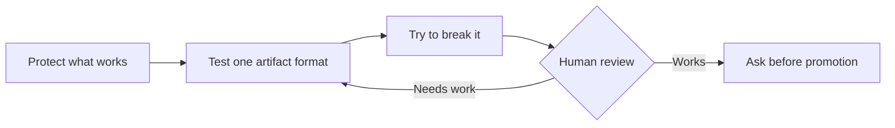

# Morning Review — Artifact Comprehension v0.2.2

Status: **APPROVED DIRECTION / BEHAVIOR PASS**

## Read This First

You did enough last night. Two artifact patterns are already accepted. There is
only one decision left: does this flow help you understand the work and keep
both of us on track?

## What We Learned

- A useful artifact explains the logic; it does not merely state facts.
- Structure wins only when it preserves insight.
- A flow is valuable when it shows dependencies, feedback, and stopping points.
- Global replies, closeouts, and the three-next-prompts system remain untouched.

## Final Candidate — Implementation Flow

**Goal:** Make artifacts easier to absorb without touching the output system
that already works.

**Stop:** No merge, hooks, or global activation.

## If You Approve It

For substantial artifacts, Codex may choose a flow when dependencies, review
loops, gates, or state changes are the information you need to see. It will not
force flows into ordinary replies, nuanced prose, or simple lists.

## Morning Decision

- `A — This is the right direction.` **SELECTED 2026-09-01**
- `B — It still needs work: [one sentence].`

That is the whole review. No other ratings are needed.

## Proof And Boundary

- 8/8 artifact-shape fixtures pass.
- 13/13 failure cases are caught.
- AHG-001, AHG-002R, and AHG-003F are accepted and frozen.
- The branch remains workspace-only and unmerged.
- Clear Depth, closeouts, hooks, and global Codex are unchanged.
