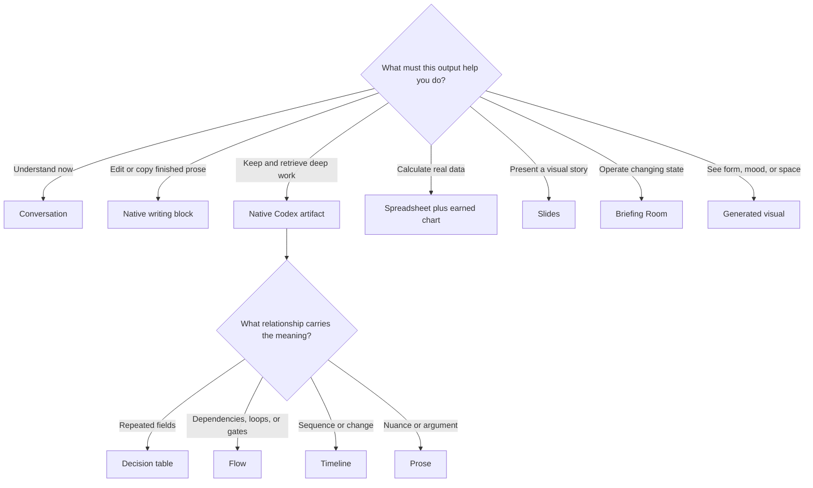

# Intelligent Output Surface Map

Status: **WORKSPACE SHADOW / STRUCTURAL PASS**

## Verdict

Codex should not default everything to chat or Markdown. It should quietly
choose one primary surface based on how you need to consume and use the work.
The feature must earn its place.

## What The “Box” Is

A native writing block is an editable, reusable container inside the Codex
conversation. It is appropriate for finished emails, posts, messages, copy, or
other prose you want to edit and reuse. It is not the right container for an
explanation, implementation plan, code, or ordinary conversation.

## How This Should Feel In Practice

- You provide the intent; Codex chooses the smallest useful surface.
- You see a flow when the path and feedback loop matter.
- You see a table when repeated fields make comparison faster.
- You get a writing block when the writing itself is the reusable deliverable.
- You get a spreadsheet or chart only when real numbers carry the meaning.
- You get slides, an interactive board, or a generated visual only when the
  outcome is genuinely presentation-shaped, live, or visual.
- You can still say `plain`, `no visual`, `make this editable`, `show this as a
  flow`, or `go deeper` at any time.

## Guardrails

- One primary surface per deliverable.
- A second representation must perform a different job.
- No duplicate deliverables merely for variety.
- No chart without comparable data.
- No dashboard for a static document.
- No image that replaces reasoning.
- No writing block for general explanation or system output.
- No global activation, publishing, paid tool use, or unrequested export.

## Proof

- Artifact comprehension: **BEHAVIOR PASS**.
- Representation fixtures: **8/8 PASS**.
- Representation sabotage: **13/13 CAUGHT**.
- Surface-selection fixtures: **8/8 PASS**.
- Surface-overuse sabotage: **6/6 CAUGHT**.
- Clear Depth, ordinary replies, closeouts, and global Codex: **UNCHANGED**.
