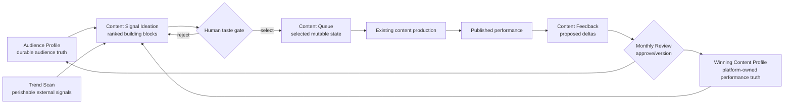

# Architecture Checkpoint: Kieran Flanagan Content Signal Loop

## Checkpoint Verdict

**Recommended build:** expand the existing Kieran Flanagan three-skill system with **3 new workflows, 3 new born-v2 prompts, 3 new command wrappers, and 3 surgical workflow extensions**.

Do not create:

- a new agent,
- a fourth Kieran skill,
- a generic ideation mega-workflow,
- a finished-content generator,
- a second queue owner.

This is the smallest architecture that captures the source’s full loop without duplicating current capabilities.

## Capability Topology



## Layer Ownership

| Layer | Owner | New responsibility | Boundary |
|---|---|---|---|
| Audience Intelligence | `kieran-flanagan-audience-intelligence` | Build and version platform-specific Winning Content Profiles | Does not perform live trend research or mutate the queue |
| Content Engine | `kieran-flanagan-content-engine` | Triangulate audience, winning patterns, and fresh signals into idea cards | Does not draft finished content or add items without selection |
| Content Ops | `kieran-flanagan-content-ops` | Maintain queue lifecycle and coordinate monthly refresh | Does not invent ideas independently or rewrite evidence profiles silently |

## Exact Workflow Architecture

### New workflow 1: Winning Content Profile

| Contract | Decision |
|---|---|
| Skill | `kieran-flanagan-audience-intelligence` |
| Workflow file | `skills/kieran-flanagan-audience-intelligence/workflows/05-winning-content-profile.md` |
| Born-v2 prompt | `skills/kieran-flanagan-audience-intelligence/references/prompts-v2/winning-content-profile.md` |
| Command wrapper | `.agent/workflows/content-winning-profile.md` |
| Command | `/content-winning-profile` |
| Purpose | Convert one platform’s owned content and performance data into a ranked, versioned pattern profile |
| Required inputs | Creator, platform, content library, performance data, time window, metric hierarchy |
| Output | Winning Content Profile; no ideas and no finished content |
| Default save | `[STATE_ROOT]/profiles/winning-content-[platform].md` |
| Hard gates | One platform per profile; dataset coverage stated; missing metrics flagged; patterns not topics; no invented performance |

**Profile schema**

```text
profile_id
creator
platform
version
source_window
source_count
metric_hierarchy
last_refreshed
freshness_status
winning_formulas[]
  formula_id
  label
  transferable_mechanic
  supporting_items[]
  performance_summary
  trend_direction
  best_use_cases
  anti_patterns
  confidence
coverage_gaps[]
```

This workflow absorbs none of `content-cluster` or `hook-formula-extract`. It may reference their outputs, but it owns the broader platform-level formula profile.

### New workflow 2: Content Signal Ideation

| Contract | Decision |
|---|---|
| Skill | `kieran-flanagan-content-engine` |
| Workflow file | `skills/kieran-flanagan-content-engine/workflows/09-content-signal-ideation.md` |
| Born-v2 prompt | `skills/kieran-flanagan-content-engine/references/prompts-v2/content-signal-ideation.md` |
| Command wrapper | `.agent/workflows/content-ideas.md` |
| Command | `/content-ideas` |
| Purpose | Produce ranked idea building blocks from audience truth + platform winners + a bounded live-signal scan |
| Required inputs | Audience profile, one or more Winning Content Profiles, requested platform or comparison mode, trend window, trend sources, optional talking-point library |
| Output | Proven, Trending, and Convergence idea cards; no finished content |
| Default save | `[STATE_ROOT]/runs/ideas-[date]-[platform].md` |
| Hard gates | Recommended platform on every card; provenance for trend claims; creator bridge; no queue mutation; no post/script/newsletter drafting |

**Idea-card schema**

```text
idea_id
working_title
one_sentence_premise
signal_lane: proven | trending | convergence
recommended_platform
audience_reason
winning_formula_id
pattern_transfer
trend_evidence[]
creator_bridge
content_category
confidence
risks_or_unknowns[]
recommended_queue_action
```

**Ranking rule**

```text
Audience fit
× owned-pattern evidence
× current-signal strength
× creator-bridge strength
× platform fit
```

The score is explanatory, not false precision. Missing evidence lowers confidence rather than being silently inferred.

### New workflow 3: Content Queue

| Contract | Decision |
|---|---|
| Skill | `kieran-flanagan-content-ops` |
| Workflow file | `skills/kieran-flanagan-content-ops/workflows/04-content-queue.md` |
| Born-v2 prompt | `skills/kieran-flanagan-content-ops/references/prompts-v2/content-queue-session.md` |
| Command wrapper | `.agent/workflows/content-queue.md` |
| Command | `/content-queue` |
| Purpose | Show and mutate the human-selected idea inventory with explicit lifecycle operations |
| Required inputs | State root, operation, item IDs or selected idea cards |
| Operations | `show`, `add-selected`, `hold`, `kill`, `promote`, `defer`, `mark-drafted`, `mark-published`, `health-check` |
| Output | Queue delta first, then current queue and health signals |
| Default save | `[STATE_ROOT]/queues/content-queue.md` |
| Hard gates | `add-selected` only; no auto-add from ideation; no destructive removal without a visible tombstone; no queue item without platform and provenance |

**Queue-item schema**

```text
item_id
idea_id
premise
category
platform
signal_lane
winning_formula_id
trend_sources[]
creator_bridge
priority
status: queued | hold | killed | promoted | drafted | published
created_at
last_reviewed
stale_after
next_action
decision_note
```

Killed items remain as compact tombstones so the system can detect repeated suggestions.

## Exact Extensions to Existing Workflows

### 1. Extend `content-orchestrate`

Files:

- `skills/kieran-flanagan-content-ops/workflows/01-content-orchestrate.md`
- `skills/kieran-flanagan-content-ops/references/prompts-v2/content-orchestration-session.md`
- `.agent/workflows/content-orchestrate.md`

Change:

- Add `Ideate` as a session goal.
- Add Winning Content Profile and Content Queue to the asset inventory.
- Add this chain:

```text
Audience Profile
→ platform Winning Content Profile
→ bounded trend scan
→ /content-ideas
→ human selection checkpoint
→ /content-queue add-selected
```

Keep `/content-ideas` independently callable. The orchestrator coordinates it; it does not reimplement it.

### 2. Extend `content-feedback`

Files:

- `skills/kieran-flanagan-content-ops/workflows/02-content-feedback.md`
- `skills/kieran-flanagan-content-ops/references/prompts-v2/content-performance-feedback-report.md`
- `.agent/workflows/content-feedback.md`

Change:

- Add Winning Content Profile to Current Assets and Asset Audit.
- Produce a formula-level proposed delta: rank up, rank down, add, deprecate, or insufficient evidence.
- Never write the profile directly.
- Route approved changes to the monthly review.

### 3. Extend `content-review-cycle`

Files:

- `skills/kieran-flanagan-content-ops/workflows/03-content-review-cycle.md`
- `skills/kieran-flanagan-content-ops/references/prompts-v2/monthly-content-system-review.md`
- `.agent/workflows/content-review-cycle.md`

Change:

- Add per-platform Winning Content Profiles and queue health to the monthly asset audit.
- Approve, modify, or reject each proposed formula delta.
- On approval, increment profile version and refresh date.
- Detect stale queue items, duplicates, depleted categories, and patterns whose performance is declining.

## Genius and Skill Contract Extensions

### `kieran-flanagan-audience-intelligence`

- Add Genius Pattern: **Creator-Owned Winning Pattern Profiles**.
- Add Signature Move: profile one platform at a time.
- Add rubric criteria: coverage, formula transferability, trend direction, confidence.
- Update `SKILL.md` workflow table from 4 to 5.

### `kieran-flanagan-content-engine`

- Add Genius Pattern: **Three-Signal Triangulation**.
- Add Hidden Knowledge: ideation as retrieval, not unrestricted brainstorming.
- Add Anti-Pattern: prompt-to-publish idea generation.
- Add rubric criteria: convergence quality, platform visibility, creator bridge, freshness.
- Update `SKILL.md` workflow table from 8 to 9.

### `kieran-flanagan-content-ops`

- Add Genius Pattern: **Human-Curated Queue State**.
- Add Signature Move: subtraction is an ideation operation.
- Add Anti-Pattern: queue accumulation without pruning.
- Add rubric criteria: mutation transparency, staleness, tombstones, approval boundary.
- Update `SKILL.md` workflow table from 3 to 4.

## State and Portability Contract

The skills must not store creator data inside `skills/`.

Use:

```text
[STATE_ROOT]/
  audience-profile.md
  profiles/
    winning-content-linkedin.md
    winning-content-substack.md
    winning-content-youtube.md
  queues/
    content-queue.md
  runs/
    ideas-YYYY-MM-DD-[platform].md
    feedback-YYYY-MM-DD.md
    review-YYYY-MM.md
```

Resolution:

1. User-supplied `--state-root` wins.
2. Existing project content-system root wins when explicitly provided.
3. Demo/default runs use `.tmp/kieran-flanagan/[creator-slug]/`.

The default is convenient but not durable. A production deployment must name a persistent project root so shared context survives cleanup and remains assistant-agnostic.

## Freshness Rules

| Asset | Default freshness | Behavior when stale |
|---|---:|---|
| Audience Profile | 30 days | Warn and route to feedback/review before high-confidence ideation |
| Winning Content Profile | 30 days | Lower confidence; request or run profile refresh |
| Trend evidence | Operator-selected 7/28/30-day window | Reject sources outside the requested window unless labeled historical context |
| Queue item | 45 days without review | Mark stale and require hold/kill/refresh decision |
| Published result | Until next monthly review | Eligible as feedback evidence; not merged automatically |

These are operating defaults, not claims that the source stated every number. The source explicitly supports monthly profile refresh and operator-selected trend windows.

## Prompt Architecture

Each net-new deliverable gets one structure-pure born-v2 prompt:

| Deliverable | Prompt | Why separate |
|---|---|---|
| Winning Content Profile | `winning-content-profile.md` | Durable analytical asset with evidence and versioning |
| Content Signal Ideation | `content-signal-ideation.md` | Perishable research synthesis with a human selection boundary |
| Content Queue Session | `content-queue-session.md` | Stateful mutation contract requiring delta visibility |

No additional prompt is needed for every wrapper edit. Existing orchestration, feedback, and review prompts are extended in place because their output identity remains unchanged.

## Command and Registry Wiring

### New commands

| Command | Direct owner | Output |
|---|---|---|
| `/content-winning-profile` | Audience Intelligence workflow 05 | Platform Winning Content Profile |
| `/content-ideas` | Content Engine workflow 09 | Ranked idea cards |
| `/content-queue` | Content Ops workflow 04 | Queue delta + queue state |

### Registry updates after build

- `agents/kieran-flanagan/AGENT.md`: 15 to 18 workflows and activation language.
- `SKILL_INDEX.md`: generated workflow counts 5 / 9 / 4 and updated keywords.
- `SLASH_COMMANDS.md`: Kieran section 8 to 11 commands, raw-intent routes, and alphabetical command index.
- `AGENT_INDEX.md`: regenerate only if the agent keyword surface changes.
- `.agent/skill-index.json` or other generated indexes: refresh through the canonical registry tools, not hand-editing.

### Provenance updates after build

- Append the source and claim labels to all three `references/source-ledger.md` files.
- Update the three `references/PROVENANCE-2026-07-18.md` files or create a dated additive provenance note if the verifier expects immutable historical receipts.
- Add a source expansion note to `agents/kieran-flanagan/AGENT.md`.

## Stacking Partners

| Need | Existing partner | Boundary |
|---|---|---|
| Topic territory and content gaps | `content-cluster` | Supplies topics; signal ideation ranks current opportunities |
| Creator beliefs and source-grounded positions | `talking-points` | Supplies creator bridge; signal ideation must not invent beliefs |
| Adjacent structural inspiration | `lookalike-content` | External pattern discovery; Winning Profile remains owned-data only |
| Hook-specific performance | `hook-formula-extract` | Supplies hook formulas; Winning Profile covers complete idea structures |
| Competitor trends | `competitor-content-spy` | Optional trend source; not a substitute for broad live-signal research |
| Finished content | Existing platform/content experts | Begins only after queue promotion and a separate creation request |

## Build Sequence

1. Add source-ledger entries and scoped genius-pattern extensions.
2. Build Winning Content Profile workflow, born-v2 prompt, and wrapper.
3. Build Content Signal Ideation workflow, born-v2 prompt, and wrapper.
4. Build Content Queue workflow, born-v2 prompt, and wrapper.
5. Extend orchestration, feedback, and monthly review contracts.
6. Update Kieran agent inventory.
7. Regenerate registries and command indexes through canonical tools.
8. Run focused validation, then full wiring and system verification.
9. Present the Verification Checkpoint before any hot/global promotion.

The order matters: downstream workflows should be written against approved upstream schemas, not against prose descriptions that may drift.

## Verification Plan

### Static verification

```text
python3 execution/validate_skill.py kieran-flanagan-audience-intelligence
python3 execution/validate_skill.py kieran-flanagan-content-engine
python3 execution/validate_skill.py kieran-flanagan-content-ops
python3 execution/verify_skill_system_contract.py
python3 execution/wiring_audit.py
python3 execution/verify_system.py
```

### Contract fixtures

1. **Platform omission regression:** every idea card must name a recommended platform.
2. **No-metrics fixture:** profile lowers confidence and does not invent engagement.
3. **Stale-profile fixture:** ideation warns and lowers confidence after freshness expiry.
4. **Pattern-not-topic fixture:** rejects an idea that merely restates an old winner.
5. **Human-gate fixture:** ideation cannot mutate the queue before explicit selection.
6. **Tombstone fixture:** killed idea remains detectable and is not resurfaced unchanged.
7. **Trend-window fixture:** evidence outside 7/28/30-day bounds is rejected or labeled historical.
8. **Finished-content veto:** ideation output contains no completed post, newsletter, or script.
9. **Cross-assistant fixture:** a queue created from one run can be read and updated from a clean session using only the state root.
10. **Monthly-delta fixture:** feedback proposes changes; review approval is required before profile version increments.

### Prose and evidence verification

```text
python3 execution/claim_risk_scan.py [changed markdown files]
python3 execution/prose_classifier.py check [changed user-facing markdown files]
python3 execution/export_format_guard.py [checkpoint artifacts]
```

### Acceptance bar

- All three skills validate.
- All three commands are discoverable and wired.
- Ten fixtures pass.
- No new dependency.
- No global `~/.codex` mirror.
- No existing Kieran workflow loses a current output contract.
- Factual claims remain VERIFIED / INFERRED / UNCONFIRMED where appropriate.

## Dependencies and Risk

- **New dependencies:** none.
- **Paid tools:** none required for the skill build.
- **External writes:** none.
- **Hot/global promotion:** excluded.
- **Primary implementation risk:** the main workspace is currently dirty with unrelated user/system changes. The production build must preserve those changes and use the Codex-owned write root if one is declared; otherwise it should stop before overlapping edits.
- **Primary design risk:** allowing `content-ideas` to drift into finished-content generation.
- **Primary state risk:** treating `.tmp` as permanent storage in a real deployment.

## Approval Gate

Approve this exact architecture to authorize the production build of:

- 3 new workflows,
- 3 new born-v2 prompts,
- 3 new command wrappers,
- 3 scoped existing-workflow extensions,
- scoped genius/SKILL/source-ledger updates,
- agent and registry wiring,
- focused fixtures and verification.

Anything outside that list returns to a new architecture checkpoint.
