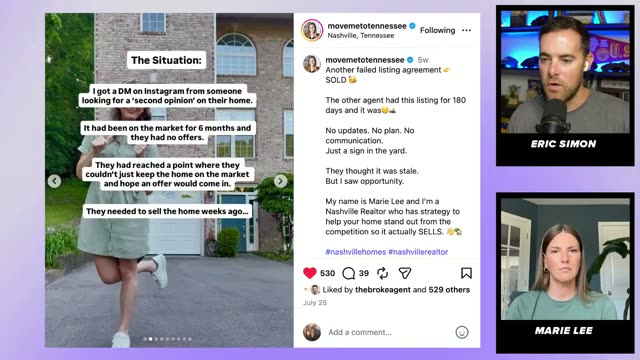
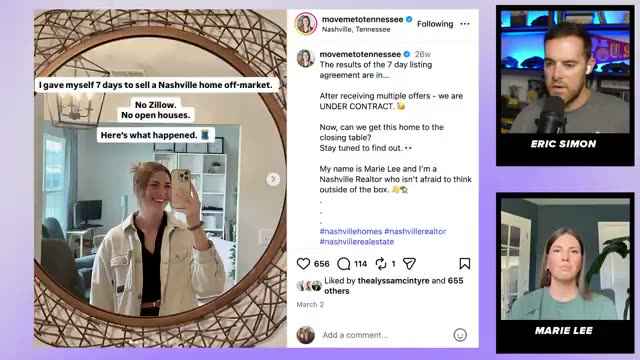

# Visual Evidence Ledger

The frames below were captured from the source interview at the listed timestamps. They support format and source-observation analysis; they do not independently validate every result claimed in a post.

## Quick visual proof

| Time | Frame | What is visible | System use |
|---|---|---|---|
| 11:22 | [`11m22s-yap-format.jpg`](frames/11m22s-yap-format.jpg) | Vertical talking-head clip | Competence-moment Reel anatomy |
| 12:18 | [`12m18s-difficult-sale-hook-caption.jpg`](frames/12m18s-difficult-sale-hook-caption.jpg) | Agent/property image and long caption | Single-image narrative format |
| 16:28 | [`16m28s-difficult-sale-result.jpg`](frames/16m28s-difficult-sale-result.jpg) | Closing address, price, and comparative result claim | Result and claim-verification boundary |
| 19:20 | [`19m20s-marketing-comparison.jpg`](frames/19m20s-marketing-comparison.jpg) | Previous and revised listing description | Proof beside diagnosis |
| 19:47 | [`19m47s-response-proof.jpg`](frames/19m47s-response-proof.jpg) | Showing response, offer, failure, and relaunch | Recovery story, not frictionless victory |
| 22:14 | [`22m14s-failed-listing-situation.jpg`](frames/22m14s-failed-listing-situation.jpg) | Instagram-origin lead, stale listing, seller urgency | Specific situation and stakes |
| 22:27 | [`22m27s-failed-listing-marketing.jpg`](frames/22m27s-failed-listing-marketing.jpg) | Old/new positioning comparison | Inspectable competence evidence |
| 22:58 | [`22m58s-failed-listing-result.jpg`](frames/22m58s-failed-listing-result.jpg) | Relaunch timing and full-price/list-price outcome | Result slide and causal restraint |
| 27:38 | [`27m38s-quantified-cover-hook.jpg`](frames/27m38s-quantified-cover-hook.jpg) | Six months vs fourteen days plus a twist | Quantified before/after hook |
| 31:09 | [`31m09s-seven-day-live-cta.jpg`](frames/31m09s-seven-day-live-cta.jpg) | In-car update, seven-day question, property CTA | Live-stakes and demand capture |
| 34:18 | [`34m18s-seven-day-recap-cover.jpg`](frames/34m18s-seven-day-recap-cover.jpg) | Seven-day recap; visible engagement counts | Final recap; engagement is attention only |
| 34:35 | [`34m35s-seven-day-situation.jpg`](frames/34m35s-seven-day-situation.jpg) | Seller time pressure and two-mortgage consequence | Relatable constraint |
| 34:52 | [`34m52s-seven-day-easy-way-out.jpg`](frames/34m52s-seven-day-easy-way-out.jpg) | Cash-offer alternative and tradeoff | Option contrast and stakes |
| 35:00 | [`35m00s-seven-day-game-plan.jpg`](frames/35m00s-seven-day-game-plan.jpg) | Reels, Stories, posts, email, right-buyer goal | Field execution and channel mix |

## Visual grammar extracted

- The agent or property remains the anchor while short text advances the sequence.
- The hook uses a measurable contrast or real deadline.
- Each slide has one narrative job.
- Screenshots and comparisons function as receipts, not decoration.
- Proof carousels tolerate simple native design when the evidence is strong.
- Field footage makes the work visible; polished production is optional.
- A direct keyword CTA appears only in the current-property demand-capture example.

## Visual cautions

- Visible likes and comments cannot be labeled as leads.
- Screenshots may contain addresses, prices, client facts, or access information that need redaction.
- Transfer slide function, evidence order, and production economy—not another agent's exact post.
- Do not use AI-generated homes, documents, clients, results, or screenshots as transaction proof.
